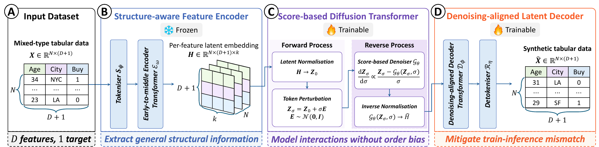

<div align="center">


# [NeurIPS 2026] TabFORGE: A Tabular Foundation Model for Generative Modelling

[](https://silencex12138.github.io/TabFORGE/)
[](https://pypi.org/project/tabforge-ml/)
[](https://github.com/SilenceX12138/TabFORGE/actions/workflows/style_check.yaml)
[](https://huggingface.co/XiangjianJiang/TabFORGE)
[](LICENSE)

</div>

> [!IMPORTANT]
> Official code for the paper **[TabFORGE: A Tabular Foundation Model for Generative Modelling](https://arxiv.org/abs/2605.09424)**, accepted at NeurIPS 2026.
>
> **Authors:** Xiangjian Jiang, Mingxuan Liu, Nikola Simidjievski, Tassilo Klein, and Mateja Jamnik
>
> **Institutions:** University of Cambridge; SAP SE; Télécom Paris, Institut Polytechnique de Paris
>
> **Maintainer:** [Xiangjian Jiang](https://github.com/SilenceX12138)

**Related tools:** [TabCamel](https://github.com/SilenceX12138/TabCamel) for tabular data preparation · [TabEval](https://github.com/SilenceX12138/TabEval) for synthetic-data evaluation · [TabStruct](https://github.com/SilenceX12138/TabStruct) for tabular generator benchmarking.

## 🌐 Overview

TabFORGE learns contextual representations of mixed-type tables with its
Structure-aware Feature Encoder, models them with the Score-based Diffusion
Transformer, and reconstructs them with the Denoising-aligned Latent Decoder.
Its estimator API supports synthetic data generation, classification,
regression, embedding, imputation, clustering, and anomaly detection.



### Model architecture

[](docs/wiki/assets/paper-framework.svg)

## ✨ Key features

- One estimator interface for pandas DataFrames and NumPy arrays, with
  schema-aware numerical, categorical, and target handling.
- Pretrained Structure-aware Feature Encoder and leakage-aware held-out-fold
  embeddings for supervised training rows.
- Latent diffusion with EDM preconditioning, Karras-style schedules, and
  Euler/Heun sampling.
- Canonical checkpoints for complete estimator restoration or data-free
  backbone transfer.
- CPU-friendly mock embeddings, single-device execution, and `torchrun`
  distributed execution.

## 🚀 Installation

TabFORGE requires Python 3.10 or later. Install the PyPI distribution
[`tabforge-ml`](https://pypi.org/project/tabforge-ml/):

```bash
pip install tabforge-ml
```

The Python import name and command-line entry point are both `tabforge`.
For notebooks or optional Weights & Biases logging:

```bash
pip install 'tabforge-ml[tutorials]'
pip install 'tabforge-ml[wandb]'
```

For development, clone the source repository and install it in editable mode:

```bash
git clone https://github.com/SilenceX12138/TabFORGE.git
cd TabFORGE
pip install -e .
```

You can also download the [source ZIP](https://github.com/SilenceX12138/TabFORGE/archive/refs/heads/master.zip).

The default feature
encoder and `checkpoint="pretrained"` use pretrained weights downloaded on
first use. For offline examples, configure
`TabFORGEEmbeddingConfig(model_path="mock")` and use `checkpoint=None` to train
all TabFORGE components from scratch.

## 📊 Logging with W&B

Install `tabforge-ml[wandb]`, authenticate with `wandb login`, and pass an online logging configuration to an estimator:

```python
from tabforge import TabFORGERuntimeConfig

runtime = TabFORGERuntimeConfig(
    log_wandb=True,
    wandb_project="tabforge",
    wandb_dir="./logs/wandb",
)
```

Use the estimator's `runtime_config=runtime` argument, or pass an existing run through `logger` to keep metrics in your surrounding experiment.

## ⚡ Quick sanity check

This small CPU example uses deterministic mock embeddings and initializes the
TabFORGE model from scratch:

```python
import pandas as pd

from tabforge import (
    TabFORGEArchitectureConfig,
    TabFORGEEmbeddingConfig,
    TabFORGEGenerator,
    TabFORGERuntimeConfig,
    TabFORGETrainingConfig,
)

X = pd.DataFrame({
    "age": [21.0, 35.0, 48.0, 62.0],
    "city": ["Cambridge", "London", "Cambridge", "Oxford"],
})

model = TabFORGEGenerator(
    task="unsupervision",
    embedding_config=TabFORGEEmbeddingConfig(model_path="mock", n_folds=0),
    architecture_config=TabFORGEArchitectureConfig(
        embedding_dimension=8,
        decoder_layers=1,
        decoder_heads=2,
        decoder_ffn_factor=2,
        denoiser_layers=1,
        denoiser_heads=2,
        denoiser_ffn_factor=2,
    ),
    training_config=TabFORGETrainingConfig(max_steps=2, batch_size=4),
    runtime_config=TabFORGERuntimeConfig(device="cpu"),
    random_state=7,
).fit(X, checkpoint=None)

synthetic = model.generate(5, random_state=7)
print(synthetic)
```

## 🧩 Example workflows

Prepare `train.csv` with feature columns in their original order. Categorical
DataFrame columns are inferred from their dtypes; pass `categorical_features`
explicitly for integer-coded categories.

```python
import pandas as pd

from tabforge import TabFORGEGenerator

X_train = pd.read_csv("train.csv")
generator = TabFORGEGenerator(task="unsupervision", random_state=7)
generator.fit(X_train)  # Uses the pretrained TabFORGE backbone by default.
synthetic = generator.generate(1_000, random_state=7)
generator.save_checkpoint("checkpoints/generator")
```

For supervised tasks, fit a classifier or regressor with `X_train, y_train`,
then call `predict` (and `predict_proba` for classification, or `predict_std`
and `predict_interval` for regression). `TabFORGEEmbedder.transform` extracts
embeddings, `TabFORGEImputer.transform` fills missing values, and the
clusterer and anomaly detector expose `predict` and `score_samples`
respectively. See the linked tutorials for complete examples.

## 📓 Tutorials

Open a notebook with its **Open in Colab** badge and follow the
[tutorial setup guide](docs/wiki/tutorials.md) to install `tabforge-ml[tutorials]`
in the runtime. Select a GPU for practical pretrained workloads; the sanity
check above is designed for CPU.

| Workflow | Notebook |
| --- | --- |
| Unconditional generation | [Unconditional generation](docs/tutorial/notebooks/generation/01_unconditional_generation.ipynb) · [](https://colab.research.google.com/github/SilenceX12138/TabFORGE/blob/master/docs/tutorial/notebooks/generation/01_unconditional_generation.ipynb) |
| Pretrained and scratch training | [Pretrained and scratch training](docs/tutorial/notebooks/generation/02_pretrained_and_scratch_training.ipynb) · [](https://colab.research.google.com/github/SilenceX12138/TabFORGE/blob/master/docs/tutorial/notebooks/generation/02_pretrained_and_scratch_training.ipynb) |
| Devices and distributed execution | [Device and distributed execution](docs/tutorial/notebooks/generation/03_device_and_distributed_execution.ipynb) · [](https://colab.research.google.com/github/SilenceX12138/TabFORGE/blob/master/docs/tutorial/notebooks/generation/03_device_and_distributed_execution.ipynb) |
| Classification | [Classification](docs/tutorial/notebooks/prediction/01_classification.ipynb) · [](https://colab.research.google.com/github/SilenceX12138/TabFORGE/blob/master/docs/tutorial/notebooks/prediction/01_classification.ipynb) |
| Regression | [Regression](docs/tutorial/notebooks/prediction/02_regression.ipynb) · [](https://colab.research.google.com/github/SilenceX12138/TabFORGE/blob/master/docs/tutorial/notebooks/prediction/02_regression.ipynb) |
| Feature embeddings | [Feature embeddings](docs/tutorial/notebooks/embedding/01_feature_embeddings.ipynb) · [](https://colab.research.google.com/github/SilenceX12138/TabFORGE/blob/master/docs/tutorial/notebooks/embedding/01_feature_embeddings.ipynb) |
| Missing-value imputation | [Missing-value imputation](docs/tutorial/notebooks/imputation/01_missing_value_imputation.ipynb) · [](https://colab.research.google.com/github/SilenceX12138/TabFORGE/blob/master/docs/tutorial/notebooks/imputation/01_missing_value_imputation.ipynb) |
| Clustering | [Clustering](docs/tutorial/notebooks/clustering/01_clustering.ipynb) · [](https://colab.research.google.com/github/SilenceX12138/TabFORGE/blob/master/docs/tutorial/notebooks/clustering/01_clustering.ipynb) |
| Anomaly detection | [Anomaly detection](docs/tutorial/notebooks/anomaly_detection/01_anomaly_detection.ipynb) · [](https://colab.research.google.com/github/SilenceX12138/TabFORGE/blob/master/docs/tutorial/notebooks/anomaly_detection/01_anomaly_detection.ipynb) |

## 💾 Checkpoints and data privacy

The official pretrained backbone is available from the
[TabFORGE Hugging Face repository](https://huggingface.co/XiangjianJiang/TabFORGE).
Estimator fitting uses `checkpoint="pretrained"` by default; use
`checkpoint=None` to train from scratch or pass a canonical checkpoint path to
restore model components.

`save_checkpoint(path)` stores a complete fitted estimator, including
preprocessing state and the fitted context required for inference.
`save_backbone_checkpoint(path)` stores reusable model weights without
preprocessing state or training rows. Complete fitted checkpoints can contain
provider training context; handle them as dataset
data. Use a backbone checkpoint for data-free distribution.

## 📚 Documentation

- [Getting started](docs/wiki/getting_started.md) · [deployed guide](https://silencex12138.github.io/TabFORGE/#/getting_started.md)
- [Tutorials](docs/wiki/tutorials.md) · [deployed gallery](https://silencex12138.github.io/TabFORGE/#/tutorials.md)
- [User guide](docs/wiki/user_guide.md) · [deployed guide](https://silencex12138.github.io/TabFORGE/#/user_guide.md)
- [Paper](docs/wiki/paper.md) · [deployed page](https://silencex12138.github.io/TabFORGE/#/paper.md)
- [Estimator API](docs/wiki/public_estimator_api.md) · [Configuration](docs/wiki/configuration.md) · [Training](docs/wiki/training_orchestration.md) · [Checkpoint lifecycle](docs/wiki/public_estimator_api_lifecycle.md)

## 📖 Citation

```bibtex
@inproceedings{jiang2026tabforge,
  title     = {TabFORGE: A Tabular Foundation Model for Generative Modelling},
  author    = {Jiang, Xiangjian and Liu, Mingxuan and Simidjievski, Nikola
               and Klein, Tassilo and Jamnik, Mateja},
  booktitle = {Advances in Neural Information Processing Systems},
  year      = {2026}
}

@inproceedings{jiang2026generative,
  title     = {A Generative Foundation Model for Heterogeneous Tabular Data},
  author    = {Jiang, Xiangjian and Liu, Mingxuan and Simidjievski, Nikola
               and Klein, Tassilo and Jamnik, Mateja},
  booktitle = {2nd ICML Workshop on Foundation Models for Structured Data},
  year      = {2026},
  url       = {https://openreview.net/forum?id=RcsaxrdpfE}
}
```
