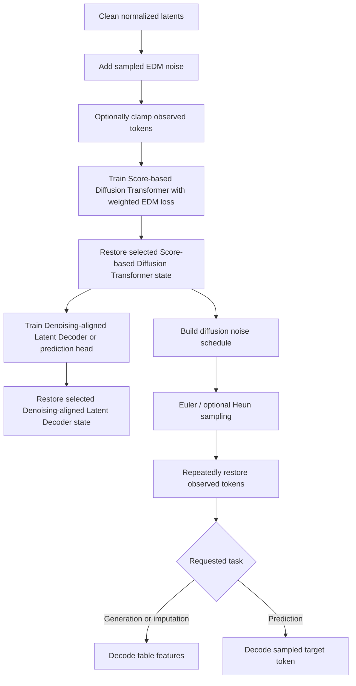

# Two-stage training and inference

TabFORGE learns a generative model over normalized embeddings from the Structure-aware Feature Encoder. Its training and inference workflow combines:

- The Score-based Diffusion Transformer denoises and samples tabular embeddings, and the Denoising-aligned Latent Decoder reconstructs numerical, categorical, or supervised outputs.
- Training orchestration that optimizes the Score-based Diffusion Transformer and Denoising-aligned Latent Decoder in separate phases while managing masking, validation, scheduling, distributed synchronization, and experiment logging.

## Architecture

<figure class="paper-figure">
<a href="assets/paper-framework.svg" target="_blank" rel="noopener"></a>
</figure>

The engine uses the following tensor contract:

```text
(batch_size, token_count, embedding_dimension)
```

Feature tokens follow the fitted schema. Supervised tasks append a target token. Diffusion operates in normalized latent space, while feature reconstruction restores the original embedding scale before decoding.

## Training and inference flows



Training allocates the configured optimizer-step budget between diffusion and Denoising-aligned Latent Decoder phases. Each phase has independent optimization, scheduling, validation, and best-weight selection. During inference, the sampler supports unconditional generation and conditional sampling in which observed tokens remain clamped.

## Core component documentation

- [Score-based Diffusion Transformer and Denoising-aligned Latent Decoder](latent_diffusion_model.md) — `TabFORGEDecoder`, `VariableColumnDenoiser`, EDM preconditioning and loss, noise schedules, and Euler/Heun sampling.
- [Training orchestration](training_orchestration.md) — `TabFORGETrainer`, phase allocation, masking, losses, gradient accumulation, validation, distributed execution, and logging.

## Source layout

| Component | Source |
| --- | --- |
| Denoising-aligned Latent Decoder and Score-based Diffusion Transformer | `src/tabforge/models/components.py` |
| EDM objective, schedule, and sampler | `src/tabforge/models/diffusion.py` |
| Training facade and optimization loop | `src/tabforge/training/trainer.py` |
| Progress and W&B integration | `src/tabforge/training/logging.py` |
