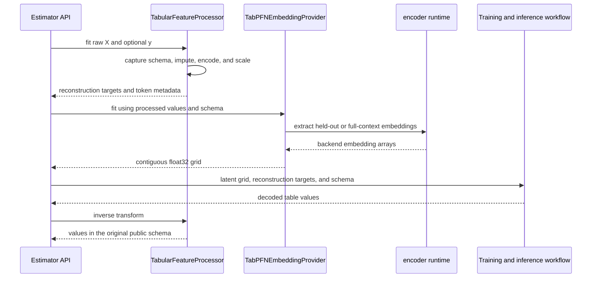

# Table preprocessing and embedding

## Purpose

The table preprocessing and embedding workflow converts mixed-type tabular data into schema-aware latent embeddings for TabFORGE.

It combines two subsystems:

- **Tabular feature processing** captures the input schema, preprocesses numerical and categorical values, builds Denoising-aligned Latent Decoder reconstruction targets, manages missing-value masks, and restores generated data to its original column order and dtypes.
- **Structure-aware Feature Encoder** converts the processed table into contextual per-feature embeddings with the stable shape `(rows, tokens, embedding_dimension)`. It supports leakage-aware training embeddings, query-time extraction, and serializable fitted context.

## Architecture

<ol class="flow-cards">
<li><strong>Capture the table schema</strong>
TabularFeatureProcessor records raw columns and dtypes, prepares numerical-first values, and constructs reconstruction targets.
</li>
<li><strong>Extract contextual tokens</strong>
TabPFNEmbeddingProvider uses held-out folds or full training context to produce a contiguous per-feature latent grid.
</li>
<li><strong>Model and reconstruct</strong>
The training workflow fits the Score-based Diffusion Transformer and Denoising-aligned Latent Decoder on the grid and reconstruction targets. The fitted schema restores decoded values to public column order.
</li>
</ol>

### Embedding flow

The main contracts are:

- One embedding token corresponds to each raw feature, with an additional target token for supervised tasks.
- Embedding values use numerical-first token order.
- Reconstruction targets contain numerical scalars followed by categorical one-hot blocks.
- The embedding adapter returns CPU-owned, C-contiguous `float32` arrays.
- The feature processor preserves mappings between raw columns, embedding tokens, and Denoising-aligned Latent Decoder outputs.

## Core component documentation

- [Tabular feature processing](tabular_feature_processing.md) — `TabularFeatureProcessor`, `FeatureSchema`, `GaussianQuantileFeatureEncoder`, reconstruction layouts, target processing, inverse transformation, and imputation support.
- [Structure-aware Feature Encoder](tabpfn_embedding_adapter.md) — `EmbeddingProvider`, `TabPFNEmbeddingProvider`, `SampleEmbedding`, backend normalization, leakage-aware folds, query extraction, and provider persistence.
