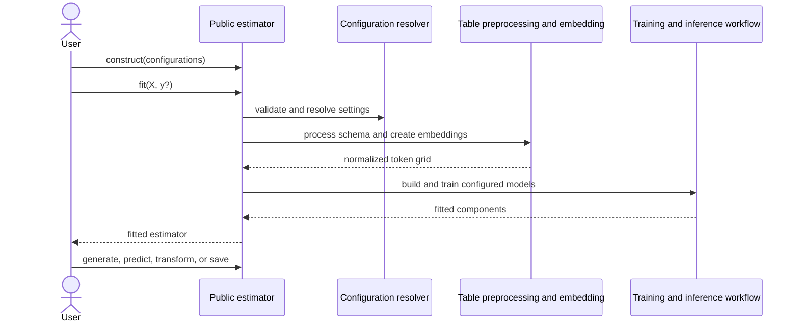

# User-facing estimator and configuration interface

## Purpose

Located under `src/tabforge`, this module is TabFORGE’s public Python interface. It combines:

- Seven scikit-learn-style estimators for synthetic-data generation, classification, regression, embedding extraction, imputation, clustering, and anomaly detection.
- Immutable, validated configuration objects for embedding, architecture, diffusion, training, scheduling, and runtime behavior.
- Shared lifecycle management for fitting, inference, distributed execution, and checkpoint restoration.

Applications typically import these components directly from `tabforge`.

## Architecture

<ol class="flow-cards">
<li><strong>Estimator + configuration</strong><p>Select a public estimator and validated embedding, architecture, diffusion, training, and runtime settings.</p></li>
<li><strong>Shared lifecycle</strong><p>The fitted core coordinates table preprocessing and embedding extraction, neural model construction, training, and task-specific inference.</p></li>
<li><strong>Persist and restore</strong><p>Canonical checkpoints preserve the shared state and concrete estimator identity. Clustering and anomaly detection add downstream heads.</p></li>
</ol>

The estimator API owns task-specific behavior and coordinates the fitted lifecycle. The configuration package supplies validated policy objects that are resolved during `fit` and consumed by the embedding, model, training, and runtime components.

The clusterer and anomaly detector use the shared TabFORGE embedding workflow, then fit downstream KMeans and Isolation Forest heads, respectively.



## Core components

- [`public_estimator_api`](public_estimator_api.md) documents all seven public estimators, shared fitted core, inference paths, distributed behavior, and checkpoint lifecycle.
- [`configuration`](configuration.md) documents the six immutable configuration families, validation rules, scikit-learn parameter integration, resolution lifecycle, and serialization.
- [`Shared lifecycle and checkpoint core`](public_estimator_api_lifecycle.md) provides detailed documentation for `src/tabforge/api/base.py`.
- [`Task-specific public estimators`](public_estimator_api_estimators.md) provides detailed contracts for `src/tabforge/api/estimators.py`.

## Repository layout

```text
src/tabforge/
├── __init__.py              # Package-level public exports
├── api/
│   ├── __init__.py          # Estimator exports
│   ├── base.py              # Shared fit, inference, and checkpoint lifecycle
│   └── estimators.py        # Task-specific public estimators
└── config/
    ├── __init__.py          # Configuration exports
    └── config.py            # Immutable configuration classes and resolution helpers
```
