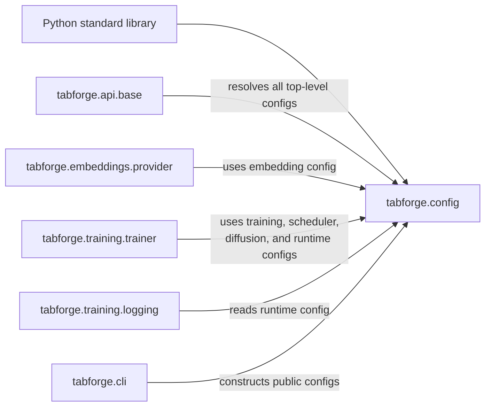
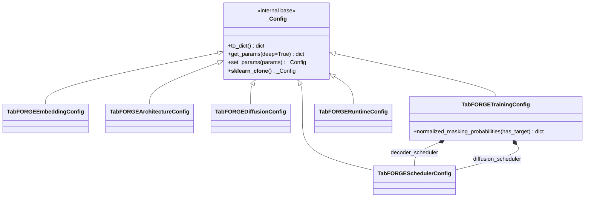
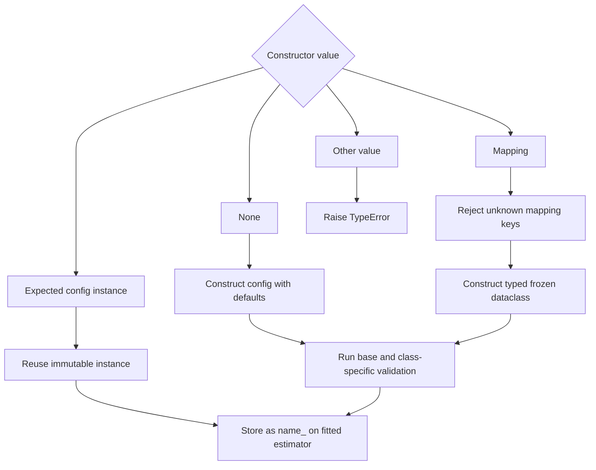
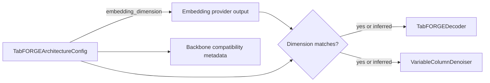
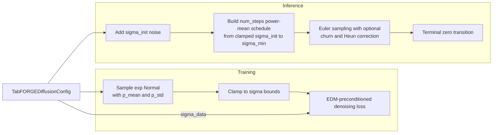
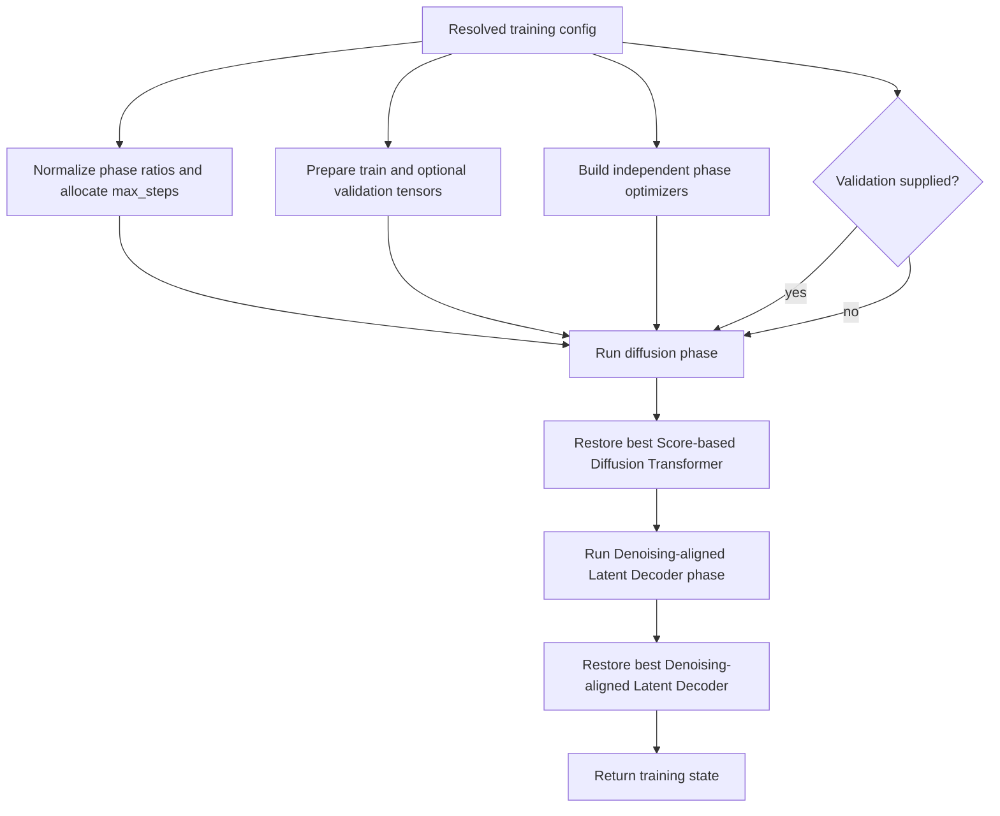
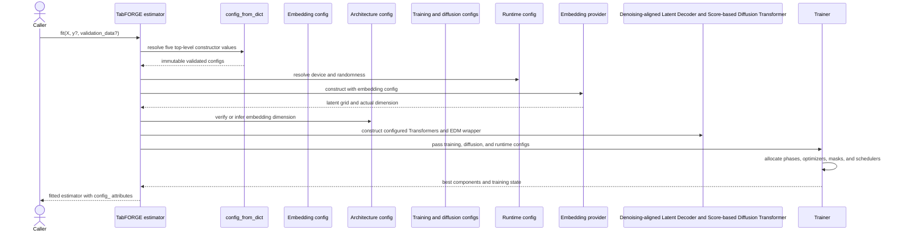

# Configuration

The `tabforge.config` module defines the validated, immutable settings used by every TabFORGE estimator. It separates user-selected policy from fitted model state across six focused dataclasses: embedding extraction, neural architecture, diffusion, training, validation-driven scheduling, and runtime execution.

Estimators accept each top-level configuration as `None`, a field mapping, or the corresponding typed object. At `fit` time, the shared estimator core resolves those inputs into frozen, underscore-suffixed objects and passes them to the embedding and latent-diffusion subsystems. This gives Python users, scikit-learn tooling, and checkpoints one consistent configuration contract.

## Position in the system

<ol class="flow-cards">
<li><strong>Declare policy</strong><p>Typed immutable objects or field mappings specify embedding, architecture, diffusion, training, and runtime behavior.</p></li>
<li><strong>Resolve at fit</strong><p>The shared estimator core validates configuration and publishes resolved underscore-suffixed objects.</p></li>
<li><strong>Pass to consumers</strong><p>The provider, model, trainer, and logger receive the relevant settings. Checkpoints serialize the resolved configuration.</p></li>
</ol>

The configuration module carries values across subsystem boundaries; it does not fit data or construct neural components itself. The [public estimator API](public_estimator_api.md) owns resolution and lifecycle ordering. The [Structure-aware Feature Encoder](tabpfn_embedding_adapter.md), [Score-based Diffusion Transformer and Denoising-aligned Latent Decoder](latent_diffusion_model.md), and [training orchestration](training_orchestration.md) consume the relevant resolved settings. Raw schema behavior belongs to [tabular feature processing](tabular_feature_processing.md).

## Configuration families and dependencies

| Configuration | Concern | Main consumers |
| --- | --- | --- |
| `TabFORGEEmbeddingConfig` | Encoder checkpoint, leakage-free folds, extraction layer, query batching, and ensemble size | `TabPFNEmbeddingProvider` |
| `TabFORGEArchitectureConfig` | Denoising-aligned Latent Decoder and Score-based Diffusion Transformer depth, attention, feed-forward width, and latent dimension | `TabFORGE`, `TabFORGEDecoder`, `VariableColumnDenoiser` |
| `TabFORGEDiffusionConfig` | EDM noise distribution, preconditioning, inference schedule, churn, and Heun correction | `TabFORGETrainer`, `EDMPreconditioner`, sampler |
| `TabFORGETrainingConfig` | Step budget, phase allocation, optimizers, batching, clipping, loss weighting, masks, and validation cadence | `TabFORGETrainer` |
| `TabFORGESchedulerConfig` | Per-phase validation plateau response | Training scheduler nested in `TabFORGETrainingConfig` |
| `TabFORGERuntimeConfig` | Device, distributed strategy, gradient accumulation, determinism, and W&B tracing | `TabFORGE`, `TabFORGETrainer`, `TrainingLogger` |

The module itself depends only on Python's `dataclasses`, `math`, and typing utilities. Downstream components import the configuration types, keeping validation independent from embedding, PyTorch, scikit-learn estimator, and logging implementations.





All public configuration classes are frozen dataclasses. Construction validates values immediately. Mutation-style operations return validated replacements, which prevents a fitted estimator's configuration from changing through a shared mutable object.

## Input and resolution lifecycle

Each estimator constructor accepts these top-level arguments:

```python
from tabforge import TabFORGEClassifier
from tabforge.config import (
    TabFORGEDiffusionConfig,
    TabFORGETrainingConfig,
)

model = TabFORGEClassifier(
    diffusion_config=TabFORGEDiffusionConfig(num_steps=20),
    training_config={
        "max_steps": 5_000,
        "decoder_scheduler": {"patience_steps": 250},
    },
    runtime_config={"device": "auto", "deterministic": True},
    random_state=7,
)
```

The constructor preserves these values as estimator parameters. `TabFORGE._resolve_fit_configuration` resolves them only when fitting begins.



`config_from_dict(value, config_type)` implements this contract. Unknown mapping fields raise `TypeError`; invalid known values raise the exception selected by the dataclass validator. Passing an already typed object returns that same immutable object.

Resolved estimator state uses trailing underscores:

| Constructor parameter | Resolved fitted state |
| --- | --- |
| `embedding_config` | `embedding_config_` |
| `architecture_config` | `architecture_config_` |
| `diffusion_config` | `diffusion_config_` |
| `training_config` | `training_config_` |
| `runtime_config` | `runtime_config_` |

Inference and checkpoint serialization use the resolved objects. Updating constructor parameters with `set_params` affects a future fit; it does not rewrite already-built components.

## Shared `_Config` behavior

`_Config` is the internal base for the six public dataclasses. It supplies four common operations:

| Operation | Behavior |
| --- | --- |
| `to_dict()` | Recursively serializes dataclass fields with `dataclasses.asdict`; nested scheduler objects become ordinary mappings. |
| `get_params(deep=True)` | Returns the serialized field mapping for scikit-learn inspection. `deep` is accepted for API compatibility. |
| `set_params(**params)` | Rejects unknown direct fields and returns a new validated object through `dataclasses.replace`. |
| `__sklearn_clone__()` | Returns the same instance because frozen configuration objects are safe to share. |

The shared post-initialization check rejects `NaN` in direct numeric fields. Each concrete class then applies concern-specific range and type validation.

### Scikit-learn parameter updates

The estimator base supports one configuration boundary in nested keys:

```python
model.set_params(
    training_config__batch_size=256,
    diffusion_config__num_steps=25,
    runtime_config__gradient_accumulation=4,
)
```

For each key, `TabFORGE.set_params` resolves the current top-level value, calls the immutable config's `set_params`, and assigns the replacement to the estimator constructor field. Scheduler settings are replaced through the whole training field:

```python
model.set_params(
    training_config__decoder_scheduler={
        "patience_steps": 200,
        "factor": 0.25,
    }
)
```

The configuration objects expose direct fields only, so keys such as `training_config__decoder_scheduler__factor` are outside this update contract.

## `TabFORGEEmbeddingConfig`

This class configures the Structure-aware Feature Encoder used to turn table rows into a per-feature latent grid.

| Field | Default | Meaning and validation |
| --- | ---: | --- |
| `model_path` | `"auto"` | `"auto"` selects the pinned external checkpoint, `"mock"` selects deterministic lightweight embeddings, and another string is treated as a local checkpoint path. |
| `n_folds` | `10` | Leakage-free held-out folds for training embeddings. Must be integer `0` or at least `2`; `0` embeds all training rows in one fitted context. |
| `layer` | `None` | Optional zero-based encoder layer. Must be a non-negative integer or `None`. |
| `batch_size` | `None` | Optional encoder query batch size. Must be positive or `None`. |
| `n_estimators` | `1` | Number of external encoder ensemble members to average. Must be a positive integer. |

The resolved object is passed to `TabPFNEmbeddingProvider`. The provider also serializes it in its fitted context so restored checkpoints can recreate the same extraction behavior. `architecture_config.embedding_dimension`, when explicit, is forwarded as the provider's requested output width and later checked against the actual embedding grid.

See [Structure-aware Feature Encoder](tabpfn_embedding_adapter.md) for fitting contexts, held-out embedding extraction, backend selection, and query transformation.

## `TabFORGEArchitectureConfig`

This class defines the reusable Transformer structure for the latent Denoising-aligned Latent Decoder and diffusion Score-based Diffusion Transformer.

| Field | Default | Consumer |
| --- | ---: | --- |
| `decoder_layers` | `4` | Number of decoder transformer layers. |
| `decoder_heads` | `2` | Denoising-aligned Latent Decoder attention heads. |
| `decoder_ffn_factor` | `10` | Denoising-aligned Latent Decoder feed-forward width multiplier. |
| `denoiser_layers` | `4` | Number of Score-based Diffusion Transformer layers. |
| `denoiser_heads` | `4` | Score-based Diffusion Transformer attention heads. |
| `denoiser_ffn_factor` | `16` | Score-based Diffusion Transformer feed-forward width multiplier. |
| `embedding_dimension` | `None` | Expected latent width; `None` infers it from provider output. |

All layer, head, and feed-forward fields must be positive. `embedding_dimension` must be positive when supplied. During fitting, the core compares an explicit dimension with the provider's actual last-axis width and raises `ValueError` on mismatch.



Each component receives its own depth, attention-head count, and feed-forward expansion fields. Schema-dependent token counts and output heads come from fitted feature processing. Backbone checkpoint loading compares the reusable architecture metadata before applying tensors. Component internals are documented in [Score-based Diffusion Transformer and Denoising-aligned Latent Decoder](latent_diffusion_model.md).

## `TabFORGEDiffusionConfig`

This class controls the EDM noise distribution used in training and the reverse-diffusion trajectory used during inference.

| Field | Default | Role |
| --- | ---: | --- |
| `num_steps` | `10` | Number of non-zero inference schedule steps; must be positive. |
| `sigma_min` | `0.002` | Lowest non-zero training and sampling noise. Must be positive and no greater than `sigma_max`. |
| `sigma_max` | `80.0` | Upper bound for sampled training noise. |
| `sigma_init` | `0.1` | Initial inference noise scale; must be positive. The sampling schedule clamps its start into `[sigma_min, sigma_max]`. |
| `sigma_data` | `1.0` | EDM data scale used by preconditioning; must be positive. |
| `rho` | `7.0` | Power-mean/Karras schedule curvature; must be positive. |
| `p_mean` | `0.0` | Mean of the log-normal training-noise distribution. |
| `p_std` | `1.0` | Spread of that distribution; cannot be negative. |
| `sigma_churn` | `1.0` | Stochastic churn supplied to the sampler; cannot be negative. |
| `enable_heun_correction` | `False` | Enables the sampler's second-order Heun correction. |

### Training and inference data flow



Training samples log-normal noise and clamps it to the configured bounds. Target-prediction training additionally caps its upper noise at the bounded `sigma_init`. During inference, the core builds a descending schedule and passes churn and correction settings to the sampler. For the mathematical model and sampler implementation, see [Score-based Diffusion Transformer and Denoising-aligned Latent Decoder](latent_diffusion_model.md).

## `TabFORGESchedulerConfig`

Each training phase owns an independent validation-driven learning-rate scheduler.

| Field | Default | Meaning and validation |
| --- | ---: | --- |
| `patience_steps` | `500` | Optimizer updates without sufficient improvement before reduction. A positive integer enables it; `None` disables that phase's scheduler. |
| `factor` | `0.5` | Multiplicative learning-rate reduction; must lie strictly between `0` and `1`. |
| `min_lr` | `0.0` | Learning-rate floor; cannot be negative. |
| `min_delta` | `0.0` | Minimum loss decrease counted as improvement; cannot be negative. |

Schedulers are active only when `fit` receives validation data. At a validation measurement, a loss below `best - min_delta` resets the improvement point. Once `patience_steps` optimizer updates have elapsed since the latest improvement or reduction, the scheduler applies `max(min_lr, current_lr * factor)`.

`TabFORGETrainingConfig` accepts each scheduler as a typed object or mapping. Mapping values are converted to frozen scheduler objects during training-config construction.

## `TabFORGETrainingConfig`

This class groups the two-phase training budget, optimizer settings, conditional masking policy, target loss, and validation cadence.

### Budget and optimization

| Field | Default | Meaning and validation |
| --- | ---: | --- |
| `max_steps` | `10_000` | Total optimizer-step budget across both phases; must be positive. |
| `batch_size` | `512` | Sampled rows per accumulation batch; must be positive. |
| `gradient_clip_value` | `1.0` | Active component gradient-norm clipping threshold; cannot be negative. Zero disables clipping. |
| `decoder_phase_ratio` | `0.5` | Relative share for Denoising-aligned Latent Decoder steps; cannot be negative. |
| `diffusion_phase_ratio` | `0.5` | Relative share for Score-based Diffusion Transformer steps; cannot be negative. |
| `decoder_optimizer` | `"sgd"` | Denoising-aligned Latent Decoder optimizer name. Runtime construction accepts `sgd`, `adam`, or `adamw`, case-insensitively. |
| `decoder_lr` | `0.1` | Denoising-aligned Latent Decoder learning rate; cannot be negative. |
| `decoder_weight_decay` | `5e-5` | Denoising-aligned Latent Decoder weight decay; cannot be negative. |
| `diffusion_optimizer` | `"adamw"` | Score-based Diffusion Transformer optimizer name with the same supported set. |
| `diffusion_lr` | `1e-3` | Score-based Diffusion Transformer learning rate; cannot be negative. |
| `diffusion_weight_decay` | `1e-5` | Score-based Diffusion Transformer weight decay; cannot be negative. |
| `target_loss_weight` | `1.0` | Non-negative, finite weight for target reconstruction or prediction loss. |

At least one phase ratio must be positive. The trainer normalizes the two ratios against their sum, rounds the diffusion share to an integer step count, and assigns the remaining steps to the Denoising-aligned Latent Decoder. The phases run in diffusion-then-decoder order, restoring each phase's best component before continuing.

Optimizer names are resolved when training constructs the optimizer; unsupported names therefore fail at fit time rather than dataclass construction. For wide supervised layouts, the estimator core may replace the resolved fitted `batch_size` with a smaller value to keep a training step near its token budget.

### Conditional masking

| Field | Default | Masking mode |
| --- | ---: | --- |
| `unmasked_probability` | `0.50` | Train from a fully noisy latent grid. |
| `target_mask_probability` | `0.25` | Observe feature tokens and regenerate the target token. |
| `random_feature_mask_probability` | `0.25` | Observe a sampled subset and regenerate other tokens. |

Each probability must lie in `[0, 1]`, their sum must be positive, and their sum cannot exceed `1` beyond a small floating-point tolerance. Before sampling, `normalized_masking_probabilities(has_target=...)` removes target-only masking when the fitted layout has no target and renormalizes the enabled weights to sum to one. If removing target mode leaves no weight, it falls back to unmasked training.

The estimator's task policy decides whether conditional masks are sampled. Target-prediction head training forces target-only masking. See [training orchestration](training_orchestration.md) for observation-mask construction and phase losses.

### Validation controls

| Field | Default | Meaning |
| --- | ---: | --- |
| `decoder_scheduler` | `TabFORGESchedulerConfig(patience_steps=500)` | Scheduler for Denoising-aligned Latent Decoder optimizer updates. |
| `diffusion_scheduler` | `TabFORGESchedulerConfig(patience_steps=1000)` | Scheduler for Score-based Diffusion Transformer optimizer updates. |
| `validation_every_n_epochs` | `5` | Validation cadence converted to optimizer steps from training rows, batch size, and gradient accumulation; must be positive. |

No validation split means both schedulers remain dormant. Validation remains useful for best-component selection even when a scheduler's `patience_steps` is `None`.

### Training process



## `TabFORGERuntimeConfig`

This class defines execution and experiment-tracing behavior shared by estimator fitting and the standalone trainer.

| Field | Default | Meaning and validation |
| --- | ---: | --- |
| `device` | `"auto"` | `"auto"`, `"cpu"`, `"cuda"`, or a CUDA selector such as `"cuda:0"`. `auto` chooses CUDA when available. |
| `strategy` | `"auto"` | `"auto"`, `"single_device"`, or `"ddp"`. A direct trainer using `ddp` requires an initialized process group. |
| `gradient_accumulation` | `1` | Sampled batches per optimizer update; must be positive. Each batch loss is divided by this value before backpropagation. |
| `deterministic` | `False` | Seeds owned Python, NumPy, and PyTorch sources and enables deterministic PyTorch algorithms. With no explicit `random_state`, deterministic mode uses seed `0`. |
| `log_wandb` | `False` | Creates a standalone W&B run when no compatible logger was supplied. |
| `wandb_project` | `"tabforge"` | Project for a trainer-owned W&B run. |
| `wandb_entity` | `None` | Optional W&B entity for that run. |
| `wandb_dir` | `"./logs/wandb"` | Local directory for W&B files. |

Under a `torchrun` environment, distributed helpers initialize the process group, map CUDA workers to local-rank devices, shard row work, and keep owned W&B tracing on rank zero. CUDA requests fail when CUDA is unavailable. Existing compatible logger objects are reused independently of `log_wandb`; only runs created by `TrainingLogger` are finished by it.

The [public estimator lifecycle](public_estimator_api_lifecycle.md) documents device resolution, random seeds, row sharding, gathering, and checkpoint writes. The [training orchestration](training_orchestration.md) page covers accumulation and distributed gradient averaging.

## Component interaction during `fit`



Configuration errors are intentionally raised close to their owning boundary: dataclass construction handles field shape and range constraints, provider integration checks the realized embedding dimension, component construction checks model-level compatibility, the trainer resolves optimizer names, and runtime setup verifies device and distributed availability.

## Serialization and checkpoint behavior

Configuration objects serialize to ordinary dictionaries so checkpoint payloads do not depend on live dataclass instances.


The exact fitted checkpoint stores all five top-level resolved configurations. Before serialization, the architecture mapping records the actual fitted embedding dimension, including when the original setting was `None`. Restoration reconstructs each typed object, migrates legacy training scheduler fields when required, selects the requested restoration device, and rebuilds empty components before loading tensors.

`resolved_config_dict(configs)` provides recursive serialization for a named collection of `_Config` values. `_CONFIG_TYPES` is the module's internal mapping from the five top-level configuration names to their expected classes; scheduler configuration remains nested under training.

For transferable backbone metadata, exact fitted restoration, and the distinction between constructor and fitted state, see [shared lifecycle and checkpoint core](public_estimator_api_lifecycle.md).

## Validation summary and operational boundaries

- Configuration objects reject direct numeric `NaN` values before concern-specific validation.
- Frozen dataclasses prevent in-place field assignment; use `set_params`, `dataclasses.replace`, or construct a new object.
- Unknown direct config replacement fields raise `ValueError`; unknown mapping fields passed through `config_from_dict` raise `TypeError`.
- Training scheduler mappings are normalized into typed scheduler objects during `TabFORGETrainingConfig` construction.
- Architecture validation covers positivity and the explicit embedding-width contract. Tensor-shape and model compatibility checks occur when components are built or checkpoints are loaded.
- Optimizer-name support is enforced by the trainer during fitting.
- Validation schedulers require explicit validation data and use optimizer-step patience.
- Runtime configuration selects execution mechanics; `random_state` remains a separate estimator parameter and supplies the seed used by fitting and stochastic inference.
- Configurations describe execution policy and are serialized in checkpoints. Data-derived schema, normalization statistics, provider context, learned tensors, and training progress belong to fitted estimator state.

## Source files

- `src/tabforge/config/config.py`: immutable dataclasses, validators, sklearn-compatible helpers, mapping resolution, and serialization.
- `src/tabforge/config/__init__.py`: public configuration exports.
- `src/tabforge/api/base.py`: estimator resolution, nested parameter updates, downstream construction, and checkpoint configuration.
- `src/tabforge/embeddings/provider.py`: embedding-config consumption and fitted provider context.
- `src/tabforge/training/trainer.py`: training, diffusion, scheduler, and runtime-config consumption.
- `src/tabforge/training/logging.py`: runtime-controlled W&B tracing.
