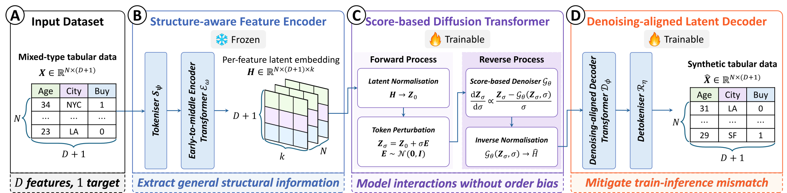
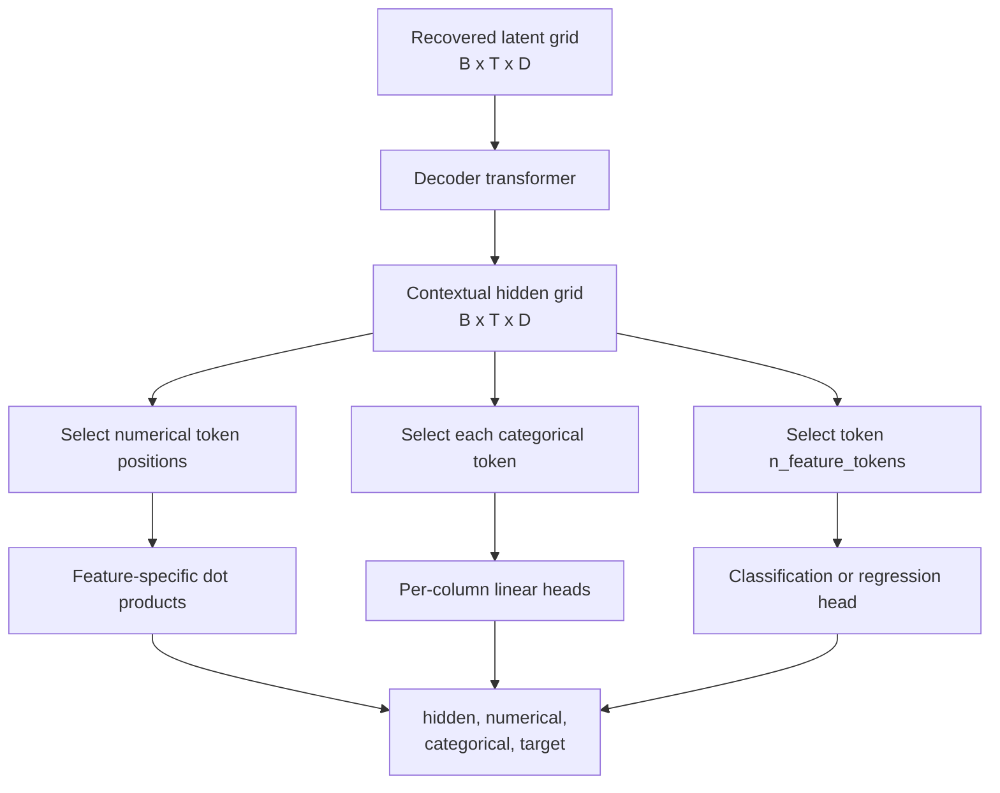
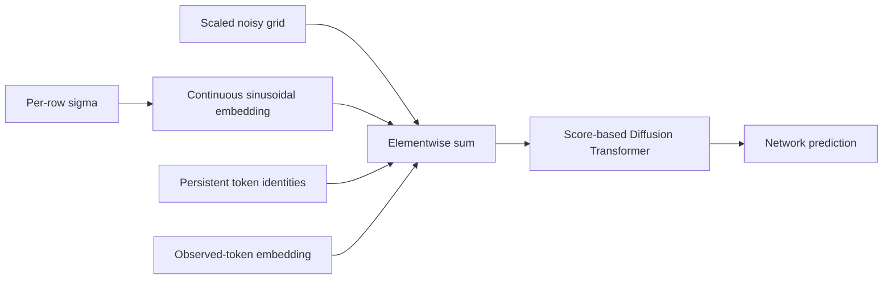
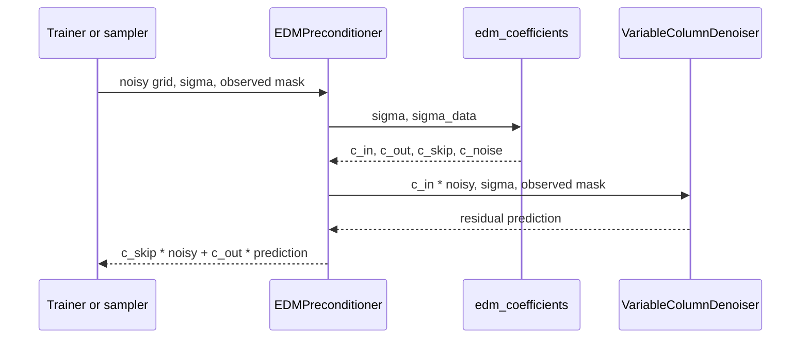
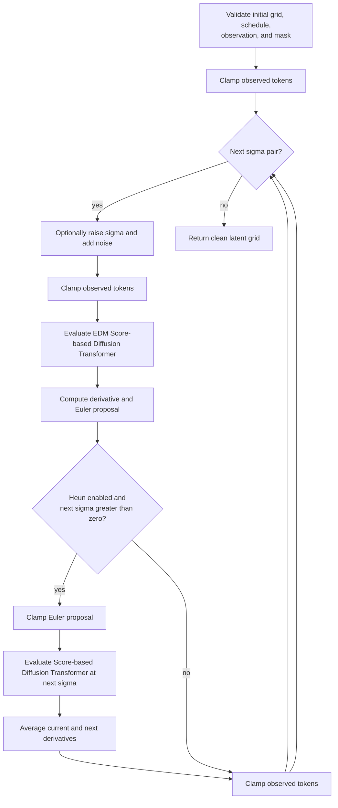
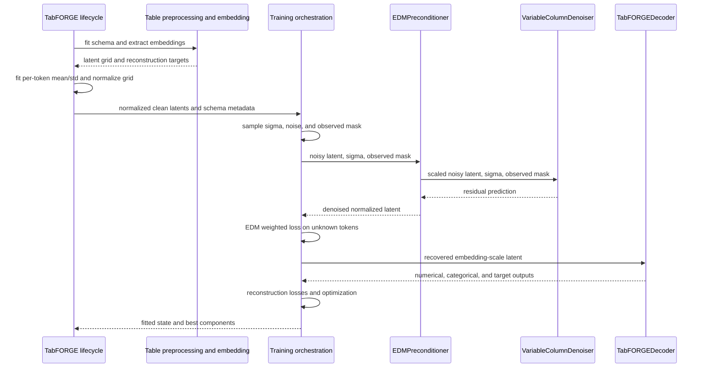
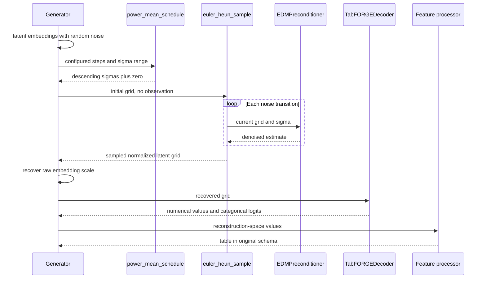
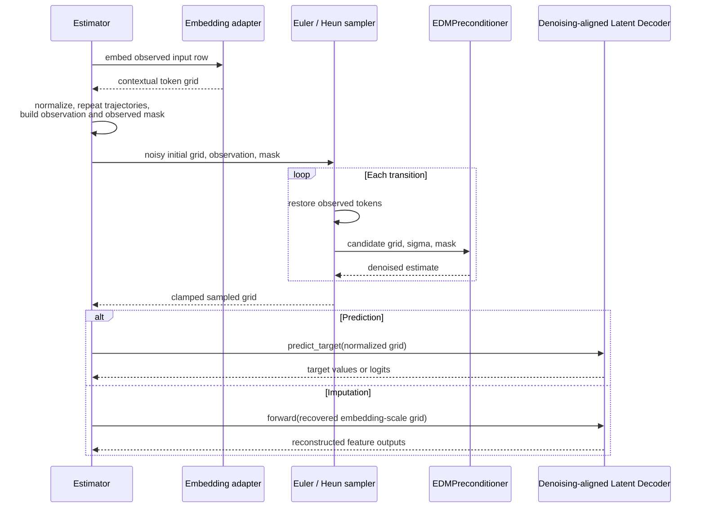
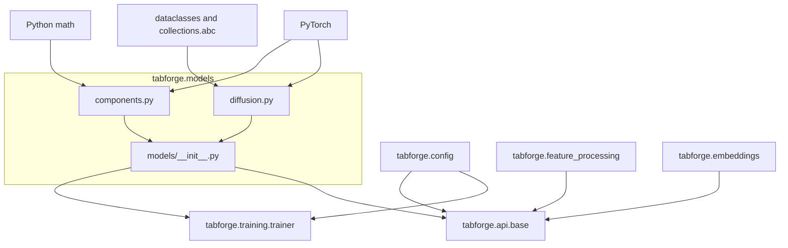

# Score-based Diffusion Transformer and Denoising-aligned Latent Decoder

The `tabforge.models` package implements TabFORGE's Score-based Diffusion Transformer and Denoising-aligned Latent Decoder. It operates on contextual token grids produced by the [Structure-aware Feature Encoder](tabpfn_embedding_adapter.md), learns to reconstruct mixed-type tables with a dataset-specific detokeniser, and samples complete or conditionally clamped latent grids for generation, prediction, and imputation.

The implementation is split across:

- `src/tabforge/models/components.py`, which defines timestep conditioning, the shared Transformer stack, the schema-dependent Denoising-aligned Latent Decoder, and the Score-based Diffusion Transformer; and
- `src/tabforge/models/diffusion.py`, which defines the EDM coefficients and objective, the Karras-style noise schedule, and the Euler/Heun sampler.

Training phases, optimizers, validation, and checkpoint selection belong to [training orchestration](training_orchestration.md). Public fit and inference behavior belongs to the [public estimator API](public_estimator_api.md).

## Purpose and system position

TabFORGE models a table in the latent space of the Structure-aware Feature Encoder. Each row becomes a sequence of feature tokens, with one additional target token for supervised tasks. This package has two complementary responsibilities:

1. `VariableColumnDenoiser` and `EDMPreconditioner` learn and sample the distribution of normalized latent grids.
2. `TabFORGEDecoder` maps denoised embeddings back to numerical values, categorical logits, and an optional supervised target.

<figure class="paper-figure">
<a href="assets/paper-framework.svg" target="_blank" rel="noopener"></a>
</figure>

The [table preprocessing and embedding](Tabular_representation_pipeline.md) owns raw-column semantics and contextual embedding extraction. The [configuration module](configuration.md) supplies architecture and diffusion settings. The [shared estimator lifecycle](public_estimator_api_lifecycle.md) constructs the fitted components, normalizes latents, invokes sampling, and formats public outputs.

## Architecture

The paper's **Score-based Diffusion Transformer** is implemented by `VariableColumnDenoiser` with `EDMPreconditioner`. The **Denoising-aligned Latent Decoder** is implemented by `TabFORGEDecoder`, including its decoder transformer and schema-specific detokeniser heads. Implementation identifiers below refer to these paper components.

| Component | Relationship and interface |
| --- | --- |
| `SinusoidalTimestepEmbedding` | Creates discrete or continuous noise-level conditioning for the Score-based Diffusion Transformer. |
| `_Transformer` | Independent Transformer stacks are owned by the Denoising-aligned Latent Decoder and Score-based Diffusion Transformer. |
| `TabFORGEDecoder` | `forward(latent)` reconstructs features; `predict_target(normalized_latent)` reads the supervised head. Schema metadata selects numerical and categorical outputs. |
| `VariableColumnDenoiser` | Combines timestep conditioning, feature identity, observation masks, and its Transformer to denoise a token grid. |
| `EDMPreconditioner` | Wraps `VariableColumnDenoiser` with noise-dependent EDM coefficients. |
| `_SamplingOptions` | Supplies the preconditioned Score-based Diffusion Transformer callable, observations, mask, generator, Heun option, and churn settings to sampling. |

Both neural paths use `_Transformer`, a pre-normalized `torch.nn.TransformerEncoder` with batch-first tensors, ReLU feed-forward blocks, zero dropout, and a final layer normalization. The Denoising-aligned Latent Decoder and Score-based Diffusion Transformer have independent stacks and independently configurable depth, attention-head count, and feed-forward expansion.

The embedding dimension must be divisible by the configured attention-head count. `_Transformer` validates this constraint when either model is constructed.

## Stable tensor and schema contracts

The canonical latent grid has shape:

```text
(batch_size, token_count, embedding_dimension)
```

Token and value conventions are shared across module boundaries:

| Contract | Meaning |
| --- | --- |
| Feature token order | Numerical features first, followed by categorical features, as established by `TabularFeatureProcessor`. |
| Supervised token layout | `n_feature_tokens` feature tokens followed by one target token. |
| Unsupervised token layout | Feature tokens only. |
| Diffusion scale | Normalized embedding space using fitted per-token mean and standard deviation. |
| Denoising-aligned Latent Decoder scale | Recovered, unnormalized encoder embedding space for `forward()`. |
| Predictor-head scale | Normalized sampled latent space for `predict_target()`. |
| Internal mask polarity | `observation_mask=True` means the token is observed and must remain clamped. |
| Categorical Denoising-aligned Latent Decoder output | One unnormalized logit tensor per categorical column. |
| Numerical Denoising-aligned Latent Decoder output | One scalar per numerical column. |

The feature processor supplies explicit numerical and categorical token positions. This allows reconstruction heads to follow the fitted schema even when raw columns were interleaved. See [tabular feature processing](tabular_feature_processing.md) for token-position mappings, reconstruction targets, categorical cardinalities, and inverse transformation.

## Component reference

### `SinusoidalTimestepEmbedding`

`SinusoidalTimestepEmbedding` adds one per-row noise embedding to a latent value vector. It supports two conditioning forms:

- Integer timesteps index a precomputed discrete sinusoidal table with `timestep_max` rows.
- Floating-point timesteps generate sinusoidal features from continuous frequencies at runtime.

The Score-based Diffusion Transformer uses the continuous path with:

```text
t = log(clamp(sigma, min=1e-8)) / 4
```

The embedding is added to every token in the row after a singleton token axis is introduced. Frequency tables are registered buffers, so they follow module device moves and checkpoint state.

### `_Transformer`

`_Transformer` is the private shared backbone used by both public neural components. Each encoder layer is configured as:

```text
d_model         = embedding_dimension
nhead           = heads
dim_feedforward = embedding_dimension * ffn_factor
dropout         = 0.0
activation      = ReLU
batch_first     = True
norm_first      = True
```

The enclosing `TransformerEncoder` adds a final `LayerNorm`. No attention mask is applied, so every token can attend to every other token in the same row.

### `TabFORGEDecoder`

`TabFORGEDecoder` converts a latent token grid into reconstruction-space outputs. A Transformer first contextualizes the entire row; schema-specific heads then read fixed token positions.



#### Reconstruction heads

| Head | Parameters | Output shape | Interpretation |
| --- | --- | --- | --- |
| Numerical | One learned vector per numerical feature, without additive bias | `(batch, numerical_count)` | Scalar reconstruction values |
| Categorical | One `Linear(D, cardinality)` per categorical feature | List of `(batch, cardinality_i)` | Category logits |
| Classification target | `Linear(D, target_cardinality)` | `(batch, target_cardinality)` | Target-class logits |
| Regression target | `Linear(D, 1)` | `(batch, 1)` | Transformed target value |
| Optional prediction head | `Linear(D, hidden)`, ReLU, `Linear(hidden, target_cardinality)` | `(batch, target_cardinality)` | Compact classifier fitted after target diffusion |

Numerical weights and categorical head weights use Xavier uniform initialization with gain `1 / sqrt(2)`. The Denoising-aligned Latent Decoder returns contextual `hidden` tokens alongside all decoded values so training code can reuse the transformed embedding grid.

`target_head` exists only for classification or regression. Its input is always `hidden[:, n_feature_tokens]`, the final supervised token. `n_tokens` therefore equals `n_feature_tokens + 1` for supervised decoders and `n_feature_tokens` for unsupervised decoders.

#### Direct target prediction

`predict_target(normalized_latent)` reads the target token directly from a sampled normalized grid. It chooses `prediction_head` when the optional classifier head exists and falls back to `target_head` otherwise. This path intentionally skips the decoder transformer. The public lifecycle uses it for prediction after conditional target diffusion; feature reconstruction continues through `forward()` after recovering the original embedding scale.

### `VariableColumnDenoiser`

`VariableColumnDenoiser` predicts the residual used by EDM preconditioning. Its fitted token count varies with the dataset schema and task, while its internal operations remain shared across tokens.

For a noisy grid `x` and row-wise noise level `sigma`, the Score-based Diffusion Transformer constructs:

```text
input = x
      + timestep_embedding(log(sigma) / 4)
      + feature_identity
      + observed_mask * observation_mask_embedding
```

The resulting grid passes through the Score-based Diffusion Transformer.



The conditioning state has two important properties:

- `feature_identity` gives each token position a stable identity. It is initialized from the active Torch random stream on the first forward pass, stored as a persistent buffer, and reused across subsequent batches and restored checkpoints.
- `observation_mask_embedding` is a learned vector per token position. It starts at zero so checkpoints from the earlier unconditional path preserve their initial behavior when mask conditioning is introduced.

`forward()` validates the complete latent shape and, when supplied, requires the observation mask to have shape `(batch, n_tokens)`.

## EDM preconditioning and objective

### Coefficients

`edm_coefficients(sigma, sigma_data)` computes the Elucidated Diffusion Model scaling terms:

```text
c_skip  = sigma_data^2 / (sigma^2 + sigma_data^2)
c_out   = sigma * sigma_data / sqrt(sigma^2 + sigma_data^2)
c_in    = 1 / sqrt(sigma^2 + sigma_data^2)
c_noise = log(sigma) / 4
```

`EDMPreconditioner` wraps the raw Score-based Diffusion Transformer as:

```text
D(x, sigma) = c_skip * x + c_out * F(c_in * x, sigma, observation_mask)
```

Here, `F` is `VariableColumnDenoiser`. Coefficients are reshaped to `(batch, 1, 1)`, so each row's scalar noise level broadcasts across all tokens and embedding dimensions. The wrapper forwards the original `sigma` and observation mask to the Score-based Diffusion Transformer.

`c_noise` exposes the standard EDM conditioning value. The current wrapper uses `c_in`, `c_out`, and `c_skip`; `VariableColumnDenoiser` derives the equivalent `log(sigma) / 4` conditioning directly from the forwarded noise level.



### Weighted denoising loss

`edm_weighted_mse()` applies the row-wise EDM weight:

```text
w(sigma) = (sigma^2 + sigma_data^2) / (sigma * sigma_data)^2
loss     = mean_rows(w(sigma) * row_error)
```

Without a mask, `row_error` is the sum of squared errors over all tokens and embedding dimensions. With `loss_mask`, only selected tokens contribute and the result is scaled back to the full token-grid magnitude:

```text
row_error = sum(selected token errors) * token_count / selected_token_count
```

Training passes the unknown-token mask, `~observation_mask`, when conditional masking is active. The mask-generation policy guarantees at least one unknown token for each conditionally trained row. Optimizer phases and reconstruction losses are documented in [training orchestration](training_orchestration.md).

## Noise schedule

`power_mean_schedule()` creates a descending Karras-style schedule. For `N` configured sampling steps, it returns `N + 1` values:

```text
ramp     = linspace(0, 1, N)
sigma_i  = (sigma_max^(1/rho)
            + ramp[i] * (sigma_min^(1/rho) - sigma_max^(1/rho)))^rho
schedule = [sigma_0, ..., sigma_(N-1), 0]
```

The nonzero portion starts at `sigma_max`, ends at `sigma_min`, and curves according to `rho`. The appended zero performs the final transition to clean data. The function requires at least one nonzero step.

At the estimator boundary, `sigma_max` is the configured `sigma_init` clamped into `[sigma_min, sigma_max]`. See [configuration](configuration.md) for all diffusion fields and their validation rules.

## Euler/Heun sampling

`euler_heun_sample()` integrates from the initial noisy grid through every adjacent schedule pair. It supports unconditional generation and conditional sampling with observed-token clamping.



### One transition

For current state `x`, effective current noise `sigma_hat`, and next noise `sigma_next`:

```text
denoised  = D(x, sigma_hat)
derivative = (x - denoised) / max(sigma_hat, 1e-8)
x_euler   = x + (sigma_next - sigma_hat) * derivative
```

When Heun correction is enabled and `sigma_next > 0`, the sampler evaluates the Score-based Diffusion Transformer again at the clamped Euler proposal, averages the two derivatives, and updates from the pre-Euler state. The terminal transition uses Euler because division by a zero next noise level would be undefined.

### Stochastic churn

With `sigma_churn > 0`, each transition computes:

```text
gamma     = min(sigma_churn / number_of_transitions, sqrt(2) - 1)
sigma_hat = sigma * (1 + gamma)
scale     = sqrt(max(sigma_hat^2 - sigma^2, 0))
x         = x + scale * random_normal
```

An optional caller-owned `torch.Generator` controls this random stream. Churn is skipped when `sigma_churn <= 0`.

### Observation clamping

Conditional sampling requires `observation` and `observation_mask` together:

```text
clamped = where(observation_mask[..., None], observation, candidate)
```

Clamping occurs before the first denoising call, after churn, before the second Heun evaluation, after every transition, and after the terminal step. This repeated restoration ensures stochastic updates cannot move observed tokens.

The public imputer exposes a mask where `True` means regenerate. The estimator converts that public mask to this module's observed-token polarity at the API boundary. Prediction marks all feature tokens observed and the final target token unknown. See [task-specific public estimators](public_estimator_api_estimators.md) for the public mask and return-value contracts.

## End-to-end process flows

### Training



The trainer owns noise sampling, mask sampling, phase scheduling, gradient updates, validation, and best-weight restoration. This module supplies the differentiable model and loss primitives used inside those phases.

### Unconditional generation



### Conditional target prediction or imputation



## Task-specific model layouts

| Task | Latent tokens | Denoising-aligned Latent Decoder target head | Sampling mode | Final Denoising-aligned Latent Decoder path |
| --- | ---: | --- | --- | --- |
| Unsupervised generation | `n_features` | None | Unconditional, or estimator-specific reference conditioning | `forward()` for features |
| Classification | `n_features + 1` | Multi-class linear head; optional compact prediction head | Features clamped, target sampled | `predict_target()` for prediction; `forward()` for joint reconstruction |
| Regression | `n_features + 1` | Scalar linear head | Features clamped, target sampled | `predict_target()` for prediction |
| Imputation | Task-dependent fitted layout | Depends on fitted estimator | Known feature tokens clamped, selected tokens sampled | `forward()` for reconstructed features |

The same Score-based Diffusion Transformer architecture supports all layouts because `n_tokens` is provided at construction. A fitted Score-based Diffusion Transformer remains schema-specific: token identities, mask embeddings, and Transformer weights correspond to that fitted token grid.

## Dependency architecture



The model implementation depends directly only on PyTorch and small standard-library utilities. Higher-level modules inject schema sizes, configuration values, tensors, masks, and random generators. This separation keeps the neural and numerical primitives independent of pandas, NumPy preprocessing, sklearn estimators, distributed coordination, and W&B logging.

## Validation and failure behavior

| Boundary | Validation | Failure |
| --- | --- | --- |
| Transformer construction | `embedding_dimension % heads == 0` | `ValueError` |
| Score-based Diffusion Transformer input | Rank 3 and exact fitted token/dimension sizes | `ValueError` with expected and received shape |
| Score-based Diffusion Transformer mask | Shape `(batch, n_tokens)` | `ValueError` |
| Schedule | `num_steps >= 1` | `ValueError` |
| EDM loss | Prediction and target shapes match; one sigma per row | `ValueError` |
| Sampler schedule | Rank 1 with at least two values | `ValueError` |
| Sampler observation | Same shape as `initial` | `ValueError` |
| Sampler mask | Shape `(batch, n_tokens)` | `ValueError` |
| Conditional sampler arguments | Observation and mask supplied as a pair | `ValueError` |
| Direct target prediction | Denoising-aligned Latent Decoder has a target-capable head | `RuntimeError` |

The module assumes schedules are ordered by the caller and masked EDM loss receives at least one selected token per row. The estimator and trainer establish those invariants.

## State, determinism, and checkpoint implications

- Timestep frequency tables, feature identities, and the initialization flag are registered buffers and participate in module state.
- Feature identities are sampled lazily on the first Score-based Diffusion Transformer forward. Reproducibility therefore depends on seeding the Torch stream before that first call; the estimator lifecycle handles model randomness.
- The observation-mask embedding and all Transformer and Denoising-aligned Latent Decoder weights are trainable parameters.
- Sampler churn uses the supplied `torch.Generator` when present. The public lifecycle creates operation-specific device generators from its resolved random seed.
- The EDM wrapper contains the Score-based Diffusion Transformer as a child module. Training optimizes `denoiser.parameters()` and can recreate the lightweight wrapper from the Score-based Diffusion Transformer plus `sigma_data`.
- Denoising-aligned Latent Decoder and Score-based Diffusion Transformer checkpoints are compatible only when architecture metadata and schema-dependent head or token layouts agree. Checkpoint validation is covered in the [shared estimator lifecycle](public_estimator_api_lifecycle.md).

## Maintenance guidance

Changes to this module frequently cross system boundaries:

1. Token-layout changes must stay aligned with [tabular feature processing](tabular_feature_processing.md), the [Structure-aware Feature Encoder](tabpfn_embedding_adapter.md), Denoising-aligned Latent Decoder head positions, Score-based Diffusion Transformer token count, and estimator observation masks.
2. A mask-polarity change must be applied consistently in trainer mask generation, `edm_weighted_mse()` selection, Score-based Diffusion Transformer conditioning, sampler clamping, and public imputer conversion.
3. A normalization change must preserve the distinction between normalized diffusion inputs, recovered Denoising-aligned Latent Decoder inputs, and the direct normalized target-prediction path.
4. New diffusion parameters should be validated and serialized through [configuration](configuration.md), then threaded through training and the [public estimator lifecycle](public_estimator_api_lifecycle.md).
5. Sampler changes should preserve terminal-zero behavior and clamping after every stochastic or numerical update.

High-value tests cover schedule endpoints and ordering, EDM row weighting, masked-loss scaling, empty numerical Denoising-aligned Latent Decoder groups, persistent feature identity state, and terminal observed-token clamping. Broader task behavior is exercised through estimator and training tests.

## Related documentation

- [Latent diffusion learning engine](Latent_diffusion_learning_engine.md) — parent subsystem overview.
- [Training orchestration](training_orchestration.md) — phase-based optimization, noise and mask sampling, reconstruction losses, validation, and best-component state.
- [Table preprocessing and embedding](Tabular_representation_pipeline.md) — table preprocessing and embedding workflow and embedding contract.
- [Tabular feature processing](tabular_feature_processing.md) — schema metadata, token positions, reconstruction layouts, and inverse transformation.
- [Structure-aware Feature Encoder](tabpfn_embedding_adapter.md) — contextual latent extraction and token-grid guarantees.
- [User-facing estimator and configuration interface](User-facing_estimator_and_configuration_interface.md) — public subsystem overview.
- [Public estimator API](public_estimator_api.md) — estimator entry points and task behavior.
- [Shared estimator lifecycle](public_estimator_api_lifecycle.md) — component construction, normalization, sampling integration, and checkpoints.
- [Configuration](configuration.md) — architecture and diffusion settings.
