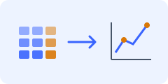

<section class="home-banner">

<h1>TabFORGE</h1>
Tabular Foundation Model for Generative Modelling

<h2>One foundation model, many downstream tasks</h2>

Generate, predict, embed, and complete mixed-type tables through a shared scikit-learn-style interface.

<a href="https://github.com/SilenceX12138/TabCamel">Data preparation · TabCamel</a> · <a href="https://github.com/SilenceX12138/TabEval">Evaluation · TabEval</a> · <a href="https://github.com/SilenceX12138/TabStruct">Structural fidelity · TabStruct</a>

<a class="button primary" href="getting_started.md">Getting Started</a><a class="button secondary" href="paper.md">NeurIPS 2026 Paper</a><a class="button secondary" href="https://github.com/SilenceX12138/TabFORGE">Source Code</a>

Install with <code>pip install tabforge-ml</code> · <a href="https://pypi.org/project/tabforge-ml/">PyPI</a>

<figure class="foundation-figure"></figure>

</section>

<section class="task-card">

<h3><a href="user_guide.md#generation">Generation</a></h3>
Create synthetic mixed-type tables with the fitted column schema.

<strong>Applications:</strong> Data augmentation in data-scarce settings, such as small patient cohorts or rare industrial-fault records. <strong>Estimator:</strong> <a href="public_estimator_api_estimators.md#tabforgegenerator">TabFORGEGenerator</a>

<a class="task-examples" href="tutorials.md#generation">Examples</a>
</section>
<section class="task-card">

<h3><a href="user_guide.md#prediction">Prediction</a></h3>
Predict class labels or continuous targets with uncertainty summaries.

<strong>Applications:</strong> Classify customer churn or equipment faults; estimate energy use or material properties. <strong>Estimator:</strong> <a href="public_estimator_api_estimators.md#tabforgeclassifier">Classifier · Regressor</a>

<a class="task-examples" href="tutorials.md#prediction">Examples</a>
</section>
<section class="task-card">

<h3><a href="user_guide.md#embedding">Embedding</a></h3>
Extract per-feature token embeddings or pool them into one embedding per row.

<strong>Applications:</strong> Feed row embeddings into a classifier, retrieve similar records, or visualise cohorts with PCA. <strong>Estimator:</strong> <a href="public_estimator_api_estimators.md#tabforgeembedder">TabFORGEEmbedder</a>

<a class="task-examples" href="tutorials.md#embedding">Examples</a>
</section>
<section class="task-card">

<h3><a href="user_guide.md#imputation">Imputation</a></h3>
Fill missing or selected cells while retaining observed values.

<strong>Applications:</strong> Complete unanswered survey fields or missing sensor measurements before analysis. <strong>Estimator:</strong> <a href="public_estimator_api_estimators.md#tabforgeimputer">TabFORGEImputer</a>

<a class="task-examples" href="tutorials.md#imputation">Examples</a>
</section>
<section class="task-card">

<h3><a href="user_guide.md#clustering">Clustering</a></h3>
Group similar rows using pooled tabular embeddings.

<strong>Applications:</strong> Segment customers by purchasing patterns or group experiments with similar measurements. <strong>Estimator:</strong> <a href="public_estimator_api_estimators.md#tabforgeclusterer-and-tabforgeanomalydetector">TabFORGEClusterer</a>

<a class="task-examples" href="tutorials.md#clustering">Examples</a>
</section>
<section class="task-card">

<h3><a href="user_guide.md#anomaly-detection">Anomaly detection</a></h3>
Score unusual rows in the pooled embedding space.

<strong>Applications:</strong> Flag unusual equipment readings or transaction records for further inspection. <strong>Estimator:</strong> <a href="public_estimator_api_estimators.md#tabforgeclusterer-and-tabforgeanomalydetector">TabFORGEAnomalyDetector</a>

<a class="task-examples" href="tutorials.md#anomaly-detection">Examples</a>
</section>

<section class="landing-container architecture-section">
<h2>Model architecture</h2>

The frozen <strong>Structure-aware Feature Encoder</strong> supplies contextual feature tokens. The <strong>Score-based Diffusion Transformer</strong> learns their latent distribution, and the <strong>Denoising-aligned Latent Decoder</strong> reconstructs mixed-type table values.

<figure class="paper-figure"></figure>

For the two-stage design, sampling workflow, and citation, see the <a href="paper.md">paper</a> and <a href="latent_diffusion_model.md">diffusion and decoding reference</a>.

</section>

<section class="home-more-info">

<section><h2>News</h2>
<strong>NeurIPS 2026.</strong> <em>TabFORGE: A Tabular Foundation Model for Generative Modelling</em> has been accepted at NeurIPS 2026. <a href="paper.md">Paper and citation</a>.

<strong>Pretrained backbone:</strong> <a href="https://huggingface.co/XiangjianJiang/TabFORGE">Download model weights</a>.
</section>
<section><h2>Documentation</h2><ul><li><a href="getting_started.md">Installation and first example</a></li><li><a href="user_guide.md">User Guide</a> · <a href="public_estimator_api.md">API Reference</a></li><li><a href="tutorials.md">Examples and Colab notebooks</a></li><li><a href="cli.md">Command-line workflows</a></li></ul></section>
<section><h2>Research &amp; development</h2>
Browse the <a href="https://github.com/SilenceX12138/TabFORGE">source repository</a> and <a href="development.md">development guide</a>. TabFORGE-owned code uses Apache 2.0; vendored components retain their upstream terms.
<a class="button orange" href="paper.md#citation">Cite TabFORGE</a></section>

</section>
