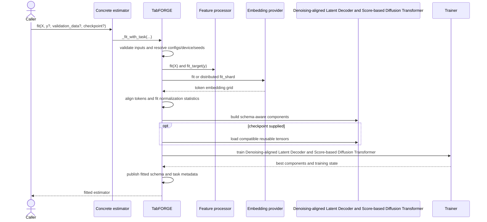
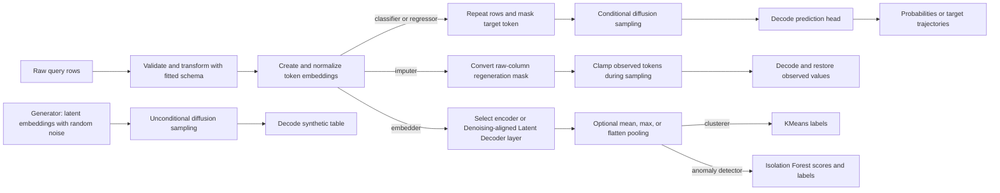
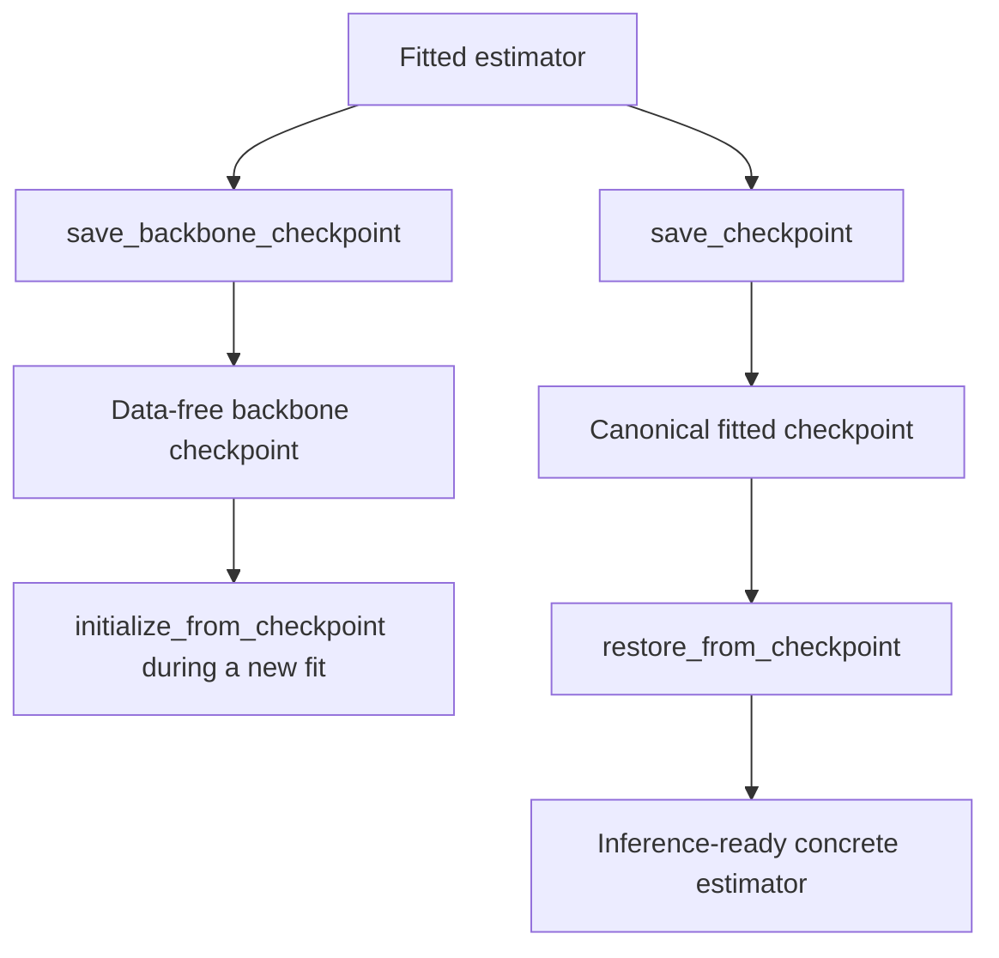

<h1 id="public-estimator-api">API Reference</h1>

The `tabforge.api` package is the user-facing Python interface to TabFORGE. It provides seven scikit-learn-style estimators for synthetic-table generation, classification, regression, embedding extraction, missing-value imputation, clustering, and anomaly detection. A shared fitted core coordinates schema handling, Structure-aware Feature Encoder embeddings, latent normalization, Denoising-aligned Latent Decoder and Score-based Diffusion Transformer training, sampling, distributed execution, and checkpoint persistence.

Applications normally import the concrete estimators and `restore_from_checkpoint` from `tabforge`. The `TabFORGE` base class is an internal implementation layer shared by those estimators.

## Architecture overview

<ol class="flow-cards">
<li><strong>Choose a task</strong>
Seven sklearn-style estimators expose generation, prediction, embedding, imputation, clustering, and anomaly detection.
</li>
<li><strong>Share the fitted core</strong>
The TabFORGE core resolves configuration, fits the schema and Structure-aware Feature Encoder, and builds Denoising-aligned Latent Decoder and Score-based Diffusion Transformer.
</li>
<li><strong>Train and reuse</strong>
The trainer coordinates optimization and distributed execution. Canonical checkpoints preserve fitted state for inference.
</li>
</ol>

The public classes remain task-focused while the base class owns fitted state and lifecycle ordering. This separation keeps schema, embedding, model, and serialization rules consistent across every workflow.

## Public surface

| Component | Primary methods | Role |
| --- | --- | --- |
| `TabFORGEGenerator` | `fit`, `generate` | Denoises latent embeddings with random noise and generates mixed-type rows. Supervised tasks return `(X, y)`; unsupervised generation returns `X`. |
| `TabFORGEClassifier` | `fit`, `predict_proba`, `predict` | Samples a masked target token repeatedly and averages decoded class probabilities. |
| `TabFORGERegressor` | `fit`, `predict_distribution`, `predict`, `predict_std`, `predict_interval` | Samples scalar target trajectories and exposes their mean, spread, and central intervals. |
| `TabFORGEEmbedder` | `fit`, `transform`, `flatten_embeddings`, `pool_embeddings` | Extracts encoder or Denoising-aligned Latent Decoder layers as token grids or pooled row embeddings. |
| `TabFORGEImputer` | `fit`, `transform` | Regenerates selected or missing cells while clamping observed feature tokens. |
| `TabFORGEClusterer` | `fit`, `fit_predict`, `predict` | Fits KMeans over pooled TabFORGE embeddings. |
| `TabFORGEAnomalyDetector` | `fit`, `score_samples`, `decision_function`, `predict` | Fits Isolation Forest over pooled TabFORGE embeddings with sklearn outlier labels. |
| `restore_from_checkpoint` | `restore_from_checkpoint` | Recreates the concrete fitted estimator encoded in a canonical checkpoint. |

All estimators accept pandas `DataFrame` or NumPy array features and expose fitted scikit-learn metadata such as `n_features_in_`, `feature_names_in_`, and `classes_` where applicable. Constructor configuration remains unfitted until `fit` runs.

## Sub-module documentation

The implementation has two cohesive sub-modules:

- [Shared lifecycle and checkpoint core](public_estimator_api_lifecycle.md) documents `TabFORGE` in `src/tabforge/api/base.py`. It covers owned fitted state, configuration resolution, preprocessing and embedding coordination, component construction, training delegation, latent sampling, distributed helpers, backbone transfer, exact checkpoint restoration, invariants, and extension points.
- [Task-specific public estimators](public_estimator_api_estimators.md) documents the seven classes in `src/tabforge/api/estimators.py`. It covers each fit and inference contract, estimator-specific options and return shapes, generation, prediction trajectories, embedding extraction, imputation aggregation, downstream heads, distributed behavior, constraints, and checkpointed inference settings.

The following sections retain the system-level flow. Use the linked pages for component-level behavior and maintenance details.

## Fit lifecycle

Every concrete estimator delegates fitting to the same ordered pipeline.

The feature processor records the raw schema and converts it to the numerical-first model layout. The embedding provider produces a three-dimensional `(rows, tokens, embedding_dimension)` grid. The core normalizes this grid, constructs schema-aware neural components, optionally initializes compatible weights, and delegates optimization to the training engine.

## Inference paths

Two mask conventions meet at the imputer boundary: the public cell mask uses `True` for values to regenerate, while the internal diffusion mask uses `True` for tokens that remain observed and clamped. `TabularFeatureProcessor.embedding_mask` handles the raw-column to token-order conversion.

Generation denoises latent embeddings with random noise, then decodes the clean embeddings into the fitted table schema. Save a complete fitted generator checkpoint to retain generation capability.

## Checkpoint roles

The API supports two distinct persistence workflows:

| Workflow | Method | Contents and use |
| --- | --- | --- |
| Reusable initialization | `save_backbone_checkpoint` and `initialize_from_checkpoint` | Transformer backbones plus architecture metadata. Current fitted preprocessing remains in place, and schema-dependent Denoising-aligned Latent Decoder heads follow the `detokeniser` policy. |
| Exact fitted restoration | `save_checkpoint` and `restore_from_checkpoint` | Model tensors, fitted processor, embedding statistics and provider context, resolved configuration, schema, and training progress. Generator checkpoints can also carry the fitted generation context. |

Backbone loading validates Denoising-aligned Latent Decoder and Score-based Diffusion Transformer architecture fields. The `detokeniser` setting controls schema-head reuse:

- `auto` loads compatible heads and reinitializes incompatible heads.
- `load` requires schema compatibility and raises an error on mismatch.
- `reinitialize` always keeps newly initialized schema-dependent heads.

Exact restoration additionally requires fitted preprocessing, estimator type, embedding-provider context, Denoising-aligned Latent Decoder state, diffusion state, and detokeniser state. Generation requires the complete fitted generator context.

## System integration

The API is the orchestration boundary across the main TabFORGE subsystems:

- [Configuration](configuration.md) defines validated architecture, embedding, diffusion, training, scheduler, and runtime settings. Nested values can be updated through scikit-learn-style keys such as `training_config__batch_size`.
- [Tabular feature processing](tabular_feature_processing.md) owns raw schema validation, target encoding, dense reconstruction layout, inverse transforms, dtype restoration, and mask conversion.
- [Structure-aware Feature Encoder](tabpfn_embedding_adapter.md) fits and applies the contextual embedding backend and serializes its fitted provider context.
- [Score-based Diffusion Transformer and Denoising-aligned Latent Decoder](latent_diffusion_model.md) supplies the Denoising-aligned Latent Decoder, Score-based Diffusion Transformer, EDM preconditioner, schedule, and Euler-Heun sampler.
- [Training orchestration](training_orchestration.md) optimizes Denoising-aligned Latent Decoder and diffusion phases and returns the fitted training state.

The API also integrates canonical checkpoint helpers and lightweight `torchrun` utilities. During distributed execution, rows or sample counts are divided across ranks, rank-local work runs independently, and gathered results are restored to source row order. Checkpoint files are written by rank zero.

## Important invariants

- `fit` must complete before inference, embedding transformation, generation, or checkpoint saving.
- Supervised tasks require `y`; unsupervised tasks reject `y`.
- Validation data is `(X_valid, y_valid)` for supervised tasks and `X_valid` or `(X_valid, None)` for unsupervised tasks.
- Query features must match the fitted raw schema.
- The resolved embedding dimension must match the provider output.
- Classification and regression sampling use one additional target token.
- `n_prediction_samples`, `n_imputation_samples`, `n_reference_neighbors`, `n_clusters`, and generation `n_samples` must be positive integers where applicable.
- Prediction batches are bounded by token count and trajectory count to control memory use for wide tables.
- A requested CUDA device requires CUDA availability; distributed CUDA workers use their local rank.

## Source files

- `src/tabforge/api/base.py`: shared fitting, inference, component construction, distributed embedding work, and checkpoint lifecycle.
- `src/tabforge/api/estimators.py`: public task-specific estimator contracts and result formatting.
- `src/tabforge/api/__init__.py`: API exports.
- `src/tabforge/__init__.py`: package-level exports for end users.
