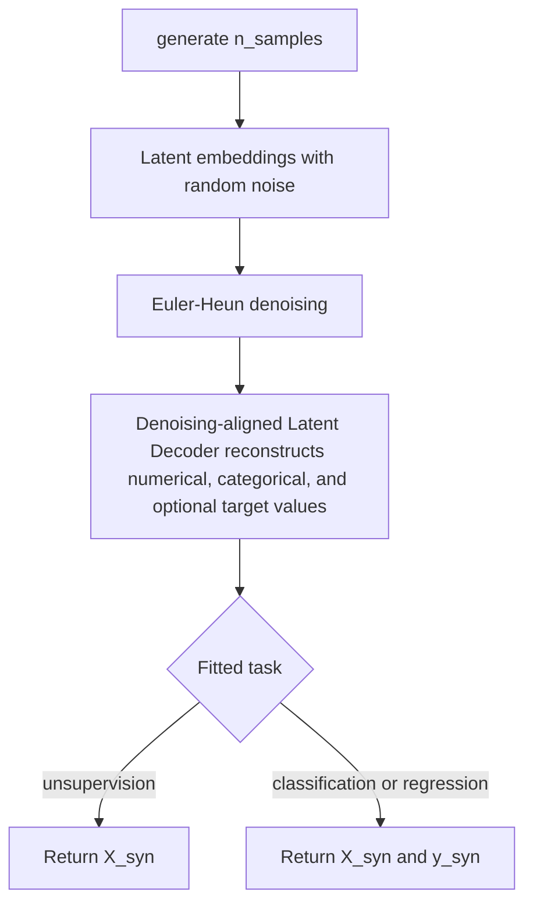
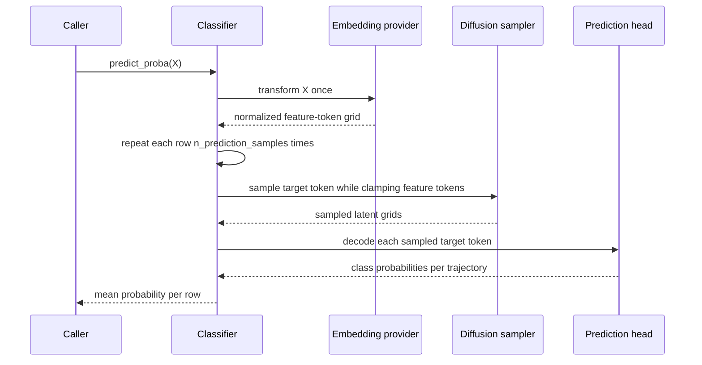
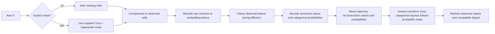

# Task-specific public estimators

`src/tabforge/api/estimators.py` defines the seven user-facing, sklearn-style TabFORGE estimators. Each class presents a narrow workflow—generation, classification, regression, embedding, imputation, clustering, or anomaly detection—while delegating fitted state, preprocessing, model construction, training, latent sampling, decoding, and checkpoint handling to `tabforge.api.base.TabFORGE`.

The classes accept pandas `DataFrame` and two-dimensional NumPy inputs. A fitted feature processor preserves the training schema and maps raw columns into the numerical-first token layout used by the latent model.

See the [public estimator API overview](public_estimator_api.md) for the module's system-level position and [shared lifecycle and checkpoint core](public_estimator_api_lifecycle.md) for the complete `TabFORGE` base-class mechanics. This page focuses on the contracts and behavior added by the concrete estimators.

## Component map

| Shared core | Task-specific subclasses |
| --- | --- |
| `TabFORGE`: configuration, fitting, embeddings, sampling, decoding, and checkpoint methods | `TabFORGEGenerator`, `TabFORGEClassifier`, `TabFORGERegressor`, `TabFORGEEmbedder`, `TabFORGEImputer`, `TabFORGEClusterer`, `TabFORGEAnomalyDetector` |

See [Estimator selection](#estimator-selection) for each subclass's fit task, inference methods, and output.

All seven classes inherit sklearn parameter discovery and nested `set_params` behavior from the shared core. The task-specific classes add classifier, regressor, transformer, clusterer, or outlier mixins where applicable.

## Shared fit lifecycle

Every public `fit` method selects a task and calls `TabFORGE._fit_with_task`.

```mermaid
flowchart LR
    A[Raw X and optional y] --> B[Validate task and validation_data]
    B --> C[Resolve configuration, device, and random state]
    C --> D[Fit TabularFeatureProcessor]
    D --> E[Fit TabPFNEmbeddingProvider]
    E --> F[Align and normalize token embeddings]
    F --> G[Build Denoising-aligned Latent Decoder, Score-based Diffusion Transformer, and EDM wrapper]
    G --> H{Checkpoint selected?}
    H -->|yes| I[Load compatible backbone and optional detokeniser]
    H -->|no| J[Keep fresh initialization]
    I --> K[Train Denoising-aligned Latent Decoder and diffusion]
    J --> K
    K --> L[Restore best states and publish fitted metadata]
```

Common constructor options are:

| Option                 | Role                                                                                             |
| ---------------------- | ------------------------------------------------------------------------------------------------ |
| `categorical_features` | Raw column names or integer positions that should be treated as categorical.                     |
| `embedding_config`     | Controls the encoder embedding provider and its fitting context.                                  |
| `architecture_config`  | Controls Denoising-aligned Latent Decoder and Score-based Diffusion Transformer dimensions and Transformer structure.                              |
| `diffusion_config`     | Controls EDM noise levels, schedule, and sampler behavior.                                       |
| `training_config`      | Controls optimization, phases, masking, validation, and batch sizes.                             |
| `runtime_config`       | Selects device, distributed strategy, determinism, and logging behavior.                         |
| `random_state`         | Default seed for fitting and stochastic inference. A per-call seed overrides it where supported. |
| `logger`               | Reuses an existing W&B run or compatible logging object during training.                         |

The default `checkpoint="pretrained"` initializes compatible model components from the official backbone. `checkpoint=path` selects a canonical local checkpoint, and `checkpoint=None` starts from fresh component initialization. The explicit mock embedding backend bypasses the official checkpoint because its architecture is intentionally fixture-sized. `detokeniser` accepts `"auto"`, `"load"`, or `"reinitialize"` and controls reuse of schema-dependent Denoising-aligned Latent Decoder heads.

Validation input follows the task contract:

- Classification and regression require `(X_valid, y_valid)`.
- Unsupervised fitting accepts `X_valid` or `(X_valid, None)`.
- Validation rows affect model selection and scheduler behavior; they are held out from the fitted training context.

After fitting, estimators expose shared schema metadata such as `n_features_in_`, `feature_names_in_`, `feature_schema_`, and resolved configuration attributes ending in `_`. Classifiers also expose `classes_`.

## Estimator selection

| Estimator                 | Fit task                                                  | Primary inference                                        | Output                                                      |
| ------------------------- | --------------------------------------------------------- | -------------------------------------------------------- | ----------------------------------------------------------- |
| `TabFORGEGenerator`       | Explicit classification, regression, or `"unsupervision"` | `generate(n_samples)`                                    | Feature table, or `(X_syn, y_syn)` for supervised tasks     |
| `TabFORGEClassifier`      | Classification                                            | `predict_proba(X)`, `predict(X)`                         | Class-probability matrix or label vector                    |
| `TabFORGERegressor`       | Regression                                                | `predict_distribution(X)` and summaries                  | Sample matrix, mean, standard deviation, or interval bounds |
| `TabFORGEEmbedder`        | Explicit classification, regression, or `"unsupervision"` | `transform(X, source=..., layer=..., pooling=...)`       | Token grid or pooled row matrix                             |
| `TabFORGEImputer`         | `"unsupervision"`                                         | `transform(X, mask=...)`                                 | Completed table in the fitted container form                |
| `TabFORGEClusterer`       | `"unsupervision"`                                         | `fit_predict(X)`, `predict(X)`                           | Integer cluster labels                                      |
| `TabFORGEAnomalyDetector` | `"unsupervision"`                                         | `score_samples(X)`, `decision_function(X)`, `predict(X)` | Normality scores or `+1`/`-1` labels                        |

## `TabFORGEGenerator`

The generator learns a latent distribution over an entire table. Generation denoises latent embeddings with random noise and decodes the resulting embeddings into synthetic rows.

### Fit contract

- `task` is required at construction and must be `"classification"`, `"regression"`, or `"unsupervision"`.
- Classification and regression require a target `y`; unsupervision requires `y=None`.
- `observation_masking=False` disables conditional masks during generator training. Setting it to `True` explicitly trains with observation-mask examples.

### Generation flow

`generate` requires a positive `n_samples` and a fully fitted generator. Save with the default `save_checkpoint` settings to retain its generation context. Passing `include_reference_embeddings=False` creates a restorable checkpoint with generation disabled.

For pandas training data, decoded features are returned as a `DataFrame` with fitted columns and compatible dtypes. Supervised targets are decoded through the fitted target processor.

### Design boundaries

- Generated samples follow the fitted table schema.
- Fitted generation context derives from training data and contributes to checkpoint size.

## `TabFORGEClassifier`

The classifier treats the target as an unobserved final token. Query feature tokens are embedded once, repeated `n_prediction_samples` times, and clamped as observed while diffusion regenerates the target token.

### Fit and inference contract

- `fit(X, y)` always selects classification and requires one-dimensional class labels.
- `n_prediction_samples` defaults to 32 and must be a positive integer. It trades inference cost and memory for a larger trajectory ensemble.
- `predict_proba(X)` returns shape `(n_rows, n_classes)` in `classes_` order.
- `predict(X)` applies `argmax` to those probabilities and maps indices back through `classes_`.
- `random_state` on prediction controls target-token sampling for reproducible calls.

Training asks the shared trainer to learn a lightweight target predictor. With at least 20 training rows, fitting subsequently transfers a scikit-learn `MLPClassifier` into the Denoising-aligned Latent Decoder's two-layer prediction head. Smaller datasets retain the head learned by the shared training phase.

The returned probabilities are trajectory averages produced by the learned diffusion and prediction head. They should be evaluated for calibration on the target application.

## `TabFORGERegressor`

The regressor uses the same masked target-token process as the classifier and retains every decoded trajectory so callers can inspect its empirical predictive distribution.

### Fit and inference contract

- `fit(X, y)` always selects regression and requires a one-dimensional continuous target.
- `n_prediction_samples` defaults to 32 and must be positive.
- `predict_distribution(X)` returns shape `(n_rows, n_prediction_samples)` in the original target scale.
- `predict(X)` returns the row-wise trajectory mean.
- `predict_std(X)` returns the row-wise population standard deviation (`ddof=0`).
- `predict_interval(X, alpha=0.05)` returns shape `(n_rows, 2)` containing the `alpha / 2` and `1 - alpha / 2` trajectory quantiles. `alpha` must lie strictly between zero and one.

After joint Denoising-aligned Latent Decoder/diffusion training, `RidgeCV` fits a scalar target head from normalized target-token latents, using logarithmically spaced regularization strengths from `1e-3` through `1e3`.

Trajectory standard deviations and intervals summarize stochastic model samples. The implementation does not add a conformal or coverage-calibration stage, so the interval bounds do not promise nominal frequentist coverage.

## `TabFORGEEmbedder`

The embedder exposes the fitted embedding provider as an sklearn transformer. Its output is the aligned, full token grid before latent normalization and diffusion sampling.

### Fit and transform contract

- `task` is required and follows the same three explicit values as the generator.
- Supervised tasks require `y`; unsupervision requires `y=None`.
- `transform(X)` and the inherited `full_embeddings(X)` return shape `(n_rows, n_tokens, embedding_dimension)`.
- `source="encoder"` selects the Structure-aware Feature Encoder; `source="decoder"` selects the Denoising-aligned Latent Decoder. `layer` selects a zero-based intermediate layer of that component.
- `pooling=None`, `"mean"`, `"max"`, or `"flatten"` returns a token grid, compact row vectors, or flattened token coordinates.
- Supervised embedders also support `pooling="label"`, which selects the fitted
  `target_token_position_` exactly and returns one embedding vector per row.
- Supervised layouts include a target-token position. Query transformations that contain feature tokens only are padded to that fitted layout.
- `flatten_embeddings(embeddings)` returns `(n_rows, n_tokens * embedding_dimension)`.
- `pool_embeddings(embeddings, method="mean")` and `method="max"` return `(n_rows, embedding_dimension)`.

Flattening and pooling require a three-dimensional array. Once the embedder is fitted, both helpers also require the token and embedding axes to match `embedding_shape_`. Pooling offers only `"mean"` and `"max"`; callers needing attention pooling or feature selection should implement that downstream.

Although inference only exposes embeddings, `fit` still executes the shared Denoising-aligned Latent Decoder and Score-based Diffusion Transformer training lifecycle. This gives the embedder the same checkpoint and fitted-state behavior as the other public estimators.

## `TabFORGEImputer`

The imputer performs conditional diffusion over selected feature tokens. It is fitted without a target and returns reconstructed values in the same table-container form as the query `X`.

### Fit and transform contract

- `fit(X, y=None)` rejects any non-`None` target and selects unsupervision.
- `n_imputation_samples` defaults to 32 and must be a positive integer.
- With `mask=None`, `transform` regenerates cells detected as missing by pandas `isna` semantics.
- With an explicit mask, the mask must have the same shape as `X` and completely defines which cells may be regenerated.
- If no cell is selected, `transform` returns a copy without running diffusion.

### Mask semantics

The public and internal mask conventions are intentionally opposite:

| Layer                                 | `True` means                 | Ordering                                             |
| ------------------------------------- | ---------------------------- | ---------------------------------------------------- |
| Public `transform(..., mask=mask)`    | Regenerate this cell         | Raw input column order                               |
| Internal diffusion `observation_mask` | Clamp this token as observed | Fitted embedding-token order, numerical tokens first |

`TabularFeatureProcessor.embedding_mask` performs the raw-column to embedding-token reordering. The estimator passes the complement of the public missing/regeneration mask into that conversion.

With multiple trajectories, numerical cells are aggregated by arithmetic mean. Categorical softmax probabilities are averaged before one final argmax and inverse transformation. Observed values are restored after aggregation. A supplied mask can select cells that already contain values; those values are eligible for replacement. Missing cells outside a supplied mask are treated as observed according to the explicit mask contract.

## `TabFORGEClusterer` and `TabFORGEAnomalyDetector`

Both downstream estimators fit TabFORGE in unsupervised mode and expose
`representation_source`, `representation_layer`, and `representation_pooling`.
The layer accepts a physical index or the relative encoder policies `"middle"`
and `"final"`; fitted estimators record the resolved physical layer. The
clusterer uses KMeans and the anomaly detector uses Isolation Forest. Their
fitted sklearn heads and embedding configuration are included in exact
fitted checkpoints. Historical encoder-layer-7/flatten benchmark outputs are
excluded from current embedding selection.

The clusterer sets `labels_` during `fit`, predicts cluster assignments for new rows, and supports `fit_predict`. The anomaly detector follows sklearn's score orientation and label convention: larger `score_samples` and `decision_function` values indicate greater normality, `+1` means inlier, and `-1` means anomaly.

## Conditional target sampling shared by classifier and regressor

Classifier and regressor inference use a token budget to bound memory. The maximum query batch is computed as `131072 // ((n_features_in_ + 1) * n_prediction_samples)`, with a minimum of one row. Each query batch is embedded once before trajectories are repeated.

The sampler initializes every repeated grid by adding `sigma_init` noise. Feature tokens have internal observation-mask value `True`, while the final target token is `False`. Euler-Heun sampling repeatedly restores observed feature tokens and evolves the target token; the lightweight prediction head then decodes that sampled token.

## Distributed behavior

When distributed execution is active, public inference methods coordinate all ranks:

| Operation                        | Partitioning and gathering behavior                                                                                                                                                                                   |
| -------------------------------- | --------------------------------------------------------------------------------------------------------------------------------------------------------------------------------------------------------------------- |
| `generate`                       | Splits the requested output count across ranks, derives a distinct rank seed, generates locally, then concatenates rank-local tables or `(X, y)` pairs. Ranks assigned zero rows return schema-correct empty results. |
| `predict_proba`                  | Shards query row indices, offsets explicit seeds by rank, predicts locally, gathers arrays, and writes results back to original row positions.                                                                        |
| `predict_distribution`           | Uses the same indexed sharding and row-order restoration as classification.                                                                                                                                           |
| `transform` on the imputer       | Shards both data and any explicit mask, imputes locally, then gathers in source-row order. Distributed pandas gathering resets the result to a range index.                                                           |
| `transform` on the embedder      | Uses the shared core's indexed embedding gather and restores original row order.                                                                                                                                      |
| Clustering and anomaly inference | Extracts and gathers the shared pooled embedding before applying the fitted downstream head.                                                                                                                     |

Generation maps a base seed to `base_seed * world_size + rank`, preventing rank overlap for a fixed world size. Classification, regression, and imputation add the rank to an explicit per-call seed. Results can therefore change when the distributed world size changes even when the base seed is held fixed.

## Checkpoint interaction

The [shared lifecycle documentation](public_estimator_api_lifecycle.md#checkpoint-lifecycle) describes checkpoint structure, transfer initialization, detokeniser compatibility, and exact restoration in detail. At the estimator layer, each class serializes the inference settings needed to reconstruct its public behavior:

| Estimator        | Saved inference state                                                    |
| ---------------- | ------------------------------------------------------------------------ |
| Generator        | `n_reference_neighbors`, `observation_masking`                           |
| Classifier       | `n_prediction_samples`                                                   |
| Regressor        | `n_prediction_samples`                                                   |
| Embedder         | Explicit `task` through the common checkpoint task field                 |
| Clusterer        | `n_clusters`, embedding source/layer/pooling, and resolved layer    |
| Anomaly detector | `contamination`, embedding source/layer/pooling, and resolved layer |
| Imputer          | `n_imputation_samples`                                                   |
| Clusterer        | `n_clusters` and the fitted KMeans head                                  |
| Anomaly detector | `contamination` and the fitted Isolation Forest head                     |

Calling the module-level `restore_from_checkpoint` resolves the concrete estimator type recorded in the checkpoint. Calling a concrete class's `restore_from_checkpoint` rejects checkpoints produced by a different estimator type. Exact fitted restoration requires preprocessing state, embedding-provider context, Denoising-aligned Latent Decoder and diffusion state, and detokeniser state. Clustering and anomaly checkpoints additionally restore their fitted downstream head. Non-generator checkpoints omit the fitted generation context because their inference paths do not use it.

## Operational constraints and failure modes

- Inference requires a completed fit or a fitted canonical checkpoint restoration.
- Query tables must match the fitted raw feature schema. Embedding grids must match the fitted token and dimension axes when passed to pooling or flattening helpers.
- `X` must be a pandas `DataFrame` or NumPy array with at least one training row. Supervised targets must align row-for-row with `X`.
- The code uses the exact task spelling `"unsupervision"`.
- Increasing prediction or imputation trajectory counts increases sampling work approximately linearly. Supervised prediction batches are bounded by token count; imputation trajectories are processed sequentially.
- Deterministic seeds control owned random streams. Device kernels, dependency versions, checkpoint contents, and distributed topology also influence reproducibility.
- Complete fitted generator checkpoints should be handled as dataset-bearing artifacts. A backbone-only checkpoint excludes fitted schema, preprocessing, and reference data and cannot serve standalone inference.

## Source and adjacent components

- Public task interfaces: `src/tabforge/api/estimators.py`
- [Public estimator API overview](public_estimator_api.md)
- [Shared fitted lifecycle](public_estimator_api_lifecycle.md): `src/tabforge/api/base.py`
- Raw schema processing and mask reordering: `src/tabforge/feature_processing/processor.py`
- Embedding provider: `src/tabforge/embeddings/provider.py`
- Denoising-aligned Latent Decoder and Score-based Diffusion Transformer: `src/tabforge/models/components.py`
- EDM sampling: `src/tabforge/models/diffusion.py`
- Training orchestration: `src/tabforge/training/trainer.py`
