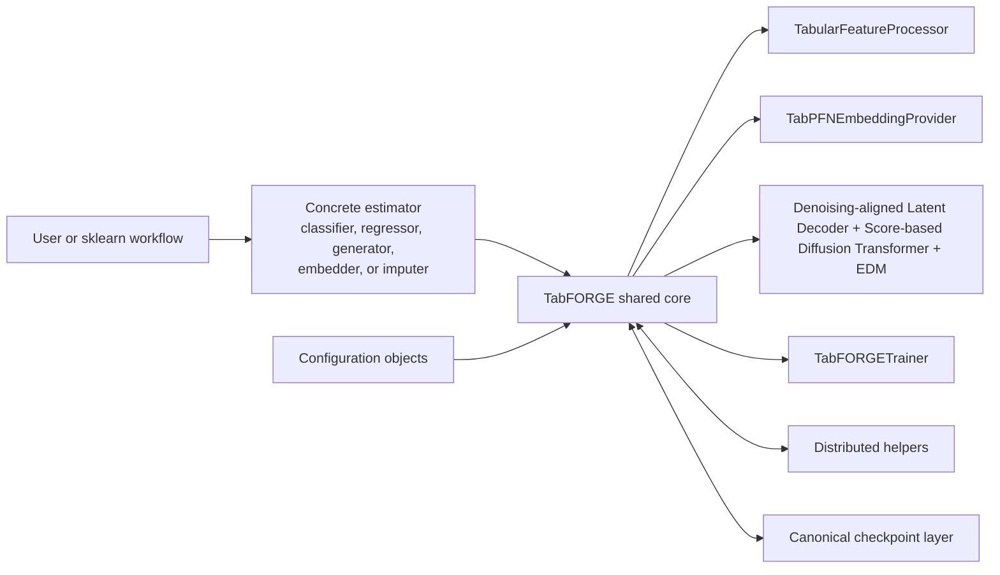
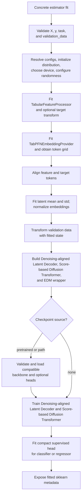
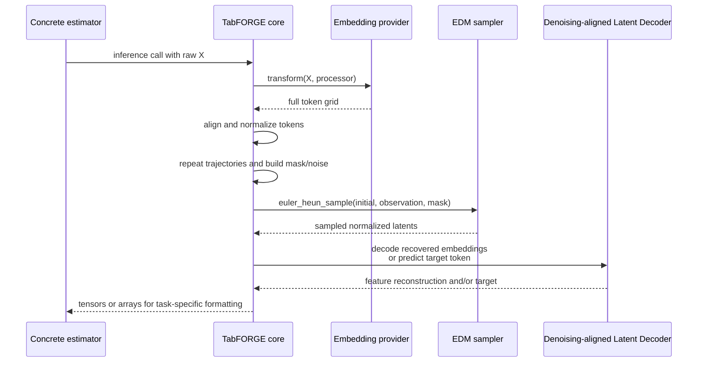
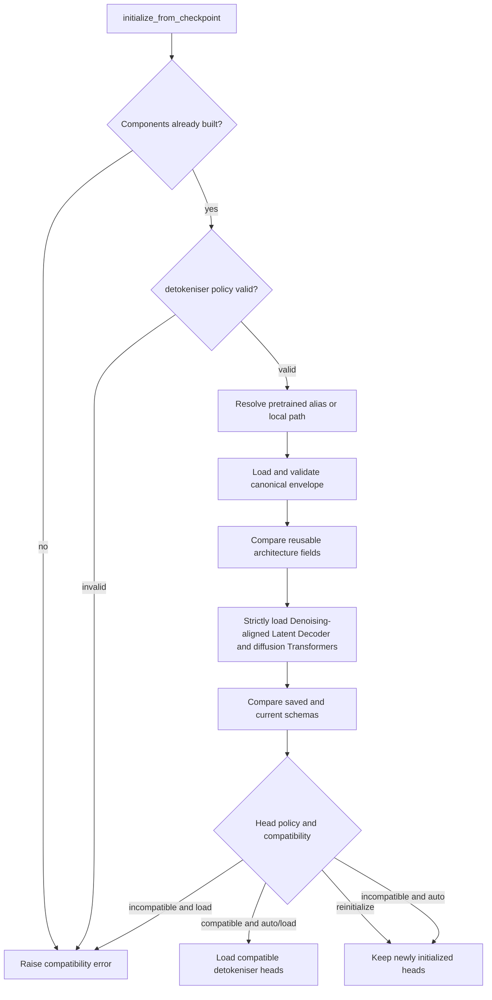
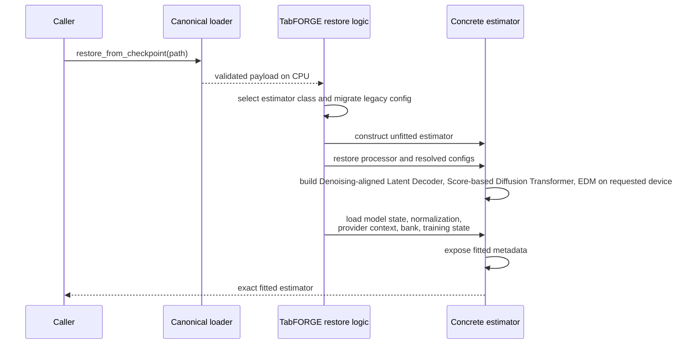

# Public Estimator API: Shared Lifecycle and Checkpoint Core

## Purpose

`src/tabforge/api/base.py` defines `TabFORGE`, the internal sklearn-compatible base class used by every public TabFORGE estimator. It centralizes the stateful work that is common to classification, regression, generation, embedding, and imputation:

- resolving immutable configuration objects and runtime settings;
- fitting the raw feature schema and the embedding-provider context;
- normalizing token embeddings;
- constructing the Denoising-aligned Latent Decoder, diffusion Score-based Diffusion Transformer, and EDM wrapper;
- delegating optimization to the training engine;
- preparing conditional latent trajectories, sampling them, and decoding results;
- saving transferable backbones or complete fitted checkpoints; and
- restoring a concrete fitted estimator without refitting.

Concrete estimators in `src/tabforge/api/estimators.py` supply task-specific public methods and small policy hooks. `TabFORGE` owns the fitted state and lifecycle those methods share.

Return to the [public estimator API overview](public_estimator_api.md) for the module-level architecture and estimator entry points.

## Position in the system

The base class is the integration boundary between the user-facing estimator layer and the lower-level embedding and diffusion subsystems. It keeps raw-table semantics in `TabularFeatureProcessor`, delegates token extraction to `TabPFNEmbeddingProvider`, and passes normalized latent grids plus dense reconstruction targets to `TabFORGETrainer`. During inference, it applies the configured diffusion schedule through `EDMPreconditioner` and `euler_heun_sample`, then sends recovered embeddings through `TabFORGEDecoder`.

## Owned fitted state

Constructor arguments remain sklearn-visible and unfitted. A successful fit resolves them into underscore-suffixed runtime state:

| State | Responsibility |
| --- | --- |
| `embedding_config_`, `architecture_config_`, `diffusion_config_`, `training_config_`, `runtime_config_` | Validated, immutable configuration used by the fitted model. |
| `feature_processor_` | Raw schema, categorical domains, numerical/categorical ordering, target encoding, reconstruction layout, and inverse transforms. |
| `embedding_provider_` | Fitted Structure-aware Feature Encoder context used to embed training, validation, and query rows. |
| `embedding_shape_`, `embedding_dimension_` | Resolved token-grid shape and latent width. |
| `embedding_mean_`, `embedding_std_` | Per-token latent normalization statistics. Standard deviations below `1e-6` are replaced with `1.0`. |
| `decoder_` | Schema-aware Denoising-aligned Latent Decoder with reusable Transformer state and schema-dependent output heads. |
| `denoiser_` | Variable-column, noise-conditioned diffusion Transformer. |
| `edm_` | EDM preconditioning wrapper around `denoiser_`. |
| `training_state_` | Completed training progress and best validation losses. |
| `task_` | Resolved `classification`, `regression`, or `unsupervision` contract. |
| `n_features_in_`, `feature_names_in_`, `feature_schema_`, `classes_` | sklearn-facing fitted metadata; `classes_` exists only for classification. |
| `_device_`, `_fitted_`, `generation_capable_` | Concrete runtime device and inference capability flags. |

The distinction between constructor fields such as `training_config` and fitted fields such as `training_config_` is significant. `set_params()` changes constructor parameters for a future fit; inference and checkpoint serialization use the resolved underscore-suffixed state.

## Fit lifecycle

Concrete estimators call `_fit_with_task(X, y, task, ...)`. The method performs the complete lifecycle in dependency order.

### 1. Validate inputs and task contract

`_validate_fit_input()` accepts pandas `DataFrame` and NumPy array inputs, requires at least one row, and checks target length. Classification and regression require `y`; unsupervised fitting rejects it. `_unpack_validation_data()` requires a supervised `(X_valid, y_valid)` pair for supervised tasks and accepts either `X_valid` or `(X_valid, None)` for unsupervision.

### 2. Resolve runtime configuration

`_resolve_fit_configuration()` converts configuration mappings or `None` into their typed config objects, initializes a `torchrun` process group when requested by the environment, resolves the rank-local device, seeds owned random sources, and records `task_`.

`set_params()` supports sklearn-style nested keys such as `diffusion_config__num_steps`. Nested updates replace the frozen configuration object through its own `set_params()` method. Other parameters are passed to `BaseEstimator.set_params()`.

### 3. Fit preprocessing and embedding context

`_fit_embedding_context()`:

1. fits `TabularFeatureProcessor` to preserve raw schema and establish the numerical-first token layout;
2. fits target encoding for supervised tasks;
3. constructs `TabPFNEmbeddingProvider` with the processor's categorical embedding positions;
4. requests the architecture's explicit embedding dimension when configured; and
5. obtains one token grid shaped `(rows, tokens, embedding_dimension)`.

For regression, the public regressor uses a standard target transform, while other supervised estimator types use a quantile transform. The embedding provider receives no target for unsupervision. In distributed execution, every rank fits shared provider context and extracts an interleaved row shard; `_gather_indexed_arrays()` reconstructs the original row order before `finalize_fit()` stores the complete provider result.

`_align_embedding_tokens()` enforces the Denoising-aligned Latent Decoder token contract. It accepts an exact grid, appends one zero target token when a supervised provider returns feature tokens only, and truncates extra trailing tokens. Too few feature tokens or an invalid grid rank raises `EmbeddingCapabilityError`.

### 4. Normalize latents and prepare validation data

`_normalize_training_embeddings()` records the resolved embedding width, checks it against an explicitly configured `embedding_dimension`, computes per-token mean and standard deviation, and returns normalized latents. Validation data is embedded through the already fitted provider and normalized with training statistics; no validation state is fitted.

### 5. Build and optionally initialize components

`_build_components()` constructs components in this order:

1. `TabFORGEDecoder`, parameterized by the processor's numerical/categorical token positions and target representation;
2. `VariableColumnDenoiser`, sized to the task-specific token count; and
3. `EDMPreconditioner`, wrapping the Score-based Diffusion Transformer with `sigma_data`.

All components move to `_device_`. Generators additionally retain their fitted generation context for standalone inference.

If `checkpoint` is supplied, `initialize_from_checkpoint()` loads compatible reusable state before training. The explicit mock embedding backend skips the default official checkpoint because its encoder and backbone dimensions are intentionally fixture-specific.

### 6. Train and finalize

`_train_components()` creates `TabFORGETrainer` and supplies normalized latents, dense reconstruction targets, schema widths, normalization statistics, optional validation tensors, masking policy, and supervised prediction-head policy. For wide supervised tables, `_adapt_supervised_training_batch_size()` caps each step to approximately 131,072 tokens.

After neural training, classifiers with at least 20 rows fit an `MLPClassifier` and copy its weights into the Denoising-aligned Latent Decoder's two-layer prediction head. Regressors fit `RidgeCV` and copy the selected linear model into the scalar target head. `_finalize_fit_metadata()` exposes the fitted schema and marks the estimator fitted.

## Shared inference services

The base class offers primitives used by the public estimator methods. It deliberately leaves output aggregation and estimator-specific return types to the subclasses.

### Embedding transformation

`full_embeddings(X)` checks fitted state, transforms query rows through the fitted provider, aligns the returned token grid, and returns a NumPy array. Active distributed processes transform interleaved row shards and gather them back into source order.

### Conditional target preparation

`_conditional_feature_latents()` embeds and normalizes each query row once. `_prepare_conditional_latents_from_features()` then repeats each row for the requested trajectory count, marks every feature token observed, leaves the final target token unobserved, and adds `sigma_init` noise from an operation-specific generator.

Prediction batching uses `_prediction_batch_size()` to keep the product of rows, token count, and trajectory count near the same 131,072-token budget used during supervised fitting.

### Diffusion sampling

`_sampling_schedule()` creates a descending power-mean/Karras schedule from a clamped `sigma_init` down to `sigma_min`, followed by terminal zero. `_sample_latents()` switches the EDM wrapper to evaluation mode and runs Euler sampling with optional Heun correction, stochastic churn, observation values, and an observed-token mask.

The internal mask polarity is fixed: `True` means observed and therefore clamped throughout sampling. Public imputation masks use `True` to request regeneration; the imputer and feature processor convert polarity and raw-column order before calling this core.

### Decoding

`_decode()` converts normalized samples back to the embedding scale, runs the Denoising-aligned Latent Decoder, writes numerical values and categorical probabilities into the processor's dense reconstruction layout, and returns an optional target output. Classification targets are softmax-normalized.

`_decode_prediction_target()` uses the Denoising-aligned Latent Decoder's lightweight target predictor directly on normalized sampled latents. It returns class probabilities for classification and scalar transformed targets for regression; the regressor subclass applies the processor's inverse target transform.

## Checkpoint lifecycle

The module supports two intentionally different artifacts.

| Operation | Intended use | Included state | Excluded or optional state |
| --- | --- | --- | --- |
| `save_backbone_checkpoint(path)` | Transfer learning into a newly fitted dataset/schema | decoder transformer parameters, Score-based Diffusion Transformer parameters, resolved architecture including embedding width | Processor, provider context, normalization, token identities, observation-mask parameters, output heads, generation context, training progress |
| `save_checkpoint(path, include_reference_embeddings=...)` | Exact fitted-model restoration for inference | Complete Score-based Diffusion Transformer state, decoder transformer, detokeniser heads, processor, normalization, provider context, resolved config, schema, and training metadata | Reference bank is policy-controlled and defaults to included only for generators |

Both operations use the versioned canonical envelope from `tabforge.checkpoints`. A destination without a `.pt` suffix is treated as a directory and receives `checkpoint.pt`. During distributed execution, only rank zero writes the payload.

### Transfer initialization

Reusable architecture checks cover Denoising-aligned Latent Decoder and Score-based Diffusion Transformer depth, attention heads, feed-forward factors, and resolved embedding dimension. Transformer loading requires the exact expected key set, shapes, and dtypes. Compatible non-Transformer Score-based Diffusion Transformer conditioning state may also load when present. Denoising-aligned Latent Decoder output heads follow the separate detokeniser policy:

- `auto` loads available heads only when structural schema compatibility succeeds;
- `load` requires compatibility and raises on a mismatch; and
- `reinitialize` always preserves the new schema-specific heads.

Schema compatibility compares numerical/categorical counts, feature types, categorical cardinalities, model feature order, target type, and target representation. Column labels and other non-structural metadata do not drive head compatibility.

### Exact fitted restoration

`restore_from_checkpoint(path, device="auto")` loads the canonical payload, dispatches to the concrete estimator class named by `config["estimator_type"]`, reconstructs its public constructor options, restores the fitted processor and resolved configs, builds empty components, then loads all required state.

A fitted restoration requires serialized preprocessing, estimator type, Denoising-aligned Latent Decoder state, full diffusion state, detokeniser state, embedding statistics, embedding-provider context, and a valid two-dimensional embedding shape. Restoring through a concrete subclass also verifies that the checkpoint estimator type matches that subclass. A generator restored without a generation context remains usable only for operations that do not require unconditional generation; `generation_capable_` is false.

Legacy checkpoints with shared scheduler fields are migrated by `_migrate_training_config()` into separate Denoising-aligned Latent Decoder and diffusion scheduler mappings before the current configuration dataclass is built.

## Component and API reference

### Public or user-reachable methods

| API | Contract |
| --- | --- |
| `set_params(**params)` | Supports direct sklearn parameters and nested `config__field` updates. Returns `self`. |
| `full_embeddings(X)` | Returns the fitted, aligned token grid with shape `(rows, tokens, embedding_dimension)`. |
| `save_backbone_checkpoint(path)` | Writes data-free reusable Transformer weights after a successful fit. |
| `initialize_from_checkpoint(path="pretrained", detokeniser="auto")` | Initializes already-built components during a new fit while preserving current dataset state. |
| `save_checkpoint(path, include_reference_embeddings="auto")` | Writes the complete fitted canonical checkpoint. |
| `TabFORGE.restore_from_checkpoint(path, device="auto")` | Restores the concrete estimator encoded in a fitted checkpoint. |
| module-level `restore_from_checkpoint(path, device="auto")` | Convenience entry point delegating to the class method. |

### Important subclass seams

| Hook or attribute | Default behavior | Subclass role |
| --- | --- | --- |
| `_estimator_type_name` | `"base"` | Supplies the serialized estimator identity. |
| `_supports_generation_estimator()` | True only when the identity is `"generator"` | Controls retention and checkpoint inclusion of the generation context. |
| `_uses_conditional_masking()` | Enabled for estimators other than the generator | Generator overrides this with its `observation_masking` option. |
| `_inference_checkpoint_config()` | Empty mapping | Stores estimator-specific inference settings. |
| `_fit_with_task(...)` | Shared implementation | Concrete `fit()` validates its own constructor options and selects a task. |
| `_prepare_conditional_latents*()`, `_sample_latents()`, `_decode*()` | Shared primitives | Prediction and imputation methods compose these into their public behavior. |

### Internal helpers

- `_checkpoint_destination()` normalizes file-or-directory checkpoint paths.
- `_extract_detokeniser_state()` selects numerical, categorical, target, and prediction heads from Denoising-aligned Latent Decoder state.
- `_estimator_class()` resolves serialized estimator identities lazily to avoid import cycles.
- `_inference_constructor_args()` reconstructs estimator-specific constructor arguments.
- `_training_state_from_payload()` recreates `TabFORGETrainingState` when progress exists.
- `_slice_rows()` and `_gather_indexed_arrays()` preserve original row order across distributed embedding work.
- `_write_rank_zero()` prevents duplicate checkpoint writes under `torchrun`.

## Invariants and failure conditions

### Fitted-state and schema invariants

- Inference and serialization require `_fitted_`; otherwise `_check_fitted()` raises `RuntimeError`.
- Query inputs must match the processor's fitted raw schema. Schema validation and dtype restoration live in `TabularFeatureProcessor`.
- Latents are always three-dimensional grids. The token count follows the fitted task, and the final token is the target for supervised tasks.
- `embedding_dimension` is inferred from provider output unless configured explicitly. An explicit mismatch raises `ValueError` before model construction.
- Denoising-aligned Latent Decoder inputs are denormalized embeddings; diffusion and prediction-head inputs remain in normalized latent space.
- Only generators retain the fitted generation context. Requesting its inclusion for another estimator raises `ValueError`.

### Checkpoint invariants

- Canonical checkpoints use `.pt` and the exact `tabforge-checkpoint-v1` envelope.
- The component map must contain `decoder`, `diffusion`, and `detokeniser` mappings, even when the detokeniser is empty for a backbone artifact.
- Exact restoration rejects a backbone-only artifact because fitted preprocessing and estimator configuration are absent.
- Exact restoration requires Denoising-aligned Latent Decoder, diffusion, and detokeniser state. Missing provider context also raises `ValueError`.
- Transfer initialization can happen only after current components have been built.
- Reusable Transformer parameters require exact names, shapes, and dtypes; architecture or tensor incompatibility raises `ValueError`.
- `detokeniser="load"` turns any structural schema mismatch into an error. `auto` records the incompatibility reason and keeps fresh heads.
- Generator checkpoints may omit the dataset-bearing generation context through an explicit save option. Such a restored model cannot perform unconditional generation.

### Runtime and reproducibility conditions

- A requested CUDA device raises `RuntimeError` when CUDA is unavailable.
- `runtime_config.deterministic=True` seeds Python, NumPy, and Torch, enables deterministic Torch algorithms, and configures the CUDA workspace when needed.
- With no estimator or operation seed and deterministic mode disabled, `_seed()` creates a fresh seed from NumPy's `SeedSequence`.
- Distributed row gathering assumes every rank participates in the collective. Rank-local pieces are placed into their original interleaved indices.

## Maintenance guidance

Changes to `TabFORGE` can affect every public estimator. Keep these boundaries aligned when extending the core:

1. New fitted state needed for standalone inference must be added to both `_write_canonical_checkpoint()` and `_load_canonical_checkpoint()`.
2. New public constructor settings that affect inference must be included in `_checkpoint_config()` or the subclass `_inference_checkpoint_config()`, then reconstructed by `_inference_constructor_args()`.
3. Any model change that alters reusable tensor shapes must update architecture compatibility checks and checkpoint migration coverage.
4. Token-layout changes must stay consistent across `TabularFeatureProcessor`, `TabPFNEmbeddingProvider`, `TabFORGEDecoder`, `VariableColumnDenoiser`, schema fingerprints, and observation masks.
5. New distributed paths must preserve original row order and keep checkpoint writes rank-zero-only.
6. Privacy reviews should treat fitted checkpoints as dataset-bearing because processor state, provider context, and fitted generation context can derive from training data. Backbone checkpoints are the transfer artifact designed to exclude dataset-specific state.
