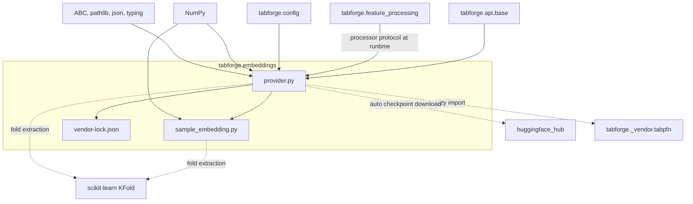
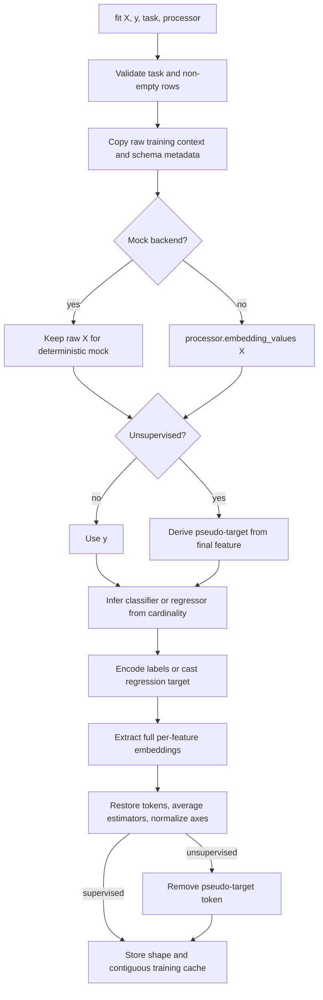
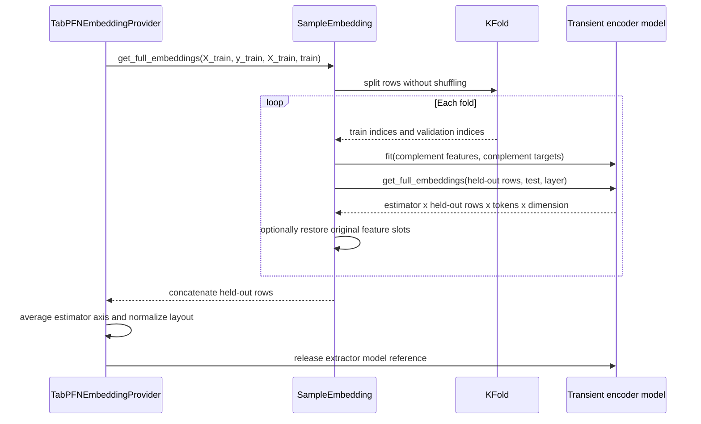
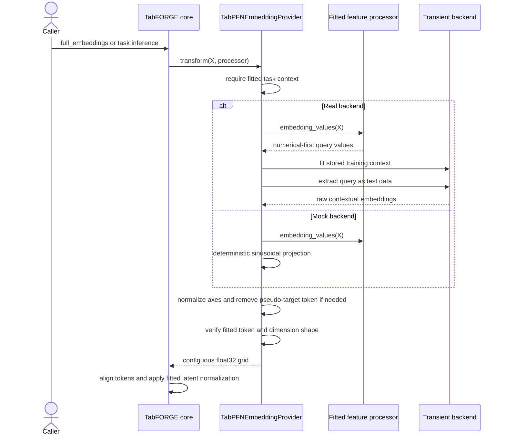
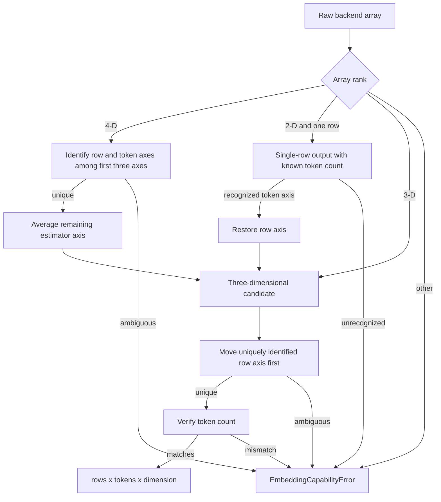
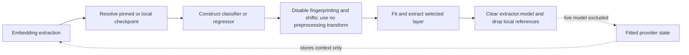
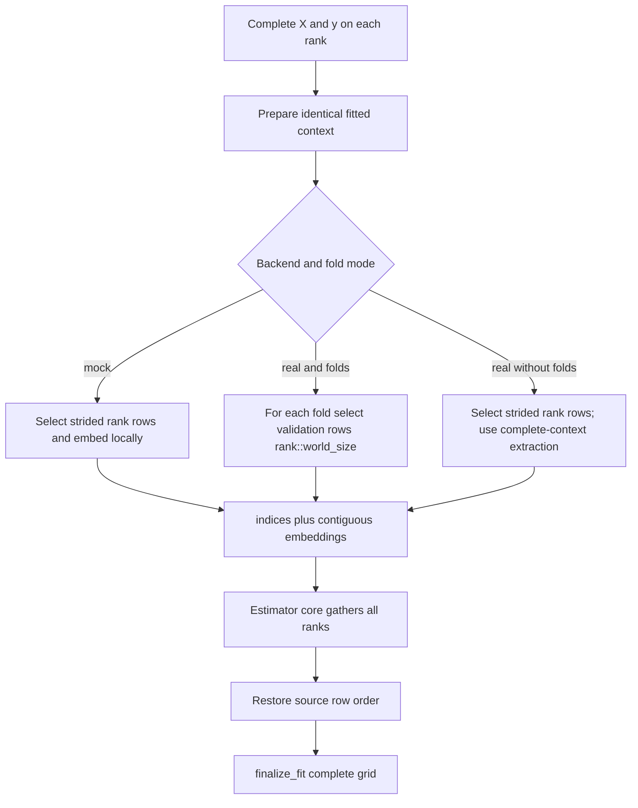

# Structure-aware Feature Encoder

The `tabforge.embeddings` package is the embedding bridge between TabFORGE's fitted tabular schema and the Structure-aware Feature Encoder. It converts numerical-first table values into contextual, per-feature latent grids, protects training embeddings from target leakage through held-out folds, normalizes backend-specific array layouts, and retains enough fitted context to embed future rows.

The adapter deliberately keeps live encoder models and encoder checkpoint bytes outside fitted TabFORGE state. Its stable output contract is a CPU-owned, contiguous `float32` NumPy array shaped `(rows, tokens, embedding_dimension)`. The implementation lives in `src/tabforge/embeddings/provider.py` and `src/tabforge/embeddings/sample_embedding.py`.

## Position in the system

<ol class="flow-cards">
<li><strong>Use the fitted schema</strong><p>The estimator supplies processed numerical-first rows, task information, and embedding/runtime configuration.</p></li>
<li><strong>Run the Structure-aware Feature Encoder</strong><p>A transient encoder runtime extracts held-out training embeddings or query embeddings against the complete fitted context.</p></li>
<li><strong>Return a stable grid</strong><p>Normalize backend layout into CPU-owned float32 arrays shaped (rows, tokens, embedding_dimension). Persist fitted context without a live model.</p></li>
</ol>

The [public estimator API](public_estimator_api.md) owns lifecycle ordering, distributed gathering, latent normalization, and downstream model construction. [Tabular feature processing](tabular_feature_processing.md) owns input validation, fitted preprocessing, raw-to-token column order, and target encoders. [Configuration](configuration.md) defines the immutable `TabFORGEEmbeddingConfig` and runtime device policy. The adapter consumes those contracts and supplies contextual latent grids to the Score-based Diffusion Transformer and Denoising-aligned Latent Decoder.

## Responsibilities and boundaries

| Concern | Adapter responsibility | Outside this module |
| --- | --- | --- |
| Embedding context | Retain copied training features, backend-ready values, targets, task metadata, and output shape | Decide the public estimator task and validate raw schemas |
| External encoder | Resolve a pinned or local checkpoint, construct the vendored classifier or regressor, and release it after extraction | Train or distribute TabFORGE neural components |
| Leakage control | Use held-out folds for training rows when `n_folds >= 2` | Split user-provided validation data and compute validation metrics |
| Output contract | Restore original feature slots, average ensemble outputs, normalize axes, remove pseudo-target tokens, and return contiguous `float32` arrays | Normalize latent values by fitted mean and standard deviation |
| Query extraction | Embed query rows against the complete stored training context and enforce the fitted grid shape | Pool, flatten, decode, impute, predict, or generate from embeddings |
| Persistence | Serialize provider configuration and fitted context without a live model or checkpoint bytes | Serialize model tensors, fitted processor, latent statistics, and optional fitted generation context |
| Distributed extraction | Compute rank-local training shards with source indices | Gather shards, restore global row order, and coordinate processes |

The provider context contains copies of training data and targets. A fitted checkpoint that contains this context is therefore dataset-bearing and should be handled according to the source data's access requirements.

## Component architecture

The paper's **Structure-aware Feature Encoder** uses frozen pretrained tokenisation and contextualisation layers. `TabPFNEmbeddingProvider` and `SampleEmbedding` adapt that component to the fitted table schema and handle embedding extraction.

| Component | Relationship and interface |
| --- | --- |
| `EmbeddingProvider` | Abstract `fit` and `transform` contract for token embeddings. |
| `TabPFNEmbeddingProvider` | Implements `EmbeddingProvider`; owns `TabFORGEEmbeddingConfig`, fitted context, training embeddings, shard fitting, and persistence. |
| `SampleEmbedding` | Built lazily by the provider to extract held-out-fold or full-context embeddings and apply an optional output transform. |
| `TabFORGEEmbeddingConfig` | Selects checkpoint, fold count, extraction layer, batch size, and estimator count. |
| `EmbeddingCapabilityError` | Raised when the backend cannot supply the requested per-feature grid. |

### `EmbeddingProvider`

`EmbeddingProvider` is the minimal estimator-facing abstraction. Implementations must support:

- `fit(X, y, *, task, processor)`, which establishes a context and returns training embeddings.
- `transform(X, *, processor)`, which embeds query rows using that fitted context.

The base interface intentionally says nothing about a particular backend, folds, checkpoints, or distributed execution. `fit_shard`, persistence, dimension reporting, and training-cache access are concrete capabilities of `TabPFNEmbeddingProvider` rather than requirements for every possible provider.

### `TabPFNEmbeddingProvider`

`TabPFNEmbeddingProvider` owns the complete encoder adaptation lifecycle. Its important state falls into four groups:

| State group | Representative attributes | Purpose |
| --- | --- | --- |
| Construction policy | `config`, `random_state`, `categorical_features`, `device` | Select extraction behavior and transient runtime placement |
| Fitted table context | `task_`, `_train_X_`, `_train_y_`, `_train_backend_X_`, `_backend_y_`, `_n_features_` | Recreate the context needed for later query extraction |
| Encoder interpretation | `encoder_task_`, `_pseudo_target_`, `_include_target_token_` | Select classifier or regressor backend and manage task tokens |
| Output contract | `embedding_shape_`, `embedding_dimension_`, `_train_embeddings_` | Enforce stable query shapes and expose the fitted training grid |

All returned arrays are copies or newly owned arrays. `finalize_fit` records the shape and stores a contiguous training cache; `train_embeddings` returns a copy of that cache. Query transformation checks the complete non-row shape against `embedding_shape_` before returning.

### `SampleEmbedding`

`SampleEmbedding` is a fold-aware wrapper around a model exposing `fit` and `get_full_embeddings`. It has two modes:

| `n_fold` | Training extraction | Query extraction |
| ---: | --- | --- |
| `0` | Fit once on all training rows and extract with the requested data source | Fit once on all training rows and extract as test rows |
| `>= 2` | Fit once per fold on the complementary rows and embed the held-out rows as test data | Fit once on all training rows and embed every query against that full context |

Fold outputs retain the backend estimator axis and are concatenated along its row axis. The provider later identifies and averages the estimator axis. An optional `output_transform` lets the provider restore backend-dropped feature slots before fold concatenation.

### `EmbeddingCapabilityError`

`EmbeddingCapabilityError` reports failures specific to preparing or using the embedding backend. Examples include missing vendored runtime data, incompatible persisted context, unresolved checkpoints, ambiguous backend axes, token-alignment failures, and a changed query embedding shape. Ordinary input-contract failures such as an unsupported task, empty training data, or an invalid fold count use `ValueError` or `RuntimeError` as appropriate.

## Dependency architecture



The heavyweight dependencies are loaded only on paths that need them. The vendored encoder types are imported by `_backend_runtime` when real extraction starts, `KFold` is imported when folds are used, and `huggingface_hub` is imported only when an automatic checkpoint must be resolved. The explicit mock backend avoids all three.

## Stable data contract

The provider's canonical output is:

```text
embedding_grid.shape == (number_of_rows, number_of_tokens, embedding_dimension)
embedding_grid.dtype == numpy.float32
embedding_grid is C-contiguous and CPU-owned
```

Token count depends on the TabFORGE task:

| Estimator task | Provider input target | Returned token count | Target-token treatment |
| --- | --- | ---: | --- |
| `classification` | User target `y` | `n_features + 1` | Keep the supervised target token |
| `regression` | User target `y` | `n_features + 1` | Keep the supervised target token |
| `unsupervision` | Pseudo-target derived from the final feature | `n_features` | Remove the backend pseudo-target token |

The embedding token order follows `processor.embedding_values(X)`: numerical columns first, followed by categorical columns encoded by the fitted outer preprocessing pipeline. See [Tabular feature processing](tabular_feature_processing.md) for raw-column mappings, categorical encoding, missing-value handling, and reconstruction layouts.

The encoder backend is selected from target cardinality rather than directly from the public estimator task:

```text
unique backend target values <= 10  -> TabPFNClassifier
unique backend target values > 10   -> TabPFNRegressor
```

Classifier targets are remapped to contiguous integer labels. Regressor targets are converted to `float32`. The same rule applies to the pseudo-target used by unsupervised fitting.

## Fit data flow



`_prepare_fit` establishes all state required by both local extraction and future queries. Encoder extraction receives the processor's complete numerical-first view. The mock backend retains raw input at this stage because `_mock_embeddings` calls the processor itself, keeping test behavior aligned with the real token contract.

For real unsupervised extraction, the final processed feature supplies a deterministic pseudo-target so the supervised external encoder API can establish a context. The backend produces one additional target token, which the provider removes before exposing the result. The mock path directly emits feature tokens only.

## Leakage-aware training extraction

The default `n_folds=10` requests out-of-fold embeddings for training rows. Each row is encoded by a model whose target context was fitted without that row.



`KFold` uses `shuffle=False`, so validation blocks preserve their original ordering and concatenation reconstructs normal row order in a local fit. The effective fold count is capped at the number of training rows. If fewer than two rows make folding impossible, backend construction disables folds for the ordinary local path.

Setting `n_folds=0` fits the encoder on the complete context and extracts training rows directly. This is faster and is useful for smoke tests, although a row's own target can then participate in its contextual training embedding. Query rows always use the complete fitted training context, regardless of the training fold setting.

### Restoring supervised feature tokens

The vendored supervised backend may drop or permute input columns during its own preprocessing or architecture-level feature selection. `_restore_supervised_feature_tokens` maps the resulting slots back to the processor's original embedding-token layout before folds are combined:

1. Rebuild source feature indices from preprocessing selection masks and permutations.
2. Apply architecture-level `column_selection_mask` metadata.
3. Allocate a zero-filled grid with `n_features + 1` token slots.
4. Scatter retained feature embeddings into their original positions.
5. Copy the target token into the final slot.

Metadata and output inconsistencies raise `EmbeddingCapabilityError`; they are never silently accepted.

## Query transformation



The real backend is rebuilt and fitted against `_train_backend_X_` and `_backend_y_` for each provider extraction call. When `batch_size` is configured, test queries are divided into contiguous batches; training extraction is unaffected. Each batch is normalized before concatenation so all callers receive the same canonical layout.

The provider validates `tuple(result.shape[1:]) == embedding_shape_`. This catches changes in token count or latent width after restoration. The estimator core then applies its task-level alignment rule and the mean and standard deviation learned from training embeddings; those downstream details belong to the [public estimator lifecycle](public_estimator_api_lifecycle.md).

## Backend output normalization

Vendored extraction can expose several shapes depending on ensemble size and single-row squeezing. `_normalize_output` accepts supported layouts only when row and token axes can be identified from expected counts.



Common accepted inputs include `(estimators, rows, tokens, dimension)`, permutations of the first three axes that remain uniquely identifiable, `(rows, tokens, dimension)`, `(tokens, rows, dimension)`, and recognized two-dimensional single-row results. Ambiguous equal-sized axes fail early because guessing could associate embeddings with the wrong rows or tokens.

## Checkpoint resolution and runtime lifetime

`model_path` selects one of three operational paths:

| Value | Resolution | Intended use |
| --- | --- | --- |
| `"auto"` | Read `vendor-lock.json` and download the pinned classifier or regressor file at its immutable Hugging Face revision | Normal production use |
| `"mock"` | Skip the external runtime and generate deterministic sinusoidal embeddings | Tests, examples, and CPU-only API checks |
| Local path | Require an existing file and pass its path to the vendored model | Managed or offline checkpoint deployments |

The packaged lock records runtime compatibility and separate immutable classifier and regressor checkpoint mappings. Automatic resolution wraps download or lookup failures in `EmbeddingCapabilityError` with checkpoint context.



The transient model receives the configured `n_estimators`, device, random seed, and optional extraction layer. Its inference configuration disables fingerprint features, feature shifts, class shifts, and additional backend preprocessing because TabFORGE's processor already owns the table representation boundary. `ignore_pretraining_limits=True` delegates supported-shape handling to the extraction path.

Cleanup occurs in `finally` blocks. The extractor's `model` reference is cleared and local model variables are discarded after success or failure, keeping GPU modules and checkpoint-loaded encoder state outside the fitted provider object.

## Deterministic mock backend

The mock backend uses `processor.embedding_values(X)` and generates one latent vector per token with a seeded sinusoidal projection. For supervised tasks it appends a processed target value; classification targets are scaled by `target_cardinality_ - 1` when there is more than one class. A fixed `random_state` produces repeatable weights and phases.

Its width comes from `configured_dimension()`:

1. Use the fitted `embedding_dimension_` when available.
2. Otherwise use the estimator-requested architecture dimension when supplied.
3. Otherwise use `192`, the default encoder embedding width.

The mock backend is an interface-compatible test facility. Its values do not approximate learned Structure-aware Feature Encoder embeddings and should not be used as research evidence.

## Distributed training extraction

`fit_shard` prepares the same complete context on every participating rank and returns a mapping with source `indices` and rank-local `embeddings`.



For real folded extraction, each rank fits the same fold complement and handles a disjoint stride of that fold's validation indices. For non-folded and mock extraction, global rows are assigned by `rank, rank + world_size, ...`. The provider does not perform inter-process communication; `_fit_embeddings_once` in the estimator core gathers indexed arrays and calls `finalize_fit` on the reconstructed full grid.

Query distribution follows a related estimator-owned path: each rank transforms a subset with the already fitted provider context, and the API gathers results by index. See [Public estimator API](public_estimator_api.md) for process coordination and row-order restoration.

## Persistence and restoration

`context_dict()` serializes the information needed to recreate query-time extraction while excluding the live backend and encoder checkpoint bytes.

| Context field | Meaning |
| --- | --- |
| `runtime_compatibility_id` | Exact provider/runtime contract identifier, currently `tabpfn-v2.5` |
| `config` | Serialized `TabFORGEEmbeddingConfig` |
| `random_state`, `categorical_features` | Reproducibility and fitted schema hints |
| `task`, `encoder_task` | Public task and selected external backend family |
| `train_X`, `train_y` | Copied raw fitted training context |
| `train_backend_X`, `backend_y` | Values ready to refit the transient runtime |
| `pseudo_target` | Unsupervised context target when applicable |
| `embedding_shape`, `embedding_dimension`, `n_features` | Query output invariants |
| `requested_dimension` | Optional architecture-requested latent width |

`from_context(context, device=...)` requires an exact compatibility ID, reconstructs the frozen embedding configuration, restores fitted arrays and shape metadata, and uses the supplied current device for future transient extraction. Older contexts without `encoder_task` are migrated by inferring it from their stored target.

The standalone provider context does not serialize `_train_embeddings_`; restored estimator inference uses the stored context to recompute query embeddings and uses separately checkpointed latent statistics. The canonical fitted checkpoint additionally stores the fitted processor, embedding mean and standard deviation, model tensors, resolved configuration, and optional fitted generation context. See the [public estimator lifecycle](public_estimator_api_lifecycle.md) for the complete checkpoint schema.

## Configuration effects

The adapter directly consumes `TabFORGEEmbeddingConfig` and receives its device from resolved runtime configuration.

| Setting | Adapter behavior |
| --- | --- |
| `model_path` | Selects the automatic pinned checkpoint, explicit mock backend, or local checkpoint |
| `n_folds` | Chooses full-context training extraction at `0` or held-out extraction at `2` or more |
| `layer` | Passes an optional zero-based encoder layer to `get_full_embeddings` |
| `batch_size` | Splits real test-query extraction into contiguous batches |
| `n_estimators` | Configures the external ensemble; normalized outputs average its estimator axis |
| Runtime `device` | Places each transient vendored model on the resolved CPU or accelerator device |
| Architecture `embedding_dimension` | Supplies an expected/requested width; the estimator later verifies real provider output against it |

Validation rules and scikit-learn parameter updates are documented in [Configuration](configuration.md).

## Operational invariants and failure modes

- `task` must be exactly `classification`, `regression`, or `unsupervision`.
- At least one training row is required.
- `transform`, `train_embeddings`, and `context_dict` require fitted state; a restored context supports `transform` and `context_dict`, while its training embedding cache is absent.
- Query rows must pass the same fitted processor contract and produce the same token count and embedding width as training.
- Fold count is `0` or at least `2` and cannot exceed the effective training-row count used by `SampleEmbedding`.
- Automatic checkpoint mappings and the packaged `vendor-lock.json` must be present and compatible with the selected encoder task.
- Local `model_path` values must identify an existing file.
- Backend row, token, and estimator axes must be uniquely identifiable from the expected sizes.
- Supervised feature-selection metadata must align with the raw backend output before token restoration.
- The runtime compatibility ID is strict; incompatible provider contexts fail instead of attempting an unsafe restoration.

## Extension and maintenance guidance

### Adding another provider

Implement `EmbeddingProvider.fit` and `EmbeddingProvider.transform` with the canonical three-dimensional output contract. Estimator integration currently also relies on concrete encoder-provider capabilities for distributed fitting, context serialization, finalization, and dimension reporting, so replacing the provider throughout the fitted lifecycle requires equivalent hooks or a corresponding generalization of the API core.

<span id="updating-the-vendored-tabpfn-runtime"></span>

### Updating the vendored encoder runtime

Treat the runtime, lock file, and persisted context ID as one compatibility unit:

1. Update the vendored runtime and immutable checkpoint mappings together.
2. Review raw embedding ranks, token behavior, preprocessing metadata, and feature-selection restoration.
3. Change `RUNTIME_COMPATIBILITY_ID` when old contexts are no longer safe to restore.
4. Verify classifier, regressor, and pseudo-target encoder selection.
5. Exercise local, folded, batched-query, single-row, ensemble, distributed-shard, and checkpoint-restoration paths.

### High-value tests

The focused test suite should preserve these behaviors:

- Supported backend axis permutations normalize to the same grid and ambiguous axes raise.
- The mock provider is deterministic, returns expected task-specific shapes, and serializes no backend model.
- Rank-local shard indices reconstruct the original row order and values.
- `SampleEmbedding` preserves pandas inputs during fold selection.
- Ten unique target values select the classifier backend and eleven select the regressor backend.
- Packaged lock entries contain immutable classifier and regressor revisions.

Run the focused Python tests from the repository root:

```bash
pytest tests/test_embeddings.py tests/test_core.py
```

## Source files

- `src/tabforge/embeddings/provider.py`: provider abstraction, encoder adapter, checkpoint resolution, shape normalization, distributed shards, context persistence, and mock embeddings.
- `src/tabforge/embeddings/sample_embedding.py`: leakage-aware fold orchestration around the external model.
- `src/tabforge/embeddings/vendor-lock.json`: pinned encoder runtime version and immutable checkpoint references.
- `src/tabforge/embeddings/__init__.py`: package exports for the provider interface, concrete provider, and capability error.
