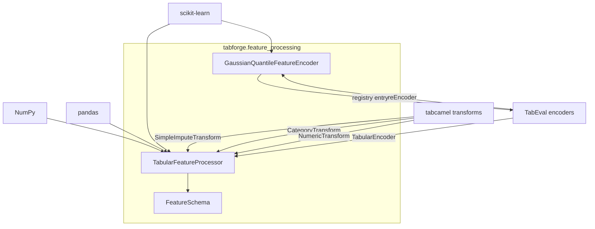
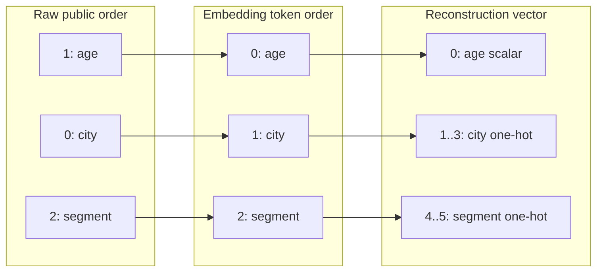
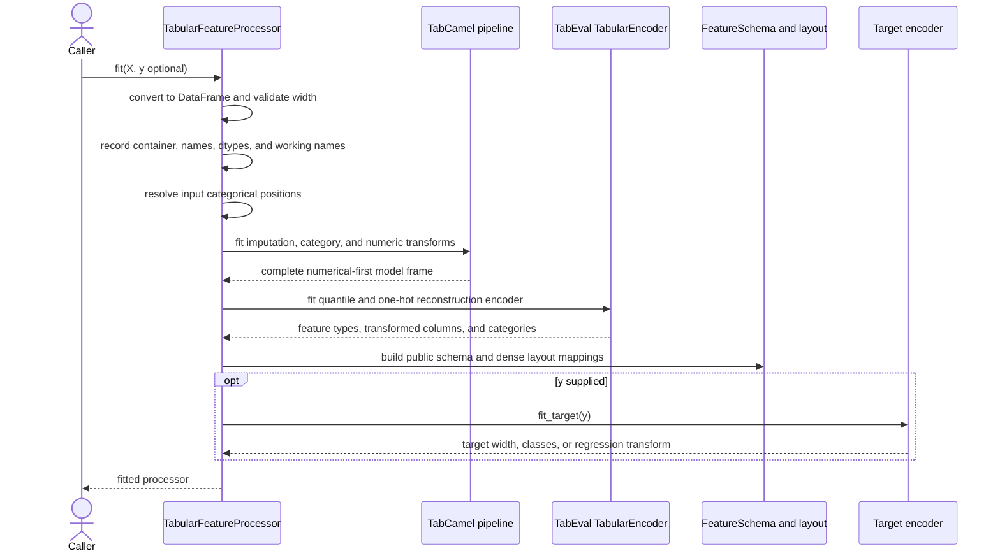
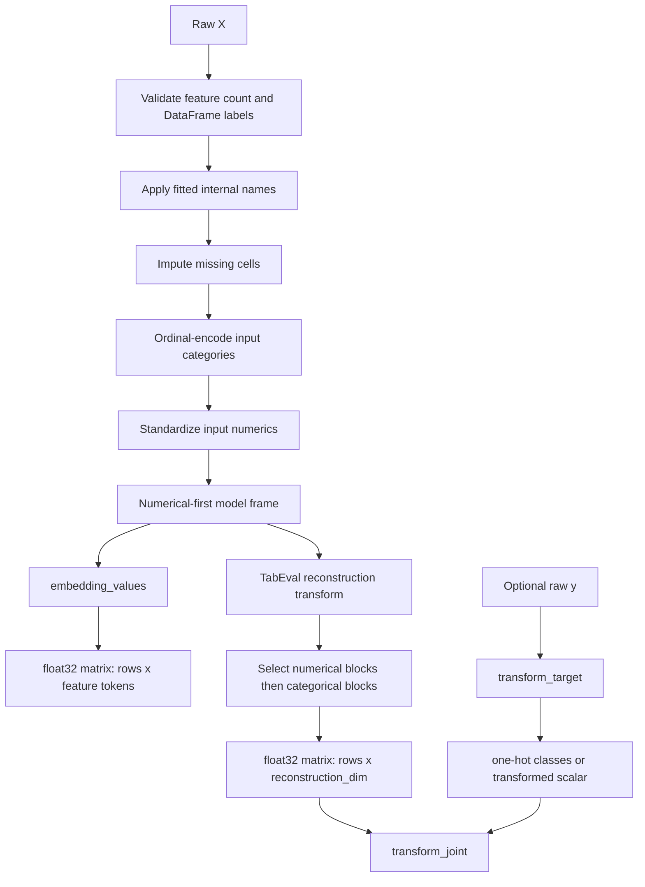
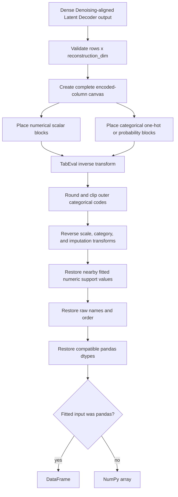
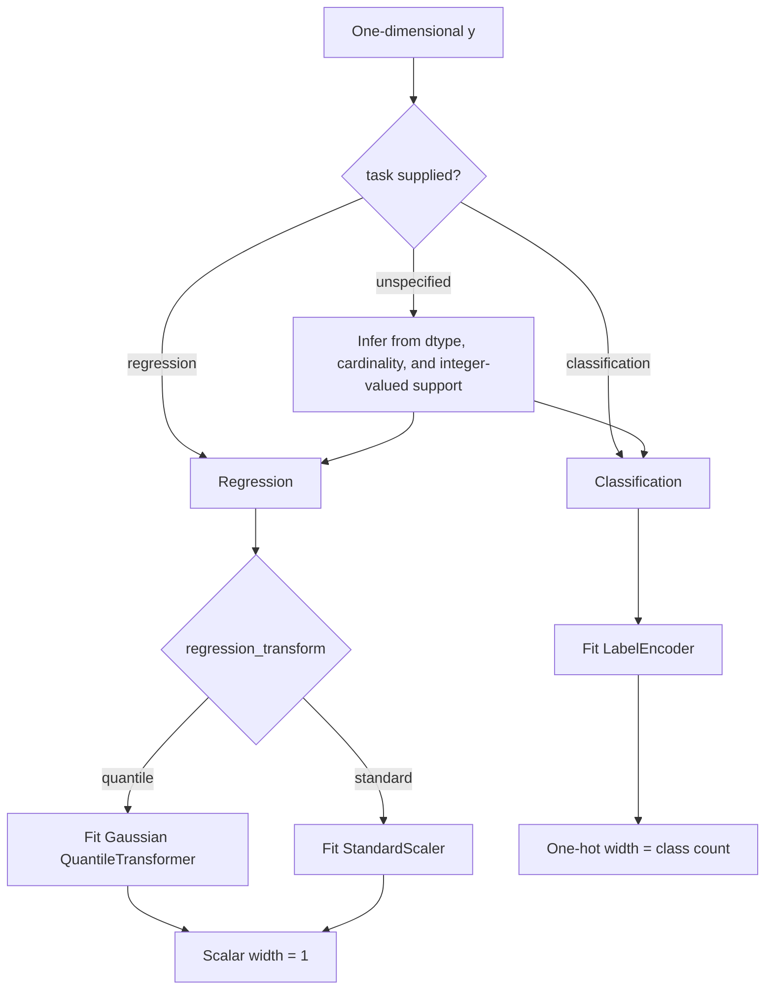
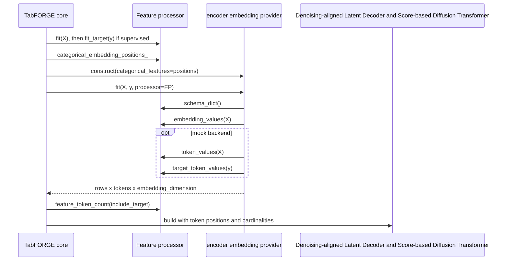
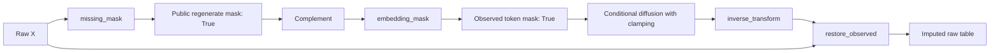

# Tabular feature processing

The `tabular_feature_processing` module is TabFORGE's schema boundary for mixed-type tables. It fits reusable preprocessing state, converts raw pandas or NumPy features into the dense targets used to train the Denoising-aligned Latent Decoder, prepares the numerical-first input consumed by the Structure-aware Feature Encoder, and reconstructs generated values in the original public column order.

The module also owns supervised-target encoding, categorical domains, token-position metadata, missing-cell masks, dtype restoration, and the serializable schema included in fitted checkpoints. Its implementation is in `src/tabforge/feature_processing/processor.py` and its public package export is `TabularFeatureProcessor`.

## Position in the system

<ol class="flow-cards">
<li><strong>Fit schema and transforms</strong><p>Capture column order, dtypes, categories, optional targets, and missing masks; impute, encode, and scale the embedding input.</p></li>
<li><strong>Prepare model inputs</strong><p>Supply numerical-first values to the feature encoder and dense reconstruction targets plus token layout to Denoising-aligned Latent Decoder training.</p></li>
<li><strong>Restore public values</strong><p>Invert Denoising-aligned Latent Decoder transforms, restore raw column order and dtypes, and retain observed cells during imputation. Checkpoints store the fitted processor.</p></li>
</ol>

The [public estimator API](public_estimator_api.md) constructs and fits the processor before embedding extraction or model construction. The [Structure-aware Feature Encoder](tabpfn_embedding_adapter.md) consumes the processor's numerical-first embedding view. The [Score-based Diffusion Transformer and Denoising-aligned Latent Decoder](latent_diffusion_model.md) uses its token positions, numerical count, and categorical cardinalities to build schema-dependent Denoising-aligned Latent Decoder heads. [Training orchestration](training_orchestration.md) learns from the processor's dense feature and target reconstruction matrices.

## Responsibilities and boundaries

| Responsibility | Owned here | Downstream consumer |
| --- | --- | --- |
| Public input contract | Container kind, column names, order, dtypes, and feature count | Estimators and checkpoint restoration |
| Input preprocessing | Missing-value imputation, ordinal category encoding, numerical standardization, and numerical-first ordering | Structure-aware Feature Encoder |
| Denoising-aligned Latent Decoder supervision | Gaussian-quantile continuous values and dense one-hot categorical blocks | Denoising-aligned Latent Decoder loss in training orchestration |
| Reconstruction metadata | Denoising-aligned Latent Decoder feature types, category domains, cardinalities, spans, and token positions | Latent diffusion model |
| Target processing | Classification labels or transformed regression values | Supervised Denoising-aligned Latent Decoder heads and estimators |
| Public reconstruction | Inverse transforms, raw column order, pandas metadata, and dtype handling | Generator and imputer outputs |
| Imputation support | Raw missing masks, token-order mask conversion, and observed-cell restoration | `TabFORGEImputer` |
| Persistence metadata | Serializable feature schema and the pickleable fitted processor | Canonical checkpoints |

Neural embedding extraction, latent normalization, Denoising-aligned Latent Decoder execution, diffusion sampling, and trajectory aggregation are outside this module. Their behavior is documented in the linked subsystem pages.

## Core components

| Component | Relationship and interface |
| --- | --- |
| `FeatureSchema` | Immutable names, dtypes, numerical/categorical indices, cardinalities, and domains; created by the fitted processor. |
| `GaussianQuantileFeatureEncoder` | Wraps a `QuantileTransformer` for fit, transform, inverse transform, and feature naming through `TabularEncoder`. |
| `TabularFeatureProcessor` | Owns schema and encoders; fits features/targets, builds embedding values and masks, transforms joint inputs, reconstructs public values, restores observations, and serializes schema. |

### `FeatureSchema`

`FeatureSchema` is a frozen dataclass describing the fitted public feature space and the Denoising-aligned Latent Decoder's interpretation of each raw column.

| Field | Meaning |
| --- | --- |
| `names` | Raw column labels in fitted public order. Labels may be non-string pandas column values. |
| `dtypes` | String representations of the fitted pandas dtypes. |
| `numerical_indices` | Raw-column indices decoded through scalar numerical heads. |
| `categorical_indices` | Raw-column indices decoded through categorical heads. |
| `categorical_cardinalities` | Width of each categorical Denoising-aligned Latent Decoder head, in `categorical_indices` order. |
| `categorical_domains` | Raw public values represented by each categorical head. |
| `n_features` | Derived count equal to `len(names)`. |

`schema_dict()` converts this state to ordinary lists and adds `embedding_token_raw_indices`, allowing checkpoint metadata and the embedding provider to preserve the mapping between raw columns and model tokens.

### `GaussianQuantileFeatureEncoder`

`GaussianQuantileFeatureEncoder` adapts scikit-learn's `QuantileTransformer` to the TabEval `FeatureEncoder` interface. It is registered at import time as `FEATURE_ENCODERS["tabforgequantile"]`, so `TabularEncoder` can request it through `continuous_encoder="tabforge_quantile"`.

The encoder maps continuous reconstruction values to an approximately normal marginal distribution. Quantile resolution scales with the fitted row count:

```text
n_quantiles = max(min(floor(n_rows / 30), 1000), 10)
```

The lower bound keeps small datasets usable and the upper bound limits the fitted quantile grid. `subsample=1_000_000_000` effectively disables ordinary subsampling for expected TabFORGE dataset sizes. The wrapper is defined at module scope so fitted processors remain pickle-safe in checkpoints.

### `TabularFeatureProcessor`

`TabularFeatureProcessor` coordinates all fitted transformations and layout metadata. Before `fit`, it stores only the optional `categorical_features` hint. After fitting, attributes with trailing underscores hold the learned schema, preprocessing transforms, reconstruction encoder, column mappings, and optional target state.

## Dependency architecture



The transformation stack has two layers:

1. The outer TabCamel pipeline creates a complete numeric table for embedding extraction.
2. The inner TabEval encoder creates the dense reconstruction targets used by Denoising-aligned Latent Decoder training and inverse generation.

Keeping these layers in one fitted object ensures the embedding and reconstruction paths share exactly the same schema and fitted preprocessing state.

## The three table layouts

The processor maintains three related layouts. Their distinctions are central to model construction and imputation.

| Layout | Column order | Representation | Primary use |
| --- | --- | --- | --- |
| Raw/public | Original fitted order | Original values and pandas dtypes | Estimator inputs and outputs |
| Embedding/model | All outer numerical columns, then explicit outer categorical columns | Mean-imputed, ordinal-encoded categories and standardized numerics | Structure-aware Feature Encoder input and latent token order |
| Reconstruction | All decoder-numerical scalars, then one dense block per decoder-categorical feature | Gaussian quantiles and one-hot values | Denoising-aligned Latent Decoder targets and generated values |

Consider raw columns `[city, age, segment]`, where `city` and `segment` are explicitly categorical. The outer model order is `[age, city, segment]`. If the reconstruction encoder identifies `age` as continuous and both other columns as discrete, a table with category cardinalities 3 and 2 has this layout:



The reconstruction dimension is:

```text
reconstruction_dim = number_of_numerical_features + sum(categorical_cardinalities)
```

The following fitted attributes make the mappings explicit:

| Attribute | Contract |
| --- | --- |
| `input_numerical_indices_` | Raw positions treated as numerical by the outer pipeline. |
| `input_categorical_indices_` | Raw positions selected by the explicit hint or dtype inference. |
| `_model_feature_raw_indices_` | Raw positions in numerical-first embedding order. |
| `embedding_token_raw_indices_` | Public mapping from each embedding token to its raw column. |
| `numerical_embedding_positions_` | Token positions decoded as numerical. |
| `categorical_embedding_positions_` | Token positions decoded as categorical. |
| `numerical_indices_` | Raw positions decoded as numerical. |
| `categorical_indices_` | Raw positions decoded as categorical. |
| `numerical_reconstruction_positions_` | Scalar positions at the start of the reconstruction vector. |
| `categorical_reconstruction_spans_` | One position tuple per categorical one-hot block. |
| `reconstruction_dim_` | Total dense Denoising-aligned Latent Decoder output width. |

### Input typing and reconstruction typing

Input categorical typing and Denoising-aligned Latent Decoder reconstruction typing are separate decisions:

- `input_categorical_indices_` controls TabCamel's missing-value handling and ordinal encoding. An explicit `categorical_features` hint takes names or zero-based positions; without a hint, numeric non-boolean dtypes are numerical and all other dtypes are categorical.
- `numerical_indices_` and `categorical_indices_` come from the fitted TabEval layout after outer preprocessing. They determine Denoising-aligned Latent Decoder heads and reconstruction widths.

This separation allows a low-cardinality numeric column to use a categorical Denoising-aligned Latent Decoder head, while a high-cardinality raw category can pass through ordinal preprocessing and use a continuous reconstruction head. `FeatureSchema.categorical_domains` always records public raw values for decoder-categorical columns, including numeric support values where a numeric input becomes reconstruction-categorical.

## Feature fitting lifecycle



### 1. Public schema capture

`_as_frame` copies a pandas `DataFrame` or wraps a two-dimensional NumPy array in a frame with integer columns. Fitting records:

- whether the original container was pandas;
- pandas dtypes and exact column labels;
- the raw feature count and order;
- collision-safe internal names such as `__tabforge_feature_0`.

Working names isolate external label types from third-party transforms. Public names are restored after inverse preprocessing.

### 2. Outer preprocessing

The outer pipeline is fitted and applied in this order:

| Stage | Configuration | Effect |
| --- | --- | --- |
| `SimpleImputeTransform` | categorical `most_frequent`; numerical `mean` | Produces a complete table. |
| `CategoryTransform` | `ordinal` | Maps explicitly categorical domains to numeric codes. |
| `NumericTransform` | `standard`; categorical excluded | Standardizes outer numerical columns. |

The processor saves each imputed numerical column's unique raw support. During inverse processing, values within a float32-aware tolerance of an observed support value snap back to that exact value. This preserves repeated numeric atoms that acquire small errors through nested transformations.

### 3. Reconstruction encoder

The numerical-first model frame fits a `TabularEncoder` with:

- `continuous_encoder="tabforge_quantile"` for scalar Gaussian reconstruction values;
- `categorical_encoder="onehot"` with dense output and `handle_unknown="ignore"` for categorical blocks.

The encoder layout supplies feature types, transformed feature names, output dimensions, and fitted category values. The processor converts that metadata into raw indices, token positions, categorical cardinalities, and reconstruction spans.

### 4. Schema and layout publication

`FeatureSchema` captures public-facing types and domains. `_build_reconstruction_layout` then establishes one latent token per raw feature and appends an optional supervised target token only after `fit_target`.

`feature_token_count(include_target=False)` returns the task-specific token count. `target_token_position_` is always `n_feature_tokens_`, placing the target immediately after all feature tokens.

## Forward data flow



### Feature transformation methods

| Method | Output | Use |
| --- | --- | --- |
| `transform(X)` | Alias of `transform_features`. | Scikit-learn-style feature transformation. |
| `transform_features(X)` | `float32`, shape `(rows, reconstruction_dim_)`. | Denoising-aligned Latent Decoder training targets. |
| `transform_joint(X, y=None)` | Feature matrix alone or feature and target blocks concatenated. | Task-independent training target construction. |
| `embedding_values(X)` | `float32`, shape `(rows, n_features_in_)`. | Real Structure-aware Feature Encoder input after outer preprocessing. |
| `token_values(X)` | One deterministic scalar per feature token. | Explicit mock embedding backend only. |

For a categorical token, `token_values` uses the one-hot argmax normalized to `[0, 1]` when the block has more than one output. Continuous tokens use the first transformed scalar directly.

## Inverse reconstruction flow



`inverse_transform` requires a two-dimensional matrix whose width is exactly `reconstruction_dim_`. It rebuilds every transformed TabEval column, inverses the reconstruction encoder, and then reverses the outer preprocessing stack. Before outer inversion, ordinal categorical codes are rounded and clipped to the fitted category range.

When `template` is a pandas frame, its leading index values are copied to the decoded frame. The fitted input container still determines whether the public return type is a DataFrame or NumPy array.

### Dtype restoration policy

| Fitted dtype | Reconstruction behavior |
| --- | --- |
| pandas categorical | Rebuilds the categorical array with fitted categories and ordering. |
| Integer decoder-categorical | Rounds and casts to the fitted integer dtype. |
| Integer decoder-numerical | Returns floating-point values so generated continuous detail survives. |
| Floating point | Casts to the fitted float dtype. |
| Boolean | Casts to `bool`. |
| Other non-object extension dtype | Attempts a direct cast. |
| Unsupported generated value for an extension dtype | Falls back to usable object values with correct columns. |

Object columns remain object-valued. The fallback is local to the affected column and preserves the reconstructed data.

## Target processing

`fit_target` is independent from feature fitting after the feature schema exists. It records Series metadata when available and resolves classification or regression behavior.



Without an explicit task, object, Unicode, string, and boolean targets are classification. Numeric targets are inferred as classification only when their unique values are integer-valued and their cardinality is at most `min(20, max(2, floor(sqrt(n_rows))))`.

| Fitted target state | Classification | Regression |
| --- | --- | --- |
| Encoder | `LabelEncoder` | `QuantileTransformer` or `StandardScaler` |
| `target_cardinality_` | Number of classes, at least 2 | `0` |
| `target_reconstruction_dim_` | Number of classes | `1` |
| `transform_target` | Dense one-hot `float32` matrix | Transformed scalar `float32` column |
| `inverse_target` | Argmax followed by label decoding | Inverse scale of the first column |

`inverse_target` accepts a one- or two-dimensional array. Classification values may be probabilities or logits because decoding uses `argmax`. A pandas target fitted from a Series is reconstructed as a Series with its original name.

`transform_joint` and `inverse_joint` concatenate or split features at `reconstruction_dim_`. Joint inverse transformation validates the full width `reconstruction_dim_ + target_reconstruction_dim_`.

## Embedding adapter integration

The feature processor and embedding provider share a strict interface:



The real provider receives the outer preprocessed matrix from `embedding_values`. The mock provider uses deterministic token scalars. Supervised tasks add a target token; unsupervised embedding output contains feature tokens only. Detailed backend fitting, leakage-free folds, query context, and embedding-axis normalization belong to the [Structure-aware Feature Encoder](tabpfn_embedding_adapter.md).

## Denoising-aligned Latent Decoder and training integration

The [public estimator API](public_estimator_api.md) passes processor metadata into `TabFORGEDecoder`:

| Processor state | Denoising-aligned Latent Decoder constructor input |
| --- | --- |
| `n_features_in_` | `n_feature_tokens` |
| `len(numerical_indices_)` | `numerical_count` |
| `cardinalities_` | `categorical_cardinalities` |
| `numerical_embedding_positions_` | `numerical_token_positions` |
| `categorical_embedding_positions_` | `categorical_token_positions` |
| Target task and `target_cardinality_` | Target head kind and width |

During fitting, `transform_joint(X, y)` supplies reconstruction targets while the embedding provider supplies clean latent token grids. The Denoising-aligned Latent Decoder emits numerical scalars and one logits tensor per categorical cardinality. The API converts categorical logits to probabilities and packs all blocks into the same reconstruction order expected by `inverse_transform`.

The diffusion Score-based Diffusion Transformer receives `feature_token_count(include_target=task != "unsupervision")`. Model architecture and sampling behavior are covered by [Score-based Diffusion Transformer and Denoising-aligned Latent Decoder](latent_diffusion_model.md), while loss computation and optimization phases are covered by [training orchestration](training_orchestration.md).

## Missing values and imputation

The public imputer mask uses `True` to mean regenerate this raw cell. The diffusion sampler's observation mask uses `True` to mean keep this token clamped. The estimator complements the public mask and then calls `embedding_mask` to reorder it from raw-column order to numerical-first token order.



`missing_mask(X)` returns `DataFrame.isna()` in raw feature order. If the user provides no explicit mask, the imputer regenerates missing cells. With an explicit mask, its shape must be `(rows, n_features_in_)`.

`restore_observed` applies the final cell-level guarantee after decoding:

- with a mask, every cell where the mask is `False` is copied from the original table;
- without a mask, every non-missing original cell is copied back;
- the result is reordered, dtype-restored, and returned in the fitted container type.

This second restoration matters because latent clamping operates per feature token, while the public contract is expressed per raw cell.

## Public method reference

| Method | Preconditions | Main contract |
| --- | --- | --- |
| `fit(X, y=None)` | Two-dimensional pandas or NumPy input with at least one feature | Fits all feature state and optionally delegates target fitting. |
| `fit_target(y, task=None, regression_transform="quantile")` | Non-empty one-dimensional target | Fits class or regression reconstruction state and assigns the target token. |
| `transform`, `transform_features` | Fitted processor and matching schema | Returns dense feature reconstruction targets. |
| `transform_target` | Fitted target | Returns one-hot classes or a transformed regression scalar. |
| `transform_joint` | Fitted feature state and optional fitted target | Concatenates feature and target targets. |
| `inverse_transform` | Exact feature reconstruction width | Returns a raw-schema table. |
| `inverse_target` | Fitted target | Returns decoded labels or regression values. |
| `inverse_joint` | Exact joint reconstruction width | Returns `(X, y)`. |
| `missing_mask` | Matching raw schema | Returns a boolean raw-cell mask. |
| `restore_observed` | Original and reconstructed tables matching the schema | Reinstates cells protected by the public mask. |
| `feature_token_count` | Fitted processor | Returns feature tokens plus an optional target token. |
| `token_values` | Fitted processor | Creates deterministic mock-backend token scalars. |
| `embedding_values` | Fitted processor | Creates the real backend's outer processed feature view. |
| `embedding_mask` | Boolean raw-column mask | Reorders columns into embedding-token order. |
| `target_token_values` | Fitted target | Creates deterministic mock target-token scalars. |
| `schema_dict` | Fitted processor | Returns serializable schema and token mapping data. |

## Validation and invariants

The processor enforces these boundaries:

- `X` must be a pandas `DataFrame` or a two-dimensional NumPy array.
- Fitting requires at least one feature column.
- Subsequent inputs must have the fitted feature count; pandas inputs must also have identical column labels in identical order.
- Explicit categorical indices must be in range, and categorical names must exist in `X`. Repeated hints are deduplicated while preserving their first occurrence.
- `y` must be one-dimensional and non-empty during target fitting.
- Explicit target tasks are limited to `classification` and `regression`.
- Classification requires at least two fitted classes.
- Regression targets must convert to finite `float64` values.
- Regression transforms are limited to `quantile` and `standard`.
- Feature and joint inverse operations require exact reconstruction widths.
- Transformation and schema access require completed feature fitting.
- Target transformation and inversion require completed target fitting.
- Imputation masks must match the raw table shape.

The stable layout invariants are:

```text
n_feature_tokens_ == n_features_in_
target_token_position_ == n_feature_tokens_                 # when a target is fitted
reconstruction_dim_ == len(numerical_indices_) + sum(cardinalities_)
len(embedding_token_raw_indices_) == n_features_in_
numerical_reconstruction_positions_ precede every categorical span
```

These invariants allow checkpoints to recreate schema-aware heads and allow every estimator to share a single reconstruction contract.

## Checkpoint behavior

Canonical fitted checkpoints serialize the entire fitted `TabularFeatureProcessor` and separately publish `schema_dict()` metadata. The processor contains third-party fitted transforms, category domains, quantiles, target state, and input metadata required for inference. The module-scope quantile encoder class and registry-backed construction keep this state pickle-compatible.

On exact restoration, the [public estimator API](public_estimator_api_lifecycle.md) reinstates the processor, republishes `n_features_in_`, `feature_names_in_`, `feature_schema_`, and classification `classes_`, and builds or loads components against the saved schema. A schema change can alter token positions, categorical head widths, and reconstruction dimensions, so schema-dependent Denoising-aligned Latent Decoder heads require compatibility checks during reusable backbone initialization.

## Maintenance guidance

Changes to this module have cross-system consequences:

- Changing outer ordering requires coordinated updates to `embedding_token_raw_indices_`, `embedding_mask`, embedding-provider categorical positions, and checkpoint compatibility.
- Changing reconstruction ordering requires coordinated updates to Denoising-aligned Latent Decoder packing, loss targets, inverse reconstruction, and saved schemas.
- Adding a new continuous encoder requires registration through the TabEval feature-encoder registry and pickle-safe class placement.
- Changing categorical inference can move a feature between scalar and categorical Denoising-aligned Latent Decoder heads, which changes model shapes.
- Changing dtype restoration affects generated and imputed public outputs even when latent training remains unchanged.
- Changing target widths affects supervised Denoising-aligned Latent Decoder heads, token handling, joint transforms, and prediction decoding.

High-value tests should cover mixed column order, all-numeric and all-categorical inputs, explicit categorical hints, low-cardinality numeric reconstruction, high-cardinality raw categories, forward/inverse round trips, target modes, exact numeric support restoration, schema mismatch errors, and imputation mask reordering. Existing focused coverage is in `tests/test_processor.py`, with integration coverage in estimator, embedding, core, and checkpoint tests.

## Related documentation

- [Table preprocessing and embedding](Tabular_representation_pipeline.md) describes the parent subsystem and its relationship with contextual embeddings.
- [Structure-aware Feature Encoder](tabpfn_embedding_adapter.md) documents the downstream consumer of `embedding_values`, token metadata, target token values, and serialized processor schema.
- [Public estimator API](public_estimator_api.md) documents fit ordering, inference paths, and task-level behavior.
- [Shared lifecycle and checkpoint core](public_estimator_api_lifecycle.md) documents processor construction, component configuration, decoding, and checkpoint restoration.
- [Task-specific public estimators](public_estimator_api_estimators.md) documents generation, prediction, embedding, and imputation contracts.
- [Score-based Diffusion Transformer and Denoising-aligned Latent Decoder](latent_diffusion_model.md) documents Denoising-aligned Latent Decoder head construction and token-position consumption.
- [Training orchestration](training_orchestration.md) documents reconstruction losses and optimization.
- [Configuration](configuration.md) documents the settings resolved before processor, provider, model, and trainer construction.

## Source files

- `src/tabforge/feature_processing/processor.py`: schema capture, feature and target transforms, layouts, inverse reconstruction, and imputation helpers.
- `src/tabforge/feature_processing/__init__.py`: public `TabularFeatureProcessor` export.
- `tests/test_processor.py`: focused transformation and schema behavior.
