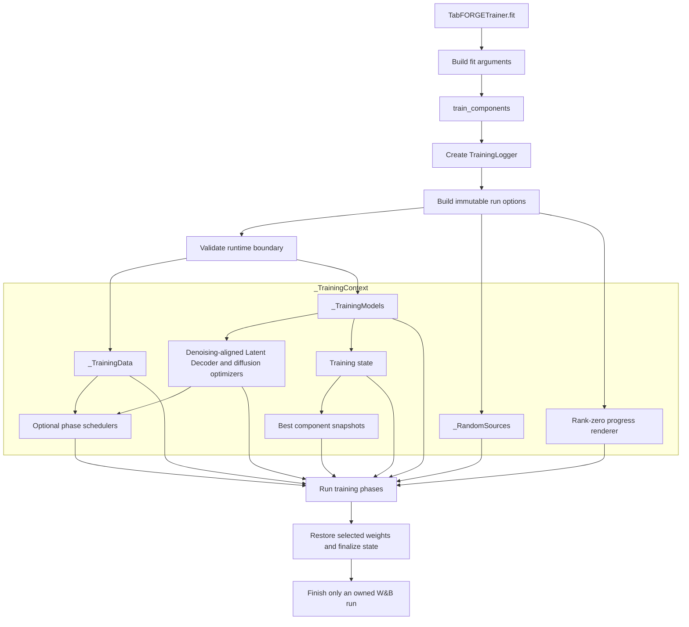
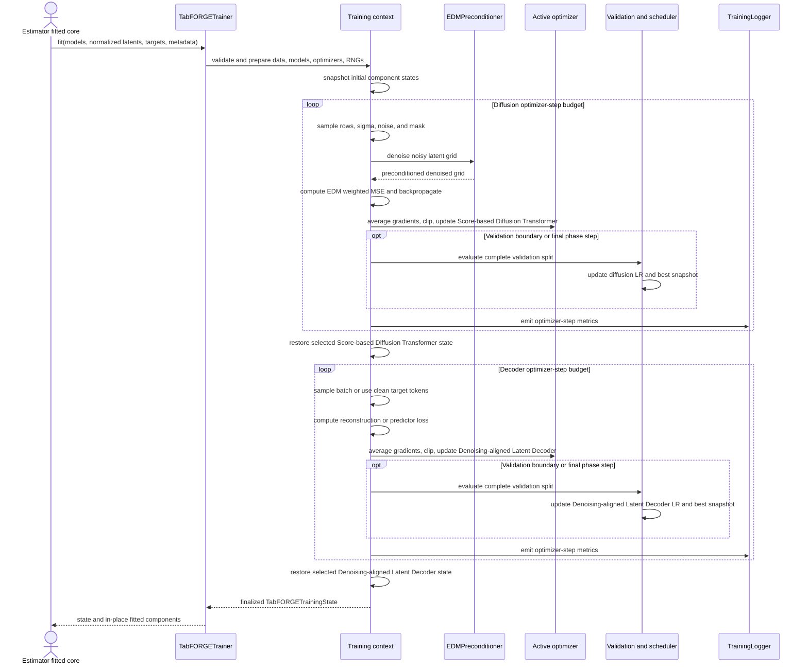
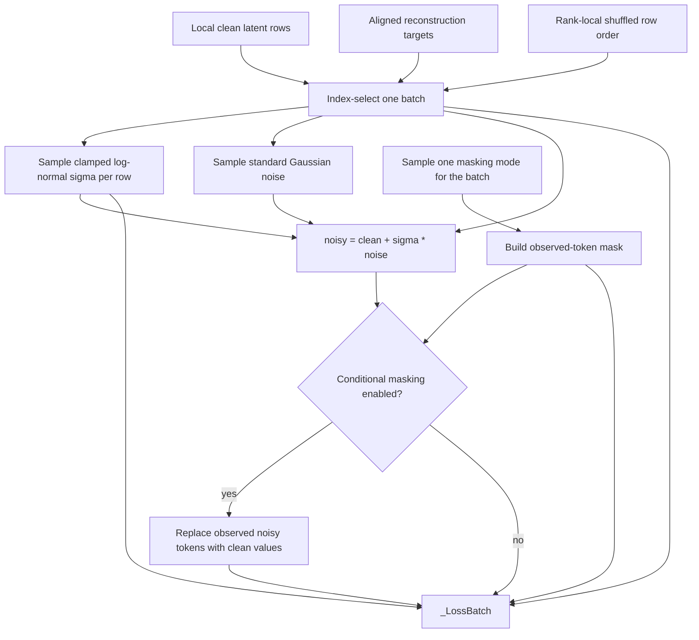
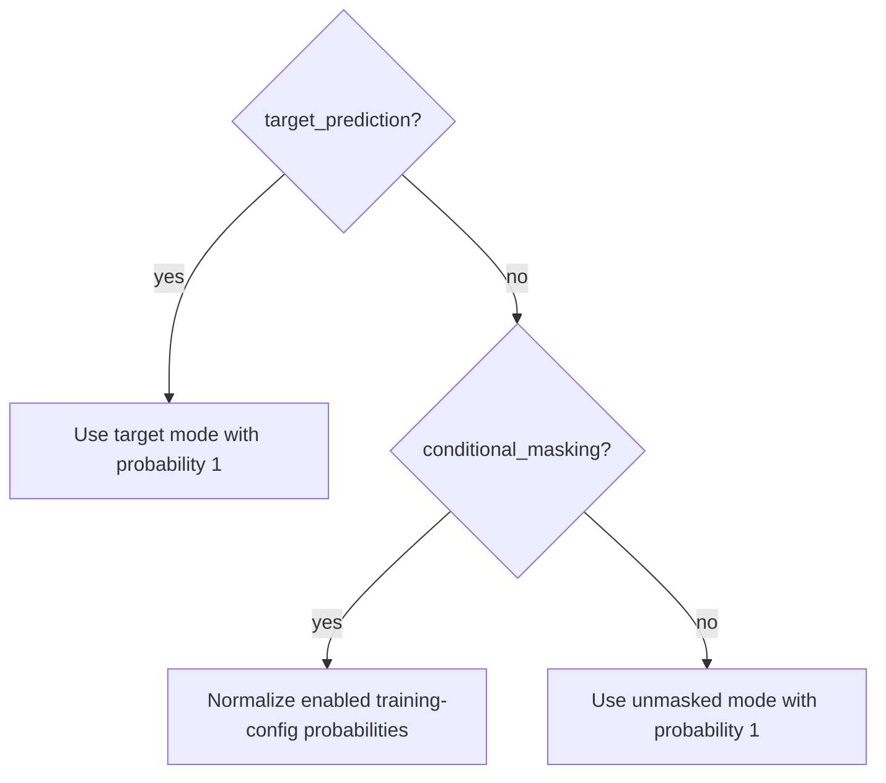
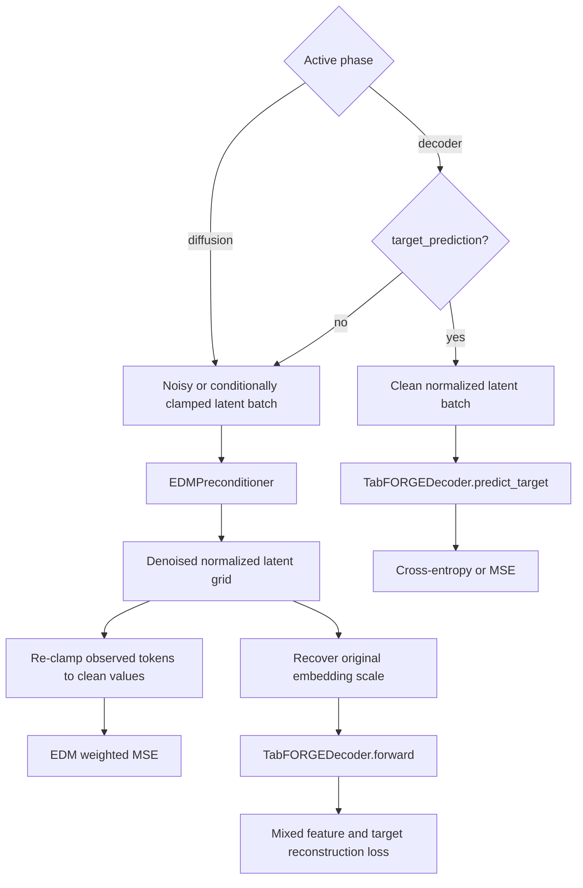
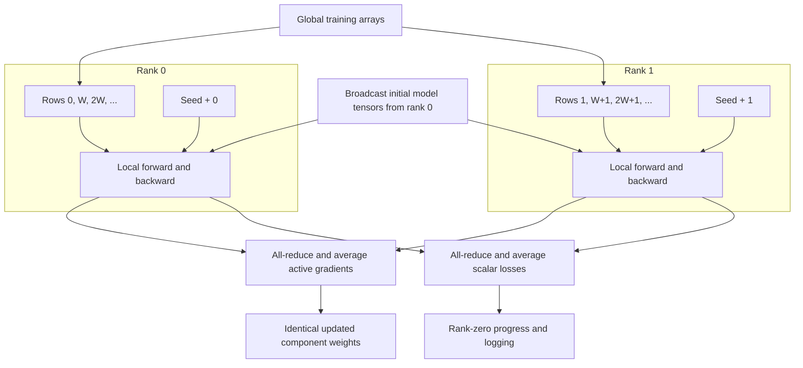
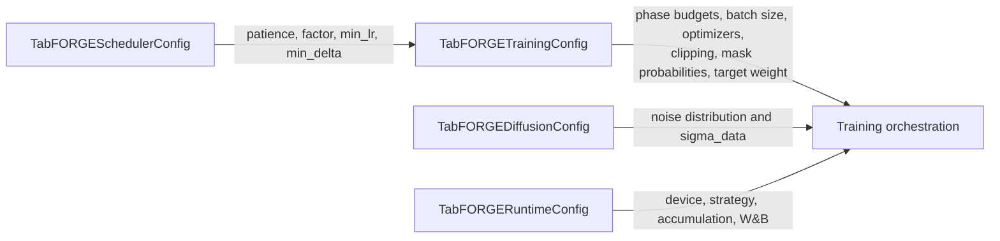

# Training orchestration

The `tabforge.training` package trains TabFORGE's Denoising-aligned Latent Decoder and Score-based Diffusion Transformer with a direct, phase-based PyTorch loop. It converts normalized latent arrays and dense reconstruction targets into fitted neural components while coordinating batching, EDM perturbations, conditional masks, gradient accumulation, validation, learning-rate scheduling, best-state restoration, distributed synchronization, progress reporting, and optional Weights & Biases tracing.

The module is the optimization layer of the [two-stage training and inference workflow](Latent_diffusion_learning_engine.md). Model structure, EDM preconditioning, and sampling mathematics are documented in the [Score-based Diffusion Transformer and Denoising-aligned Latent Decoder](latent_diffusion_model.md); estimator fit and inference ordering are documented in the [public estimator API](public_estimator_api.md).

## Purpose and system position

The public estimator lifecycle prepares all data-dependent state before invoking this module. It fits the raw schema, extracts contextual embeddings, normalizes the latent grid, constructs the Denoising-aligned Latent Decoder and Score-based Diffusion Transformer, and supplies the schema metadata needed to interpret reconstruction targets. Training orchestration then updates the two neural components and returns compact progress metadata.

<ol class="flow-cards">
<li><strong>Prepare inputs</strong><p>The fitted estimator supplies normalized token grids, reconstruction targets, Denoising-aligned Latent Decoder and Score-based Diffusion Transformer, and resolved configuration.</p></li>
<li><strong>Optimize in phases</strong><p>TabFORGETrainer coordinates EDM perturbations, conditional masks, Denoising-aligned Latent Decoder and diffusion phases, validation, scheduling, and distributed execution.</p></li>
<li><strong>Select fitted components</strong><p>Restore best component weights and return training state to the estimator. Rank-zero logging reports progress and optional W&B metrics.</p></li>
</ol>

The module owns optimization policy and run-time coordination. Its neighboring modules own the following concerns:

| Concern | Owning documentation |
| --- | --- |
| Raw schema, categorical encoding, reconstruction-target layout, and inverse transforms | [Tabular feature processing](tabular_feature_processing.md) |
| Contextual embedding extraction and latent-grid production | [Structure-aware Feature Encoder](tabpfn_embedding_adapter.md) |
| Denoising-aligned Latent Decoder and Score-based Diffusion Transformer architecture, EDM coefficients, weighted loss, and inference sampler | [Score-based Diffusion Transformer and Denoising-aligned Latent Decoder](latent_diffusion_model.md) |
| Training, diffusion, scheduler, and runtime option definitions and validation | [Configuration](configuration.md) |
| Estimator-specific fit calls, post-training heads, checkpoints, and inference | [Public estimator API](public_estimator_api.md) |

## Source layout and public boundary

The implementation is contained in two files:

| File | Responsibility |
| --- | --- |
| `src/tabforge/training/trainer.py` | Public trainer facade, run context construction, two-phase optimization, losses, validation, distributed synchronization, and final state |
| `src/tabforge/training/logging.py` | Rank-zero W&B run discovery, optional run creation, metric definition, trace emission, and owned-run cleanup |

The supported entry point is `TabFORGETrainer.fit()`. The standalone `train_components()` function implements the same operation and is useful to internal callers and focused tests. Names beginning with `_` are private implementation details and may change without preserving an external API contract.

| Component | Relationship and interface |
| --- | --- |
| `TabFORGETrainer` | Configured facade; prepares `_TrainingContext` and exposes `fit(...)`. |
| `TabFORGETrainingState` | Returned progress state: global/phase steps, epoch, optimizer steps, and best Denoising-aligned Latent Decoder/diffusion losses. |
| `TrainingLogger` | Context-owned logger with `log(values, step)` and `finish()`; records optional W&B metrics. |
| `_TrainingContext` | Groups options, data, models, optimizers, schedulers, random sources, best states, progress, and distributed settings. |
| `_LossBatch` | Repeatedly sampled clean/target tensors, noise levels, perturbed latents, and observed-token masks. |

## Input and output contracts

### Model and tensor inputs

`TabFORGETrainer.fit()` receives already-constructed model components and already-normalized training data. It mutates the supplied Denoising-aligned Latent Decoder and Score-based Diffusion Transformer in place.

| Input | Contract |
| --- | --- |
| `decoder` | A schema-aware `TabFORGEDecoder` whose token positions and output heads match the fitted feature processor. |
| `denoiser` | A `VariableColumnDenoiser` whose token count and embedding width match `clean_latents`. |
| `clean_latents` | Normalized `float32`-compatible array with shape `(rows, tokens, embedding_dimension)`. |
| `targets` | Dense reconstruction array aligned row-for-row with `clean_latents`; numerical values precede categorical one-hot blocks and any encoded target block. |
| `has_target` | Indicates whether the final latent token represents a supervised target. |
| `target_kind` | `"classification"`, `"regression"`, or `None`, consistent with Denoising-aligned Latent Decoder construction and target layout. |
| `categorical_cardinalities` | Ordered widths of the categorical reconstruction blocks. |
| `numerical_count` | Number of leading scalar reconstruction values. |
| `latent_mean`, `latent_std` | Per-token normalization statistics broadcastable over a latent batch. |
| Validation arrays | `validation_latents` and `validation_targets` must appear together, have equal row counts, contain at least one row, and use the training latent token shape. |

The feature and target layout is defined by [tabular feature processing](tabular_feature_processing.md). The latent shape, mask polarity, and Denoising-aligned Latent Decoder scale are defined by the [Score-based Diffusion Transformer and Denoising-aligned Latent Decoder](latent_diffusion_model.md).

### Returned and mutated state

Training returns `TabFORGETrainingState` and leaves the supplied modules loaded with their selected best weights. The state contains counters and selection losses; optimizer state, scheduler state, sampled row order, and random-generator state are intentionally transient.

| Field | Meaning after a completed run |
| --- | --- |
| `global_step` | Total optimizer updates completed across both phases. Normally equals `training_config.max_steps`. |
| `epoch` | Phase-completion counter. A complete two-phase traversal ends at `2`; this is separate from dataset epochs. |
| `phase` | `"complete"`. During training it is `"diffusion"` or `"decoder"`. |
| `phase_step` | Reset to `0` after each completed phase. |
| `diffusion_optimizer_step` | Score-based Diffusion Transformer updates allocated from the total step budget. |
| `decoder_optimizer_step` | Denoising-aligned Latent Decoder updates allocated from the remaining budget. |
| `best_diffusion_loss` | Selected validation loss, or the final training-step loss when validation is absent; `None` when the phase received zero steps. |
| `best_decoder_loss` | Selected validation loss, or the final training-step loss when validation is absent; `None` when the phase received zero steps. |

## Architecture and context construction

`TabFORGETrainer` is a small configured facade. It collects estimator-owned settings through `_fit_arguments()` and delegates to `train_components()`. The function wraps logging in a `try/finally`, ensuring a W&B run created by the trainer is finished even if preparation or optimization raises an exception.

The run is organized through `_TrainingContext`, which prevents the phase helpers from passing a large, unstable argument list.



The private context dataclasses divide state by concern:

| Component | Contents and role |
| --- | --- |
| `_LossOptions` | Schema metadata, diffusion configuration, target loss policy, and device-resident latent normalization tensors |
| `_TrainingOptions` | Training/runtime settings, device, seed, conditional-mask switch, loss options, and logger |
| `_TrainingData` | Device-resident local training tensors, optional full validation tensors, and the original training row count |
| `_TrainingModels` | Denoising-aligned Latent Decoder, Score-based Diffusion Transformer, and an `EDMPreconditioner` wrapping that Score-based Diffusion Transformer |
| `_PhasePair` | A Denoising-aligned Latent Decoder resource and diffusion resource; used for optimizers and optional schedulers |
| `_RandomSources` | Rank-seeded Torch and NumPy generators, masking probabilities, and current shuffled row order |
| `_BestComponents` | Deep-copied Denoising-aligned Latent Decoder/Score-based Diffusion Transformer state dictionaries and their selection losses |
| `_TrainingProgress` | Compact rank-zero stderr progress bar state |
| `_LossBatch` | Clean rows, targets, sampled noise scales, perturbed latents, and observed-token mask |

## End-to-end training lifecycle



### Phase allocation and ordering

Training always considers the diffusion phase first and the Denoising-aligned Latent Decoder phase second. `_phase_steps()` normalizes the two configured ratios against their sum:

```text
diffusion_steps = round(
    max_steps * diffusion_phase_ratio
    / (decoder_phase_ratio + diffusion_phase_ratio)
)

decoder_steps = max_steps - diffusion_steps
```

The rounded diffusion allocation is clamped to `[0, max_steps]`, so the two phase counts always sum to the configured total. A zero ratio disables its phase. Each phase:

1. Enables gradients only on its active component.
2. Runs exactly its allocated number of optimizer updates.
3. Selects and restores that component's best state.
4. Resets `phase_step` and advances the phase-completion counter.

The ordering matters: Denoising-aligned Latent Decoder training consumes the Score-based Diffusion Transformer state selected at the end of diffusion training. The two components use independent optimizers, schedulers, step counters, and best snapshots.

### Optimizers and trainability

The Denoising-aligned Latent Decoder optimizer covers only that component's parameters; the diffusion optimizer covers the underlying Score-based Diffusion Transformer parameters. `EDMPreconditioner` has no separate optimizer ownership.

| Configured name | PyTorch optimizer | Special behavior |
| --- | --- | --- |
| `sgd` | `torch.optim.SGD` | Uses configured learning rate and weight decay. |
| `adam` | `torch.optim.Adam` | Uses configured learning rate and weight decay. |
| `adamw` | `torch.optim.AdamW` | Uses betas `(0.9, 0.98)` in addition to configured learning rate and weight decay. |

Unknown names raise `ValueError`. A phase sets `requires_grad=True` only on its component and disables gradients on the other component. This keeps gradient synchronization and clipping scoped to the active optimizer.

## Batch construction and data flow

The trainer converts NumPy inputs to Torch `float32` tensors. Under distributed execution it selects each rank's interleaved rows before transferring the local training shard to the configured device. Validation data is transferred in full to each rank.

Training rows are drawn without replacement from a device-local random permutation until a full batch would exceed the remaining rows. At that point, a new permutation starts and the incomplete tail is skipped. The effective batch size is `min(configured_batch_size, local_row_count)`.



### Noise distribution

For each row, `_sample_sigma()` draws:

```text
z ~ Normal(p_mean, p_std)
sigma = clamp(exp(z), sigma_min, sigma_max)
```

During target-prediction training, the upper bound becomes:

```text
max(sigma_min, min(sigma_init, sigma_max))
```

This keeps supervised target corruption near the configured initial inference scale. EDM coefficients and the weighted denoising objective are described in the [Score-based Diffusion Transformer and Denoising-aligned Latent Decoder](latent_diffusion_model.md).

### Observation-mask modes

Internal mask polarity is consistent with inference: `True` means observed and clamped; `False` means the token is regenerated and contributes to a masked diffusion loss.

One mode is sampled for the whole batch:

| Mode | Observed mask | Intended behavior |
| --- | --- | --- |
| `unmasked` | All `False` | Unconditional denoising over every token. |
| `target` | Feature tokens `True`, final target token `False` | Learn conditional target regeneration for supervised tasks. If no target token exists, the mask stays all `False`. |
| `random` | Approximately 75% of tokens `True` | Learn arbitrary feature completion. A target token, when present, stays observed, and every row retains at least one feature token to regenerate. |

Masking probabilities follow the run mode:



The estimator API enables conditional masking for prediction and imputation workflows. Generator training leaves it disabled by default and exposes an explicit `observation_masking` opt-in. See [task-specific public estimators](public_estimator_api_estimators.md) for those public policies.

## Loss paths

The active phase selects one of three loss paths.



### Diffusion phase

The diffusion phase sends noisy latents, row-wise sigma values, and the observed mask through `EDMPreconditioner`. When conditional masking is enabled, observed output tokens are replaced with their clean values before loss evaluation. `edm_weighted_mse()` compares denoised and clean normalized latents using `sigma_data`; its loss mask is `~observed_mask`, so only regenerated tokens contribute during conditional training.

### Denoising-aligned Latent Decoder reconstruction phase

For ordinary reconstruction training, the Denoising-aligned Latent Decoder consumes denoised latents produced by the already-selected Score-based Diffusion Transformer. The trainer reverses latent normalization first:

```text
recovered_latent = normalized_latent * latent_std + latent_mean
```

`mixed_feature_loss()` then combines schema-aware numerical and categorical reconstruction with any supervised target loss:

```text
decoder_loss = reconstruction_loss
             + target_loss_weight * target_loss
```

The Denoising-aligned Latent Decoder, output heads, and mixed-schema loss contract are documented in the [Score-based Diffusion Transformer and Denoising-aligned Latent Decoder](latent_diffusion_model.md).

### Direct target-prediction phase

When `target_prediction=True`, used for classifier and regressor training, the Denoising-aligned Latent Decoder phase bypasses denoising and `decoder.forward()`. `decoder.predict_target()` reads clean normalized target-token latents directly:

- Classification applies cross-entropy to the class index recovered from the final one-hot target block.
- Regression applies mean squared error to the final scalar target value.

This branch trains the Denoising-aligned Latent Decoder's lightweight supervised prediction path. Estimator-owned post-training target-head behavior remains part of the [public estimator lifecycle](public_estimator_api_lifecycle.md).

## Gradient accumulation and optimizer updates

`runtime_config.gradient_accumulation` is the number of independently sampled batches accumulated into one optimizer update. For each optimizer step, the trainer:

1. Clears active optimizer gradients with `set_to_none=True`.
2. Samples and evaluates the configured number of batches.
3. Backpropagates each batch loss divided by the accumulation count.
4. Averages active gradients across distributed ranks.
5. Applies global norm clipping to the active component when `gradient_clip_value` is nonzero.
6. Performs one optimizer update.
7. Averages the recorded batch losses locally and then across ranks for reporting.

The configured `max_steps` and the fields in `TabFORGETrainingState` count optimizer updates. They do not count accumulated microbatches.

## Validation, scheduling, and best-state selection

Validation is optional and changes both scheduling and component selection.

### Validation cadence

The epoch-style configuration is converted to a phase-step interval:

```text
steps_per_epoch = max(
    1,
    training_row_count // batch_size // gradient_accumulation,
)

validation_interval = steps_per_epoch * validation_every_n_epochs
```

`training_row_count` is the original pre-sharding row count stored in `_TrainingData`. Validation runs whenever the current phase-local optimizer step is divisible by this interval and always at the final step of each non-empty phase.

The full validation split is processed in sequential batches under `torch.no_grad()`. Both components temporarily enter evaluation mode and return to their prior modes afterward. Validation remains stochastic: it draws fresh sigma, noise, and mask values through the same batch-construction and phase-loss paths used in training.

### Plateau scheduler

Each phase can own a private `_StepScheduler`. A scheduler is constructed only when:

- a validation split exists; and
- its `TabFORGESchedulerConfig.patience_steps` is not `None`.

An improvement requires:

```text
metric < best - min_delta
```

After `patience_steps` phase optimizer updates without such an improvement, every parameter-group learning rate is reduced to:

```text
max(min_lr, current_lr * factor)
```

Patience restarts from the later of the last improvement or last reduction. The scheduler operates in phase-local optimizer steps and never advances from training loss alone.

### Selection behavior

| Run type | Selected component state |
| --- | --- |
| With validation | Deep-copy the component whenever its stochastic validation loss improves; restore the lowest observed validation snapshot. |
| Without validation | Keep the component state from the final optimizer update of the phase and report that update's averaged training loss. |
| Zero-step phase | Preserve the initial component state and report `None` for that phase's best loss. |

The selected Score-based Diffusion Transformer is restored before Denoising-aligned Latent Decoder training begins. Both selected components are restored again during finalization, so the estimator receives the chosen weights even if later operations changed the live modules.

## Distributed execution

The trainer supports direct single-process execution and an already-initialized `torch.distributed` process group. Process-group creation and device selection occur outside this module; see the distributed fit lifecycle in the [public estimator API](public_estimator_api.md).



The distributed contract is:

- `strategy="ddp"` requires a live process group. Requesting it without one raises `RuntimeError`.
- Training rows are interleaved by global rank: `rank, rank + world_size, ...`.
- Every rank must receive at least one training row; otherwise preparation raises `ValueError`.
- Denoising-aligned Latent Decoder and Score-based Diffusion Transformer state tensors are broadcast from rank zero before optimization.
- Each rank uses Torch and NumPy random sources seeded with `random_state + rank` when a seed is supplied.
- Gradients are manually summed and divided by `world_size` before clipping and stepping.
- Reported training losses are averaged across ranks.
- Each rank evaluates the full validation split using its rank-local stochastic draws; validation losses are averaged across ranks.
- Only rank zero renders progress and emits W&B traces.

This is manual synchronous data parallelism. The module does not wrap components in `DistributedDataParallel`, create the process group, gather fitted modules, or write checkpoints.

## Logging and progress reporting

### `TrainingLogger`

`TrainingLogger` accepts one of three logging arrangements:

1. An existing W&B run with `log` and `summary` attributes.
2. A Lightning-style logger whose `experiment` attribute exposes `log`.
3. No context, in which case `runtime_config.log_wandb=True` reuses `wandb.run` or creates a run from `wandb_project`, `wandb_entity`, and `wandb_dir`.

Passing an existing context never creates a second run. `finish()` closes only a run created by this trainer. Non-primary distributed ranks disable logging before inspecting or creating any run.

When `define_metric` is supported, the logger defines `training/optimizer_step` and makes `training/*` and `valid/*` use it as their step metric. Compatible non-W&B loggers instead receive the global optimizer step through `log(values, step=...)`.

Every optimizer update can emit:

| Metric | Meaning |
| --- | --- |
| `training/optimizer_step` | Global update count across both phases |
| `training/decoder_optimizer_step` | Decoder-only update count |
| `training/diffusion_optimizer_step` | Denoiser-only update count |
| `training/phase` | Active phase name |
| `training/phase_optimizer_step` | Active phase's update count |
| `training/decoder_learning_rate` | Current Denoising-aligned Latent Decoder optimizer rate |
| `training/diffusion_learning_rate` | Current Score-based Diffusion Transformer optimizer rate |
| `training/reconstruction_loss` or `training/diffusion_loss` | Latest cross-rank averaged training loss for the active phase |
| `valid/reconstruction_loss` or `valid/diffusion_loss` | Validation loss when evaluation occurs on that update |

### Terminal progress

Rank zero renders a 24-character progress bar to stderr. The total is `max_steps`; updates are throttled to approximately 100 refreshes, with a final newline at completion. The display contains completed global optimizer steps, active phase, and latest training loss. It has no persistence or checkpoint role.

## Configuration dependencies

The trainer consumes four resolved configuration objects. Their complete field definitions and validation rules live in [configuration](configuration.md).



Key ownership boundaries are worth preserving when extending the trainer:

- Inference schedule fields such as `num_steps`, `rho`, churn, and Heun correction are model/sampler concerns and are not used by the optimization loop.
- Architecture configuration is consumed when the estimator constructs the Denoising-aligned Latent Decoder and Score-based Diffusion Transformer, before this module runs.
- Runtime determinism is configured by the estimator lifecycle; this module confines itself to rank-specific generators.
- Scheduler configuration has an effect only when explicit validation data is present.

## Errors and invariants

The trainer relies on validated configuration objects and model-level shape checks, while enforcing run-specific boundaries close to the affected operation.

| Condition | Result |
| --- | --- |
| Exactly one validation array is supplied | `ValueError`: both must be provided together. |
| Validation split is empty | `ValueError`. |
| Validation latent and target row counts differ | `ValueError`. |
| Training and validation latent token shapes differ | `ValueError`. |
| Distributed rank receives no training row | `ValueError`. |
| `strategy="ddp"` without an active process group | `RuntimeError`. |
| Optimizer name is outside `sgd`, `adam`, and `adamw` | `ValueError`. |

Maintainers should preserve these behavioral invariants:

- Latent and target rows remain aligned through sharding and batch selection.
- The final token is treated as the target only when `has_target=True`.
- `observed_mask=True` always means preserve the clean token.
- Denoising-aligned Latent Decoder reconstruction always receives latents restored to the original embedding scale.
- Direct target prediction receives normalized clean target-token latents.
- Phase step budgets sum to `max_steps`.
- Exactly one component is trainable in each phase.
- Distributed ranks start from the same model state and apply identical averaged updates.
- A supplied logger remains owned by its caller.
- Completed training leaves both modules at their selected states and returns `phase="complete"`.

## Extension guide

### Adding an optimizer

Extend `_make_optimizer()` and add a focused test for its parameterization. Keep phase ownership unchanged so Denoising-aligned Latent Decoder and Score-based Diffusion Transformer parameters remain independent.

### Changing a loss

Route phase-level choices through `_phase_loss()` and keep schema extraction inside the focused reconstruction or prediction helper. Changes to EDM weighting or Denoising-aligned Latent Decoder output semantics should be coordinated with the [Score-based Diffusion Transformer and Denoising-aligned Latent Decoder](latent_diffusion_model.md).

### Adding a masking mode

Update configuration normalization and `_sample_observation_mask()` together. Define the internal observed-mask polarity explicitly, retain at least one regenerated token when the mode is conditional, and verify both supervised and unsupervised layouts.

### Changing validation or scheduling

Preserve phase-local step semantics. Validation is the selection signal and the only scheduler signal; training-loss traces remain observational. Any move to deterministic validation should use separate random-state policy so it does not silently alter training draws.

### Extending distributed behavior

Keep synchronization collective calls identical across ranks. Changes to sharding, validation ownership, or conditional branches can deadlock when ranks execute different collectives. Process-group lifecycle and public device resolution remain outside this module.

### Adding trace fields

Add values in `_log_training_step()` and retain `training/optimizer_step` as the canonical W&B step metric. Avoid finishing or replacing a caller-supplied logging context.

## Related documentation

- [Score-based Diffusion Transformer and Denoising-aligned Latent Decoder](latent_diffusion_model.md) — Denoising-aligned Latent Decoder and Score-based Diffusion Transformer internals, EDM preconditioning, loss weighting, and sampling.
- [Configuration](configuration.md) — training, scheduler, diffusion, and runtime configuration fields.
- [Public estimator API](public_estimator_api.md) — system-level fit, inference, distributed execution, and persistence.
- [Shared lifecycle and checkpoint core](public_estimator_api_lifecycle.md) — exact estimator-to-trainer integration and serialized training state.
- [Table preprocessing and embedding](Tabular_representation_pipeline.md) — system-level preprocessing and embedding flow.
- [Tabular feature processing](tabular_feature_processing.md) — schema metadata and reconstruction-target layout.
- [Structure-aware Feature Encoder](tabpfn_embedding_adapter.md) — origin and shape of latent training arrays.

## Source files

- `src/tabforge/training/trainer.py`: phase-based training interface and implementation.
- `src/tabforge/training/logging.py`: optional rank-zero experiment tracing.
