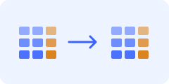
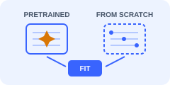
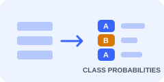
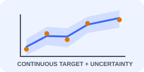
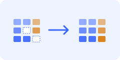

<h1 id="tutorial-gallery">Examples</h1>

Nine notebooks take you from fitting to task-specific inference. Open a notebook in Colab or run it locally after installing `tabforge-ml[tutorials]`. For a small example without model downloads, start with [Getting started](getting_started.md). [TabCamel](https://github.com/SilenceX12138/TabCamel) prepares the tutorial datasets; [TabEval](https://github.com/SilenceX12138/TabEval) supplies synthetic-data evaluation.

The notebook buttons open the public [TabFORGE repository](https://github.com/SilenceX12138/TabFORGE) on its `master` branch.

## Generation

<div class="notebook-grid">
<div class="notebook-card"><h3><a href="https://github.com/SilenceX12138/TabFORGE/blob/master/docs/tutorial/notebooks/generation/01_unconditional_generation.ipynb">Unconditional generation</a></h3><p>Generate a mixed-type table and inspect marginal and pairwise fidelity.</p><div class="notebook-actions"><a href="https://colab.research.google.com/github/SilenceX12138/TabFORGE/blob/master/docs/tutorial/notebooks/generation/01_unconditional_generation.ipynb"></a><a href="https://github.com/SilenceX12138/TabFORGE/blob/master/docs/tutorial/notebooks/generation/01_unconditional_generation.ipynb">View notebook ↗</a></div></div>
<div class="notebook-card"><h3><a href="https://github.com/SilenceX12138/TabFORGE/blob/master/docs/tutorial/notebooks/generation/02_pretrained_and_scratch_training.ipynb">Pretrained or from scratch</a></h3><p>Compare backbone initialization and save a reusable fitted model.</p><div class="notebook-actions"><a href="https://colab.research.google.com/github/SilenceX12138/TabFORGE/blob/master/docs/tutorial/notebooks/generation/02_pretrained_and_scratch_training.ipynb"></a><a href="https://github.com/SilenceX12138/TabFORGE/blob/master/docs/tutorial/notebooks/generation/02_pretrained_and_scratch_training.ipynb">View notebook ↗</a></div></div>
<div class="notebook-card"><h3><a href="https://github.com/SilenceX12138/TabFORGE/blob/master/docs/tutorial/notebooks/generation/03_device_and_distributed_execution.ipynb">Devices and distributed execution</a></h3><p>Select a device and prepare a torchrun workflow on your own workers.</p><div class="notebook-actions"><a href="https://colab.research.google.com/github/SilenceX12138/TabFORGE/blob/master/docs/tutorial/notebooks/generation/03_device_and_distributed_execution.ipynb"></a><a href="https://github.com/SilenceX12138/TabFORGE/blob/master/docs/tutorial/notebooks/generation/03_device_and_distributed_execution.ipynb">View notebook ↗</a></div></div>
</div>

## Prediction

<div class="notebook-grid">
<div class="notebook-card"><h3><a href="https://github.com/SilenceX12138/TabFORGE/blob/master/docs/tutorial/notebooks/prediction/01_classification.ipynb">Classification</a></h3><p>Predict class labels and probabilities from a mixed-type table.</p><div class="notebook-actions"><a href="https://colab.research.google.com/github/SilenceX12138/TabFORGE/blob/master/docs/tutorial/notebooks/prediction/01_classification.ipynb"></a><a href="https://github.com/SilenceX12138/TabFORGE/blob/master/docs/tutorial/notebooks/prediction/01_classification.ipynb">View notebook ↗</a></div></div>
<div class="notebook-card"><h3><a href="https://github.com/SilenceX12138/TabFORGE/blob/master/docs/tutorial/notebooks/prediction/02_regression.ipynb">Regression</a></h3><p>Inspect target trajectories, predictions, and uncertainty estimates.</p><div class="notebook-actions"><a href="https://colab.research.google.com/github/SilenceX12138/TabFORGE/blob/master/docs/tutorial/notebooks/prediction/02_regression.ipynb"></a><a href="https://github.com/SilenceX12138/TabFORGE/blob/master/docs/tutorial/notebooks/prediction/02_regression.ipynb">View notebook ↗</a></div></div>
</div>

<span id="representations" aria-hidden="true"></span>

## Embedding

<div class="notebook-grid">
<div class="notebook-card"><h3><a href="https://github.com/SilenceX12138/TabFORGE/blob/master/docs/tutorial/notebooks/embedding/01_feature_embeddings.ipynb">Feature embeddings</a></h3><p>Extract encoder and Denoising-aligned Latent Decoder layers and pool feature-token grids.</p><div class="notebook-actions"><a href="https://colab.research.google.com/github/SilenceX12138/TabFORGE/blob/master/docs/tutorial/notebooks/embedding/01_feature_embeddings.ipynb"></a><a href="https://github.com/SilenceX12138/TabFORGE/blob/master/docs/tutorial/notebooks/embedding/01_feature_embeddings.ipynb">View notebook ↗</a></div></div>
</div>

## Imputation

<div class="notebook-grid">
<div class="notebook-card"><h3><a href="https://github.com/SilenceX12138/TabFORGE/blob/master/docs/tutorial/notebooks/imputation/01_missing_value_imputation.ipynb">Missing-value imputation</a></h3><p>Regenerate missing or explicitly masked cells while keeping observations.</p><div class="notebook-actions"><a href="https://colab.research.google.com/github/SilenceX12138/TabFORGE/blob/master/docs/tutorial/notebooks/imputation/01_missing_value_imputation.ipynb"></a><a href="https://github.com/SilenceX12138/TabFORGE/blob/master/docs/tutorial/notebooks/imputation/01_missing_value_imputation.ipynb">View notebook ↗</a></div></div>
</div>

## Clustering

<div class="notebook-grid">
<div class="notebook-card"><h3><a href="https://github.com/SilenceX12138/TabFORGE/blob/master/docs/tutorial/notebooks/clustering/01_clustering.ipynb">Clustering</a></h3><p>Group rows with KMeans over learned embeddings.</p><div class="notebook-actions"><a href="https://colab.research.google.com/github/SilenceX12138/TabFORGE/blob/master/docs/tutorial/notebooks/clustering/01_clustering.ipynb"></a><a href="https://github.com/SilenceX12138/TabFORGE/blob/master/docs/tutorial/notebooks/clustering/01_clustering.ipynb">View notebook ↗</a></div></div>
</div>

## Anomaly detection

<div class="notebook-grid">
<div class="notebook-card"><h3><a href="https://github.com/SilenceX12138/TabFORGE/blob/master/docs/tutorial/notebooks/anomaly_detection/01_anomaly_detection.ipynb">Anomaly detection</a></h3><p>Score unusual rows and inspect Isolation Forest inlier labels.</p><div class="notebook-actions"><a href="https://colab.research.google.com/github/SilenceX12138/TabFORGE/blob/master/docs/tutorial/notebooks/anomaly_detection/01_anomaly_detection.ipynb"></a><a href="https://github.com/SilenceX12138/TabFORGE/blob/master/docs/tutorial/notebooks/anomaly_detection/01_anomaly_detection.ipynb">View notebook ↗</a></div></div>
</div>

## Set up a Colab runtime

Install the package and notebook dependencies in the Colab runtime before running the tutorial cells:

```python
%pip install "tabforge-ml[tutorials]"
```

Select a GPU runtime for practical pretrained-model workloads. The first pretrained run downloads Structure-aware Feature Encoder and TabFORGE backbone weights; follow any model-access prompts. Mock examples use local deterministic embeddings. The device tutorial includes distributed terminal commands intended for your own multi-worker environment; run its single-device sections in Colab. Its pretrained CLI workflow exports the full training split, while the notebook can use the smaller row cap.

## Run locally

Install the tutorial dependencies, then download the [source ZIP](https://github.com/SilenceX12138/TabFORGE/archive/refs/heads/master.zip) or clone the repository to obtain the notebooks:

```bash
pip install 'tabforge-ml[tutorials]'
git clone https://github.com/SilenceX12138/TabFORGE.git
cd TabFORGE
jupyter notebook docs/tutorial/notebooks
```

For a short verification run, set `TABFORGE_TUTORIAL_MAX_ROWS=64` and `TABFORGE_TUTORIAL_MAX_STEPS=10` before launching Jupyter. The embedding, imputation, clustering, and anomaly examples default to mock embeddings; set `TABFORGE_TUTORIAL_MODEL_PATH=auto` to run their pretrained path. Set `TABFORGE_RUN_SCRATCH=1` to include the optional scratch-training example.

The distributed Python examples in `docs/tutorial/cli/generation/` accept the same row and step limits. Install `tabforge-ml[wandb]` and run `wandb login` before using them. Their normal defaults remain 5,000 steps for training and 1,000 steps for continuation; both use online W&B logging under `./logs/wandb`. They write checkpoints to `./logs/checkpoints/` and synthetic CSV files to `./logs/synthetic/`.

For estimator methods and configuration details, see the [user guide](user_guide.md), [API reference](public_estimator_api.md), and [configuration reference](configuration.md).
